Université de Saragosse · Campus de Huesca · Année universitaire 2026–2027
Tous les cours au même endroit : ouvre une matière, puis le document ou le chapitre souhaité.
**État : 5 matières disponibles. Les 10 documents fournis sont traduits ci-dessous.**
Traduction des supports fournis, avec leurs références de pages. Les schémas pédagogiques sont présentés sous forme d’images traduites en français, en conservant leur organisation visuelle. Les diapositives textuelles restent en texte ; les illustrations purement décoratives ne sont pas systématiquement reproduites. Les remarques ajoutées sont identifiées comme notes de traduction.
# Fondements du marketing {toggle="true" color="blue"}
	**Intitulé original :** Fundamentos de marketing / Fundamentals of Marketing.
	**Formation :** diplôme en administration et gestion des entreprises (ADE), plan 702.
	**Enseignante :** María José Barlés Arizón · [mjbarles@unizar.es](mailto:mjbarles@unizar.es) · bureau 32.
	

	
À vérifier dans les supports : dates et groupes de TD

		**Années des examens :** la lettre Erasmus indique le 21 décembre 2016 et le 20 janvier 2017. Ces années paraissent être une erreur de reprise dans un dossier 2026–2027. La présentation espagnole indique les mêmes jours et mois, sans année. Les dates sont conservées telles qu'écrites dans chaque traduction ; les années correctes sont à confirmer auprès de l'enseignante ou sur Moodle.
		**Groupes de travaux pratiques :** la présentation espagnole attribue 8 h 30–10 h 30 au groupe A (noms de A à G) et 10 h 30–12 h 30 au groupe B (noms de H à Z). La lettre Erasmus donne les horaires inverses. Aucun des deux documents ne permet de trancher seul.
		**Support du chapitre 1 :** la version anglaise a été traduite automatiquement avec Canva Pro. Certaines formulations sont maladroites. Les passages ambigus sont signalés ci-dessous.
	

	## 1. Lettre de bienvenue aux étudiants Erasmus {toggle="true"}
		**Source :** Welcome for Erasmus.pdf · 1 page · traduction de l'anglais.
		Bienvenue, étudiant Erasmus, dans le cours « Fondements du marketing » du diplôme en administration et gestion des entreprises de l'Université de Saragosse, campus de Huesca.
		Je m'appelle María José Barlés Arizón et je suis l'enseignante de ce cours ([mjbarles@unizar.es](mailto:mjbarles@unizar.es)). Mon anglais n'est pas très bon, mais je ferai de mon mieux pour vous faciliter les choses dans cette matière. J'utiliserai le traducteur DeepL pour les documents écrits ; je trouve qu'il fonctionne assez bien.
		Bien que le programme du cours en anglais soit disponible sur notre site ([fegp.unizar.es](http://fegp.unizar.es)), je souhaite vous en donner un bref aperçu.
		Le cours « Fondements du marketing » vise à initier les étudiants aux concepts, outils et décisions de base du marketing, et à les familiariser avec ceux-ci.
		**Programme**
		1. Introduction au marketing.
		2. Décisions relatives au produit.
		3. Décisions relatives au prix.
		4. Décisions relatives à la distribution.
		5. Décisions relatives à la communication.
		Pour chaque chapitre, je déposerai un plan de cours sur Moodle. Il est recommandé de le compléter avec les lectures conseillées (voir le guide pédagogique).
		**Évaluation**
		**Partie 1 : 7 points.** Pour que la partie 2 puisse être prise en compte, vous devez obtenir au moins **2,75 points** à la partie 1. Celle-ci consiste en un examen écrit final, organisé le **21 décembre 2016**, lors de la session ordinaire. Si vous échouez ou ne vous présentez pas à cette date, vous pourrez passer l'examen lors de la session de rattrapage, le **20 janvier 2017**. L'examen écrit sera en anglais et vous pourrez également y répondre en anglais.
		*Note de traduction : les années 2016 et 2017 sont celles du document original ; voir l'avertissement en tête de matière.*
		**Partie 2 : 3 points.** Deux possibilités, qui ne s'excluent pas mutuellement :
		- Répondre à des questions complémentaires aux mêmes dates que l'examen écrit final.
		- Réaliser et remettre les travaux pratiques, qui auront lieu chaque mercredi de **8 h 30 à 10 h 30 pour le groupe B** (noms de famille commençant par H ou une lettre suivante) et de **10 h 30 à 12 h 30 pour le groupe A** (noms de A à G). Les travaux pratiques individuels valent **1 point**, les travaux en groupe **2 points**. Cette option est recommandée si vous êtes à l'aise en espagnol. **Les travaux pratiques réalisés en dehors de la salle de cours ne seront pas acceptés.**
		*Note de traduction : ces horaires sont ceux de la lettre Erasmus ; ils contredisent la présentation espagnole.*
		Je vous souhaite un excellent séjour en Espagne et dans notre université !
	## 2. Présentation de la matière et organisation {toggle="true"}
		**Source :** PresentacionFUNDMK.pdf · 6 pages · traduction de l'espagnol.
		

		
Pages 1–2 · Objectifs et programme

			**Fondements du marketing**, diplôme en ADE (plan 702). María José Barlés Arizón, [mjbarles@unizar.es](mailto:mjbarles@unizar.es). Faculté d'entreprise et de gestion publique, Huesca, Université de Saragosse. Département de direction du marketing et de recherche commerciale.
			**Objectifs :** connaissances, compétences et attitudes. Message de l'illustration : « Tu peux le faire ! »
			**Connaissances :** initier les étudiants aux concepts, instruments et décisions de base du marketing, et les familiariser avec ceux-ci.
			**Programme :**
			1. Introduction au marketing.
			2. Décisions relatives au produit.
			3. Décisions relatives au prix.
			4. Décisions relatives à la distribution.
			5. Décisions relatives à la communication.
		

		

		
Pages 3–4 · Compétences, attitudes et évaluation

			**Compétences**
			- Observer dans la réalité ce qui a été étudié en cours.
			- Travailler en groupe dans un temps limité : argumenter et communiquer.
			- Développer ses capacités d'analyse et de synthèse.
			- Prendre des décisions.
			**Attitudes**
			- Curiosité et proactivité.
			- Savoir écouter et faire preuve d'empathie.
			- Adopter une attitude positive et être ouvert à l'apprentissage.
			**L'attitude multiplie !** Formule du succès de Víctor Küppers : **V = (C + H) × A**.
			- V = valeur ; C = connaissances ; H = compétences ; A = attitude.
			*Présentation · page 4, diapositive du haut · version française.*
			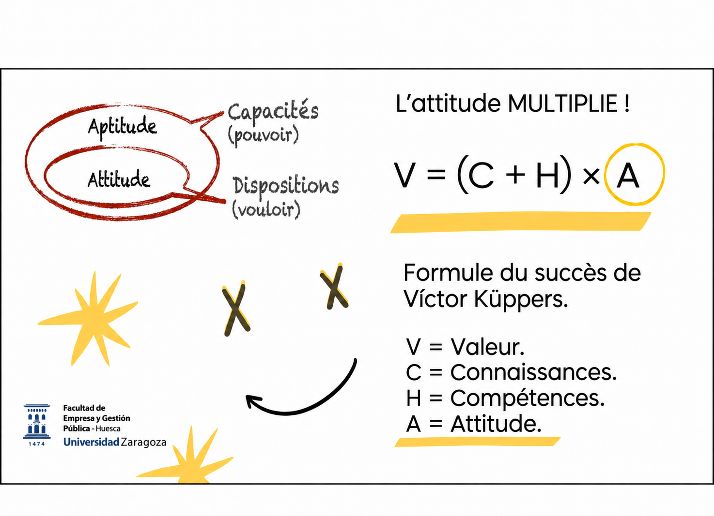
			*Présentation · page 4, diapositive du bas · version française.*
			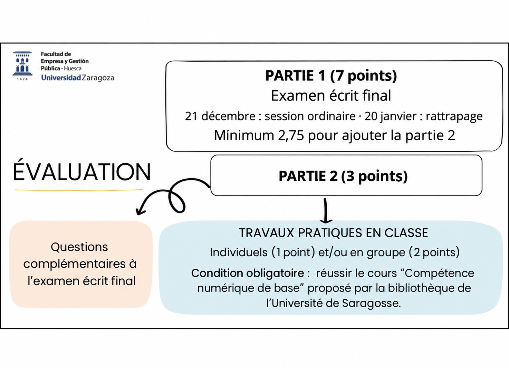
			**Évaluation : partie 1, sur 7 points**
			Examen écrit final : **21 décembre, session ordinaire**, et **20 janvier, session de rattrapage**. Il faut obtenir **au minimum 2,75 points** pour ajouter la note de la partie 2.
			**Évaluation : partie 2, sur 3 points**
			- Questions complémentaires lors de l'examen écrit final.
			- Travaux pratiques en classe : individuels (**1 point**) et/ou en groupe (**2 points**).
			- Condition obligatoire pour les travaux pratiques : réussir le cours **« Compétence numérique de base »**, proposé par la bibliothèque de l'Université de Saragosse.
		

		

		
Pages 5–6 · Supports, horaires, permanences et règles

			**Supports d'étude**
			- Plans et schémas disponibles dans l'ADD, l'environnement numérique d'enseignement. Il est indispensable de les compléter avec les notes prises en cours et la bibliographie.
			- Bibliographie complémentaire : voir le guide pédagogique.
			- Lectures disponibles dans l'ADD.
			- Lecture autonome de revues spécialisées disponibles à la bibliothèque : *Emprendedores*, *IPMARK*, *Alimarket*, *Distribución Actualidad*, etc.
			**Rendez-vous en cours**
			- Jeudi : **12 h 30–14 h 30**, groupe complet.
			- Mercredi : groupes de travaux pratiques.
			- Groupe A, noms de famille de A à G : **8 h 30–10 h 30**.
			- Groupe B, noms de famille de H à Z : **10 h 30–12 h 30**.
			- Mercredi à **12 h 30** : conférences, dispositif « Pasaporte FEGP ».
			*Note de traduction : l'attribution des créneaux A/B contredit la lettre Erasmus. À confirmer.*
			**Permanences de l'enseignante : bureau 32**
			- Jeudi : **9 h–12 h 30**.
			- Vendredi : **9 h–11 h 30**.
			- Pour un autre jour : contacter [mjbarles@unizar.es](mailto:mjbarles@unizar.es).
			- Rendez-vous également possibles via Meet, Zoom, etc.
			**Points importants**
			- Respectez l'horaire du groupe de travaux pratiques auquel vous avez été affecté.
			- Les études de cas en équipe qui comptent dans la note sont réalisées **en classe, sans exception**.
			- L'intelligence artificielle sera utilisée **sous la supervision de l'enseignante**.
		

	## 3. Chapitre 1 · Introduction au marketing {toggle="true"}
		**Source :** T1 vr-ingles26-27.pdf · 19 pages · document daté du 10/09/2026 · traduction de la version anglaise.
		**Rappel du support :** ces diapositives constituent un plan de cours. Il faut les compléter en classe et/ou avec les lectures recommandées.
		

		
Pages 1–2 · Objectifs, plan et distinction entre vente et marketing

			**Fondements du marketing, diplôme en administration des entreprises. Chapitre 1 : introduction au marketing.**
			**Objectifs d'apprentissage**
			- Comprendre ce qu'est le marketing.
			- Comprendre ses fonctions et ses rôles dans l'économie et dans les organisations.
			- Comprendre les notions fondamentales du marketing.
			- Comprendre son évolution et les orientations adoptées par les organisations.
			- Identifier les tendances les plus récentes.
			**Plan du chapitre**
			1.1. Qu'est-ce que le marketing ?
			1.2. Fonctions du marketing dans l'organisation et concepts de base.
			1.3. Orientations des entreprises vis-à-vis du marketing.
			1.4. Tendances au sein de l'orientation marché : marketing social, marketing relationnel, marketing numérique, marketing expérientiel et neuromarketing.
			*Chapitre 1 · page 2, diapositive du bas · version française.*
			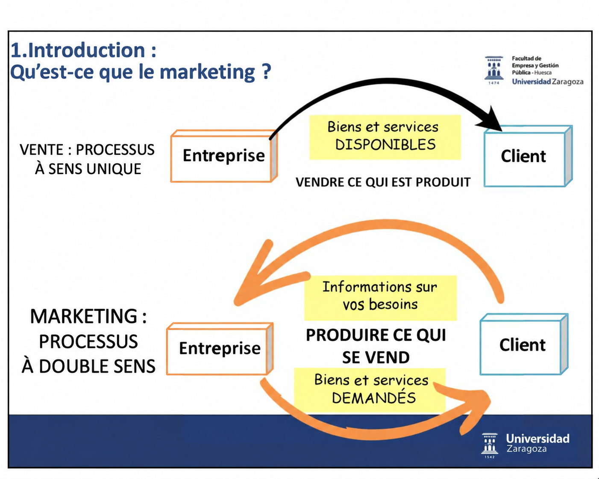
		

		

		
Pages 3–4 · Le marketing comme philosophie et technique ; définitions de l'AMA

			**Le marketing comme philosophie**
			- Des principes, une philosophie, un état d'esprit, une attitude.
			- Une manière de concevoir l'échange qui définit la façon d'aborder le marché.
			- « Le client est roi » : satisfaire ses besoins, mais pas à n'importe quel prix.
			- Obtenir de la rentabilité pour l'entreprise.
			**Le marketing comme technique**
			- Un processus planifié pour mettre en œuvre la relation d'échange.
			- Identifier, créer, développer et satisfaire la demande.
			- Un processus composé de différentes phases et de différents outils.
			**Définitions du marketing selon l'AMA, telles que présentées dans le cours**
			**1960 :** le résultat des activités de l'entreprise qui dirigent les flux de biens et de services du producteur vers le consommateur ou l'utilisateur.
			**1985 :** le processus de planification et de mise en œuvre de la conception du produit, de la fixation du prix, de la promotion et de la distribution des biens, services et idées, afin de créer des échanges satisfaisant les objectifs des individus et des organisations.
			**2004 :** le marketing est une fonction des organisations et un ensemble de processus destinés à créer, communiquer et apporter de la valeur aux clients, ainsi qu'à gérer les relations avec eux au moyen de démarches qui bénéficient à l'organisation et à l'ensemble de ses parties prenantes.
			**2017, dernière version citée dans le support :** le marketing est l'activité exercée par des organisations d'individus, au moyen d'un ensemble d'institutions et de processus, afin de créer, communiquer, apporter de la valeur et échanger des offres qui ont de la valeur pour les consommateurs, les clients, les entrepreneurs et la société dans son ensemble.
			*Note de traduction : ces formulations traduisent le support anglais fourni ; elles ne constituent pas une vérification ni une nouvelle traduction des publications originales de l'AMA. Le terme « entrepreneurs » figure bien dans le support.*
		

		

		
Pages 4–7 · Processus marketing et concepts fondamentaux

			**Processus marketing, Kotler et Armstrong (2018)**
			1. Comprendre le marché ainsi que les besoins et désirs des clients.
			2. Concevoir une stratégie marketing centrée sur le client.
			3. Élaborer un programme marketing.
			4. Construire avec les clients des relations stables et satisfaisantes.
			5. Capter la valeur apportée par les clients afin de les fidéliser et de générer des ventes pour l'entreprise.
			*Chapitre 1 · page 4, diapositive du bas · version française.*
			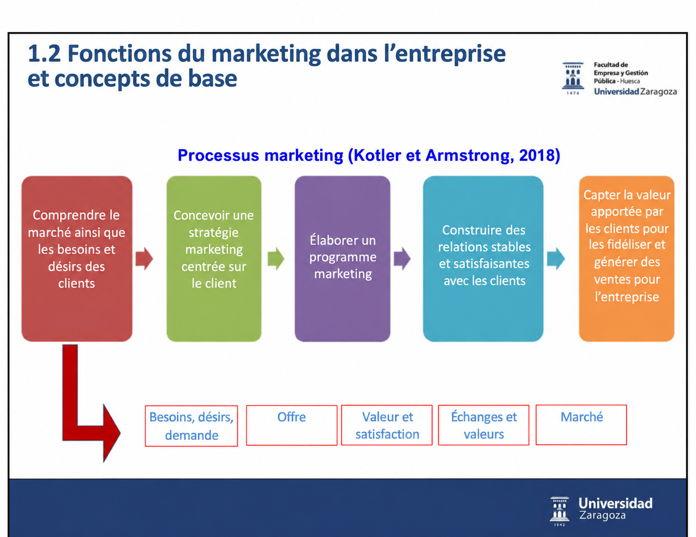
			*Note de traduction : le schéma anglais porte « Exhanges and values », traduit ici par « échanges et valeurs », malgré sa formulation inhabituelle.*
			**Besoin, désir et demande**
			- **Besoin :** état dans lequel une personne ressent, selon sa propre perception, qu'il lui manque « quelque chose ».
			- **Désir :** manière dont chaque personne exprime comment elle souhaite satisfaire un besoin, sous l'influence de son développement culturel et social.
			- **Demande :** désirs soutenus par une capacité de paiement.
			*Chapitre 1 · page 5, diapositive du haut · version française.*
			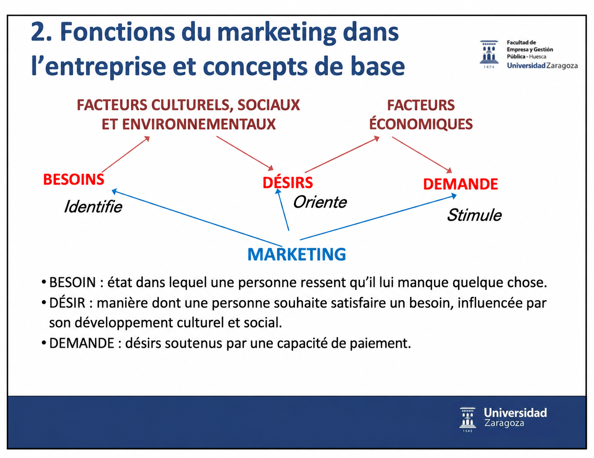
			*Note de traduction : « oriente » est une restitution probable du sens. Le schéma traduit automatiquement affiche le mot incohérent « Eastern » à cet endroit.*
			**Produit, ou offre sur le marché :** tout ce qui peut être proposé pour satisfaire un besoin ou un désir.
			**Valeur nette :** rapport entre les bénéfices tangibles et intangibles apportés par le produit et les coûts monétaires et non monétaires supportés par la personne qui l'achète.
			*Chapitre 1 · page 5, diapositive du bas · version française.*
			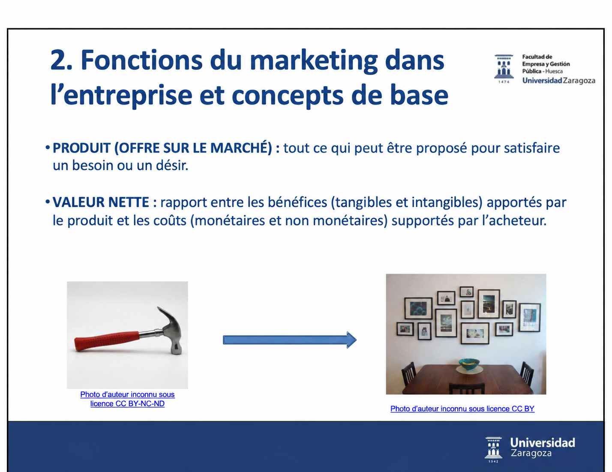
			**Échange :** acte entre deux parties par lequel l'une obtient un produit, un service, une idée, etc., qu'elle désire en offrant quelque chose en contrepartie. Il y a **création de valeur**.
			*Chapitre 1 · page 6, diapositive du haut · version française.*
			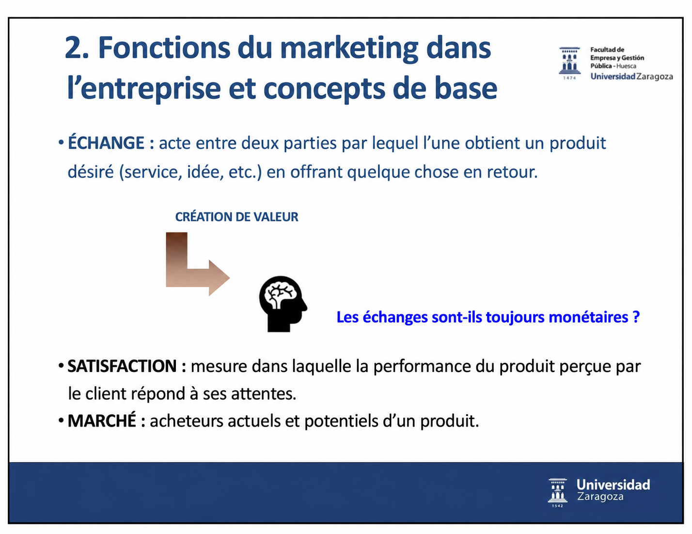
			**Satisfaction :** degré auquel la performance du produit, telle que le client la perçoit, répond à ses attentes.
			**Marché :** ensemble des acheteurs actuels et potentiels d'un produit.
			**Comment mesurer la satisfaction ? Les indicateurs clés de performance, ou KPI**
			- **CSAT, Customer Satisfaction Score :** indicateur de satisfaction du client.
			- **NPS, Net Promoter Score :** indicateur de fidélité du client.
			- **CES, Customer Effort Score :** indicateur de l'effort fourni par le client pour accomplir une action ou résoudre un problème.
			- Autres indicateurs et outils : statistiques du site internet (Google Analytics), statistiques des réseaux sociaux et enquêtes.
		

		

		
Page 7 · Marketing stratégique et marketing opérationnel

			*Chapitre 1 · page 7, diapositive du haut · version française.*
			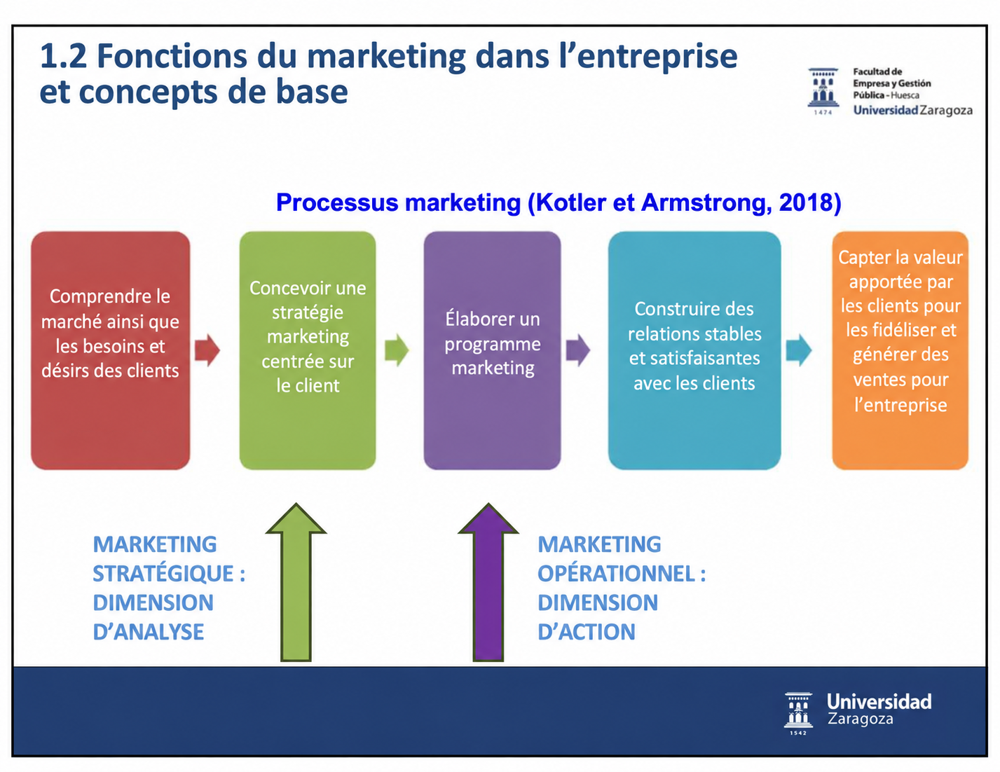
			**Marketing stratégique : dimension d'analyse**
			- **Objectif :** obtenir une performance économique supérieure à celle du marché grâce à une politique continue de création de produits apportant une valeur supérieure à celle de la concurrence.
			- **Horizon : moyen et long terme.**
			**Marketing opérationnel : dimension d'action**
			- **Objectif :** obtenir une part de marché donnée en utilisant le marketing-mix et le budget marketing.
			- **Horizon : court et moyen terme.**
		

		

		
Pages 8–9 · Outils fondamentaux : des 4 P aux 4 C et aux 4 E

			Le **marketing-mix** est l'ensemble des outils que l'entreprise utilise pour atteindre ses objectifs marketing.
			**Approche centrée sur l'entreprise : les 4 P, McCarthy (1960)**
			- **Product : produit.**
			- **Price : prix.**
			- **Place : distribution.**
			- **Promotion : communication / promotion.**
			Source de l'illustration du support : [www.canva.com](http://www.canva.com).
			**Approche centrée sur le client : des 4 P aux 4 C, Lauterborn (1990)**
			- Produit → **Customer Value : valeur pour le client**.
			- Prix → **Customer Cost : coût pour le client**.
			- Distribution → **Convenience : commodité et facilité d'accès**.
			- Promotion → **Communication : communication**.
			**Adaptation à l'ère numérique : des 4 C aux 4 E, Fetherstonhaugh (2009)**
			*Chapitre 1 · page 9, diapositive du haut · version française.*
			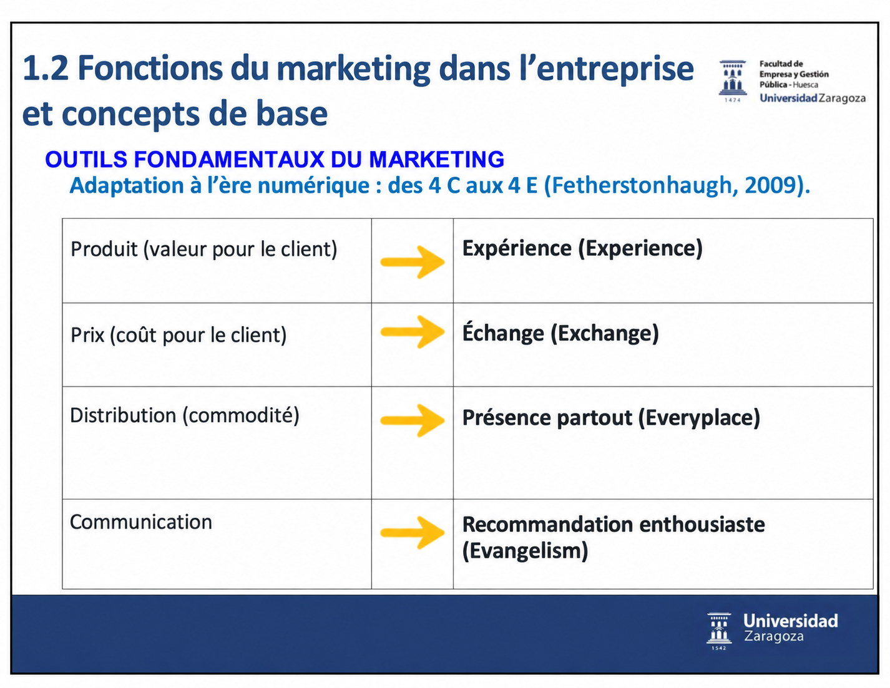
		

		

		
Pages 9–11 · Évolution des orientations des entreprises

			*Chapitre 1 · page 9, diapositive du bas · version française.*
			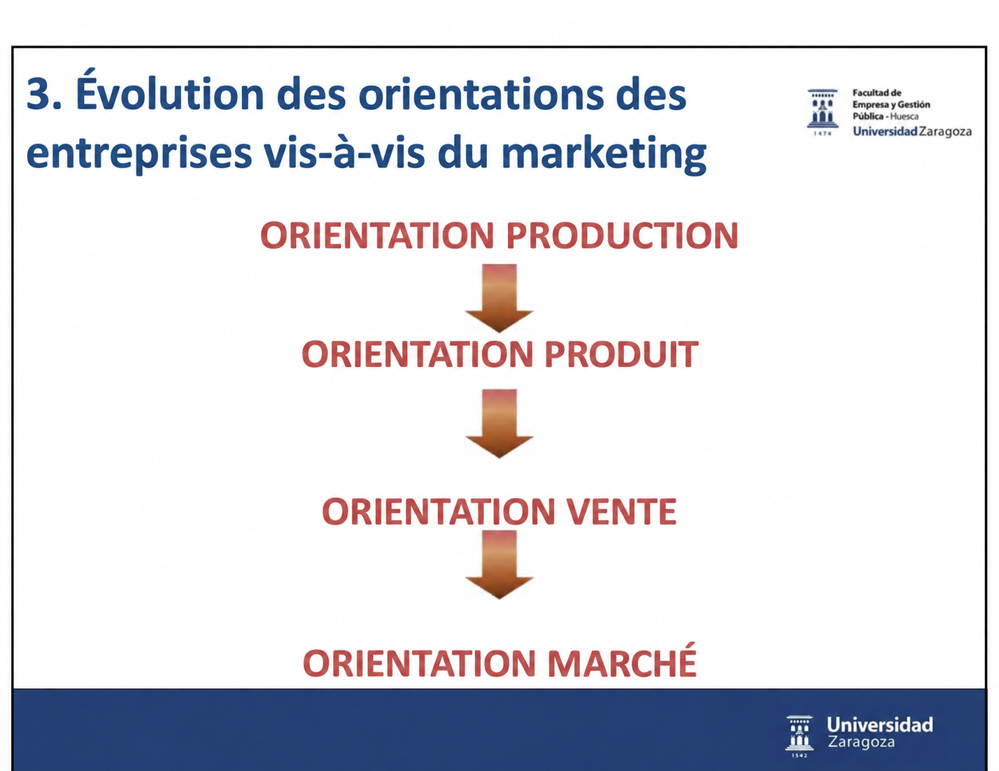
			**1. Orientation production**
			- Environnement stable et maîtrisable : **demande supérieure à l'offre**.
			- Hypothèse : les personnes choisissent les produits disponibles, c'est-à-dire ce qui existe ; elles n'ont pas réellement le choix.
			- Clé du succès : fabriquer en grand volume des produits et services peu coûteux, grâce à l'efficacité productive.
			- Organisation dominée par la fonction production : développer la capacité de production et améliorer la productivité.
			- Rôle du marketing nul ou très limité et passif : pas d'études de marché, faible communication, absence d'intérêt pour ce que veut le client, etc.
			**2. Orientation produit**
			- Environnement : **équilibre entre demande et offre**, concurrence plus forte.
			- Hypothèse : les personnes choisissent les produits de meilleure qualité ; les bons produits se vendent d'eux-mêmes.
			- Clé du succès : fabriquer des produits et services de qualité à un coût raisonnable.
			- Organisation dominée par la fonction production : recherche de la perfection technique du produit.
			- Rôle du marketing limité et passif. La qualité prend une importance particulière.
			- Conséquence indiquée : **myopie marketing**.
			**3. Orientation vente**
			- Environnement concurrentiel : **offre supérieure à la demande**. Nouvelles formes de distribution, notamment le libre-service, élargissement des marchés et politique de marque.
			- Hypothèse : si on ne les incite pas à acheter, les personnes n'achètent pas.
			- Clé du succès : convaincre d'acheter par la publicité, la vente personnelle, les promotions, etc.
			- Décisions relatives au produit liées à la fonction production ; volonté de créer une organisation commerciale efficace, avec la création d'un service des ventes.
			- Rôle du marketing limité à un effort de vente agressif. **Approche fondée sur l'offre.**
			**4. Orientation marché**
			- Environnement concurrentiel : **offre supérieure à la demande**. Marchés matures et fragmentés, nouveaux besoins et mondialisation.
			- Hypothèse : principe de souveraineté du consommateur, « le client est roi ».
			- Clé du succès : identifier les besoins et désirs du public cible et les satisfaire de manière plus efficace et efficiente que la concurrence.
			- Organisation dominée par l'orientation marché : les personnes et la concurrence. **Approche fondée sur la demande ; le client est le point de départ.**
			- Rôle central du marketing : identifier les besoins et désirs et apporter une valeur nette supérieure à celle de la concurrence.
		

		

		
Page 12 · Tableau récapitulatif des orientations

			<table header-row="true">
<tr>
<td>Orientation</td>
<td>Période indiquée</td>
<td>Environnement</td>
<td>Clé du succès</td>
<td>Fonction dominante</td>
<td>Rôle du marketing</td>
</tr>
<tr>
<td>Production</td>
<td>Jusqu'aux années 1950</td>
<td>Stable et maîtrisable ; demande supérieure à l'offre</td>
<td>Production importante à faible coût</td>
<td>Production : capacité et productivité</td>
<td>Nul ou limité et passif</td>
</tr>
<tr>
<td>Produit</td>
<td>Jusqu'aux années 1960</td>
<td>Concurrence accrue ; équilibre entre offre et demande</td>
<td>Produits de haute qualité</td>
<td>Production : perfectionnement du produit</td>
<td>Limité et passif ; priorité à la qualité</td>
</tr>
<tr>
<td>Vente</td>
<td>Années 1950 et 1960</td>
<td>Offre supérieure à la demande ; concurrence ; libre-service</td>
<td>Vente agressive</td>
<td>Production : direction des ventes, organisation commerciale efficace</td>
<td>Actif, centré sur la persuasion du consommateur</td>
</tr>
<tr>
<td>Marché, philosophie marketing</td>
<td>Des années 1970 à aujourd'hui</td>
<td>Offre supérieure à la demande ; marchés matures et fragmentés ; mondialisation ; concurrence</td>
<td>Identifier les besoins et les satisfaire mieux que la concurrence</td>
<td>Marketing : orientation marché et concurrence</td>
<td>Identifier besoins et désirs ; apporter une valeur nette supérieure</td>
</tr>
			</table>
		

		

		
Pages 12–13 · Tendances, marketing social et responsabilité sociétale

			**Les tendances au sein de l'orientation marché**
			- **Marketing social :** prendre en compte les conséquences socioculturelles de l'activité de l'entreprise.
			- **Marketing relationnel :** construire des relations clients à long terme, fidéliser.
			- **Marketing numérique :** actions et stratégies mises en œuvre sur les appareils électroniques du public cible.
			- **Marketing expérientiel :** proposer une expérience unique et créer des fans de la marque.
			- **Neuromarketing :** processus cérébraux et marketing.
			**Marketing social : les changements sociaux à son origine**
			- **Mouvement des consommateurs, années 1970 :** réaction à une orientation excessive vers la vente. Adapter l'offre à la demande, et non l'inverse, c'est appliquer le marketing.
			- **Mouvement environnemental :** préoccupation face aux effets de la consommation et du marketing sur l'environnement ; coût social de la consommation.
			Le marketing doit contribuer, **à long terme**, au **bien-être des acheteurs** et au **bien-être de la société tout entière**.
			**Perspective du marketing social :** déterminer les besoins et désirs des marchés cibles et les satisfaire plus efficacement que la concurrence, de manière à maintenir ou améliorer le bien-être des consommateurs et de la société (Lambin, 2003).
			*Note terminologique : le support utilise « marketing social ». La perspective de bien-être collectif développée ici est aussi appelée « marketing sociétal » en français.*
			**Responsabilité sociétale des entreprises, RSE (CSR dans le support anglais)**
			Il s'agit de gérer l'entreprise de manière à assurer la durabilité de ses activités sur les plans **économique**, **social** et **environnemental**, en tenant compte des intérêts de tous les groupes concernés et de la durabilité pour les générations futures.
			*Chapitre 1 · page 13, diapositive du bas · version française.*
			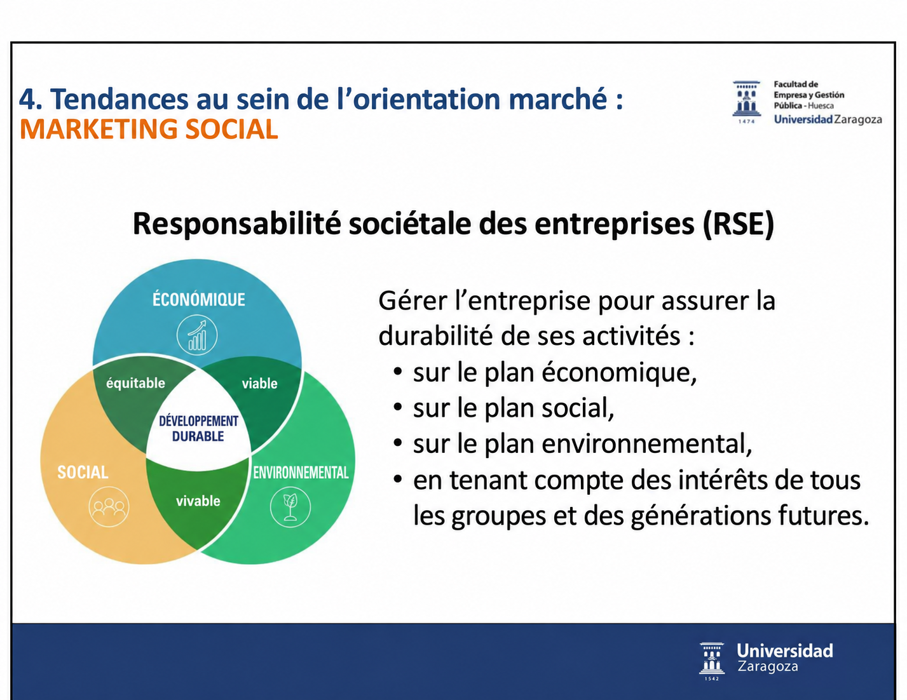
		

		

		
Page 14 · Marketing relationnel

			**Facteurs à l'origine du marketing relationnel**
			- Sophistication des marchés : les clients savent qu'ils occupent une place centrale.
			- Progrès des technologies de l'information et de la communication : gestion de grandes quantités de données clients.
			- Il est plus rentable de conserver et de fidéliser les clients habituels que d'en attirer de nouveaux.
			**Avantages apportés**
			- Avantages financiers : programmes de fidélisation et marketing de club.
			- Avantages sociaux : personnalisation de la relation.
			**Perspective du marketing relationnel :** établir avec les clients rentables des relations de long terme, mutuellement satisfaisantes, prospères et durables. **Gagner leur fidélité.**
			**Outils pour entretenir les relations à long terme**
			- Programmes de fidélité.
			- Personnalisation.
			- **CRM, Customer Relationship Management : gestion de la relation client.**
			<table header-row="true">
<tr>
<td>Dimension</td>
<td>Marketing transactionnel</td>
<td>Marketing relationnel</td>
</tr>
<tr>
<td>Perspective temporelle</td>
<td>Courte</td>
<td>Longue</td>
</tr>
<tr>
<td>Objectif</td>
<td>Court terme : acquérir des clients</td>
<td>Long terme : conserver la clientèle</td>
</tr>
<tr>
<td>Transactions</td>
<td>Ponctuelles</td>
<td>Continues</td>
</tr>
<tr>
<td>Rapports avec fournisseurs, concurrents et distributeurs</td>
<td>Rivalité</td>
<td>Coopération</td>
</tr>
<tr>
<td>Fonction marketing</td>
<td>Concentrée dans le service marketing</td>
<td>Présente dans toute l'organisation</td>
</tr>
<tr>
<td>Service client</td>
<td>Faible importance</td>
<td>Forte importance</td>
</tr>
			</table>
		

		

		
Page 15 · Marketing expérientiel : principes

			**Motivations**
			- Proposer des expériences qui aident à relier la marque aux habitudes du consommateur.
			- Les personnes réagissent aux stimuli rationnels, mais davantage encore aux stimuli émotionnels.
			**Ce qu'il apporte**
			- Une expérience unique et personnelle, plutôt qu'un simple produit qui s'épuise une fois consommé.
			- Des clients non seulement fidèles, mais engagés envers la marque grâce à des liens émotionnels : des **fans de l'entreprise**.
			**Perspective du marketing expérientiel :** communiquer le message de la marque au moment et à l'endroit où les personnes y sont le plus réceptives, et leur permettre d'interagir avec la marque ou le produit (Lederman, 2008).
		

		

		
Pages 15–16 · Marketing numérique, bouche-à-oreille et viralité

			**Marketing en ligne / numérique : caractéristiques**
			- Grande accessibilité : qui ne possède pas de téléphone mobile et/ou d'accès à Internet ?
			- Coût abordable par rapport aux autres canaux traditionnels de communication, ce qui présente un intérêt pour les petites entreprises.
			**En B2C, des entreprises vers les consommateurs**
			- Processus d'achat rapide, sensible aux offres et aux messages de court terme.
			- Contenus fondés sur l'émotion, qui procurent un sentiment positif à la personne qui achète.
			- Contenus individualisés et importance de la reconnaissance de la marque.
			Source de l'illustration du support : [www.canva.com](http://www.canva.com).
			**Bouche-à-oreille électronique, eWOM (Electronic Word of Mouth)**
			Toute opinion, positive ou négative, formulée par des consommateurs actuels, potentiels ou anciens au sujet d'un produit ou d'une entreprise, et rendue accessible à un grand nombre de personnes et d'organisations via Internet (Henning-Thurau et al., 2004, orthographe du support).
			**Marketing viral**
			Phénomène par lequel les consommateurs partagent et diffusent entre eux des informations marketing pertinentes, initialement envoyées délibérément par une organisation pour stimuler et exploiter les comportements de bouche-à-oreille électronique (Van der Lans et al., 2010).
			**Relation entre les objectifs du marketing viral**
			*Chapitre 1 · page 16, diapositive du bas · version française.*
			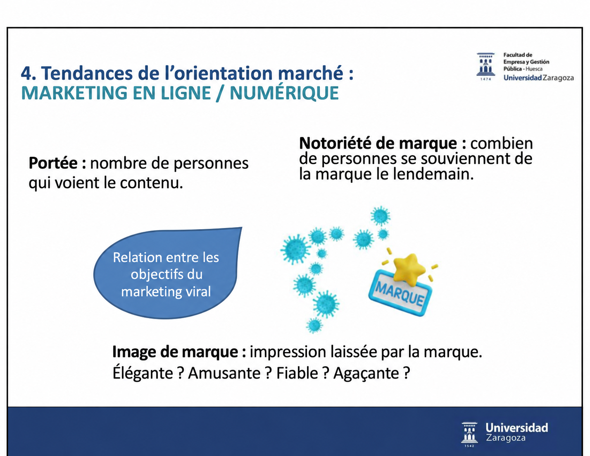
			- **Portée, reach :** nombre de personnes qui voient le contenu.
			- **Notoriété de marque, brand awareness :** nombre de personnes qui se souviennent de la marque le lendemain.
			- **Image de marque, branding :** impression laissée par la marque. Élégante ? Amusante ? Fiable ? Agaçante ?
		

		

		
Page 17 · Marketing expérientiel : objectifs et cinq types d'expériences

			Le marketing expérientiel est une stratégie visant à créer des situations mémorables et stimulantes dans lesquelles le consommateur participe activement, au lieu d'être un simple destinataire passif de la publicité.
			Au-delà de la vente d'un produit, l'objectif est de faire **« ressentir » la marque** au consommateur.
			**Objectif :** que la personne se souvienne de l'expérience et la partage avec d'autres, ce qui renforce :
			- La fidélité.
			- La recommandation.
			- La perception positive de la marque.
			**Cinq types d'expériences à développer pour les clients, Schmitt (2003)**
			1. **Sensations :** expériences centrées sur les sens, la vue, l'odorat, l'ouïe, le goût et le toucher.
			2. **Sentiments :** susciter des sentiments positifs envers la marque, comme l'amour, la joie ou l'enthousiasme.
			3. **Pensées :** associer à la marque des pensées positives, par exemple l'écologie ou l'éducation.
			4. **Actions :** motiver les clients à agir d'une manière qui améliore leur relation avec la marque, voire leur vie.
			5. **Relations :** créer des expériences reliant l'acheteur à un système social, une communauté ou une identité.
		

		

		
Page 18 · Neuromarketing

			Le neuromarketing analyse les processus mentaux, explicites et implicites, qui influencent le comportement du consommateur.
			Il permet de déterminer quelles zones du cerveau d'une personne s'activent en réponse à un stimulus précis, par exemple lorsqu'elle regarde une publicité ou un produit, ou qu'elle entre dans un magasin.
			Il permet donc d'identifier les facteurs conscients et inconscients qui influencent le comportement.
			**Il contribue à développer des stratégies marketing plus efficaces :**
			- Il améliore la compréhension des besoins et désirs des consommateurs, permettant de développer des produits mieux adaptés.
			- Il permet de créer des messages marketing plus efficaces.
			- Il optimise et personnalise l'expérience client.
			**Types de neuromarketing présentés dans l'illustration, source HubSpot :**
			1. Auditif.
			2. Visuel.
			3. Kinesthésique.
			4. Émotionnel.
			5. Narratif, fondé sur les histoires.
		

		

		
Page 19 · Rappel final et contact

			**Fondements du marketing, diplôme en administration des entreprises. Chapitre 1 : introduction au marketing.**
			**Rappel :** ces diapositives sont un plan de cours ; complétez-les en classe et/ou avec les lectures recommandées.
			**Questions :** [mjbarles@unizar.es](mailto:mjbarles@unizar.es) · bureau 32 · Moodle.
			Mention du support original : **traduction automatique par Canva Pro**.
		

	## Prochains chapitres de marketing {toggle="true"}
		Les chapitres suivants figurent au programme, mais leurs documents n'ont pas encore été fournis :
		- Chapitre 2 : décisions relatives au produit.
		- Chapitre 3 : décisions relatives au prix.
		- Chapitre 4 : décisions relatives à la distribution.
		- Chapitre 5 : décisions relatives à la communication.
# Direction commerciale I {toggle="true" color="blue"}
	**Intitulé original :** Dirección comercial I
	## Chapitre 1 · Le rôle actuel de la direction marketing {toggle="true"}
		**Source :** Tema 1ab. El papel actual de la direccion de Mkt 26-27 ADD.pdf
		

		
Page 1 · Le rôle actuel de la direction marketing

			Chapitre 1. Le rôle actuel de la direction marketing. Direction commerciale I.
		

		

		
Page 2 · Objectifs

			Revoir les concepts clés étudiés dans les cours précédents :
			- Se rappeler ce qu’est le marketing.
			- Revoir les concepts fondamentaux.
			- Consolider l’orientation marché.
			- Introduire la direction du marketing en ligne : réseaux sociaux, stratégies de commercialisation et de communication.
			- Identifier les nouvelles tendances.
		

		

		
Page 3 · Plan

			1.1. Direction marketing dans l’entreprise et dans la société.
			1.2. Direction du marketing en ligne.
			1.3. Nouvelles tendances de la direction marketing.
		

		

		
Page 4 · Évolution des définitions du marketing

			**AMA, 1985 :** processus de planification et de mise en œuvre de la conception, de la fixation des prix, de la communication et de la distribution d’idées, de biens et de services, afin de créer des échanges qui satisfassent les individus et les objectifs de l’organisation.
			**AMA, 2004 :** fonction organisationnelle et ensemble de processus destinés à créer, communiquer et apporter de la valeur aux clients, ainsi qu’à gérer les relations avec eux d’une manière qui bénéficie à l’organisation et à ses parties prenantes.
			**AMA, 2007 :** activité, ensemble d’institutions et de processus permettant de créer, communiquer, distribuer et échanger des offres ayant de la valeur pour les consommateurs, les clients, les partenaires et la société en général.
		

		

		
Page 5 · Besoins, désirs et demande

			Le marketing consiste à **satisfaire les besoins de manière rentable** : orientation client, actions coordonnées, réalisation des objectifs et processus bidirectionnel. **Ne pas confondre marketing et vente.**
			**Besoin :** sensation de manquer de quelque chose.
			**Désir :** forme sous laquelle s’exprime la volonté de satisfaire un besoin.
			**Demande :** formulation explicite d’un désir, conditionnée par les ressources disponibles et par les stimuli marketing.
			Exemple : j’ai besoin de manger parce que j’ai faim → je désire manger une côte de bœuf → j’ai de quoi acheter un sandwich.
			Exemple : j’ai besoin de communiquer avec mes amis → je désire un iPhone 18 Pro Max → je peux me permettre un iPhone 13 reconditionné chez Back Market.
			*Les modèles cités sont ceux du support.*
		

		

		
Page 6 · Pyramide des besoins de Maslow

			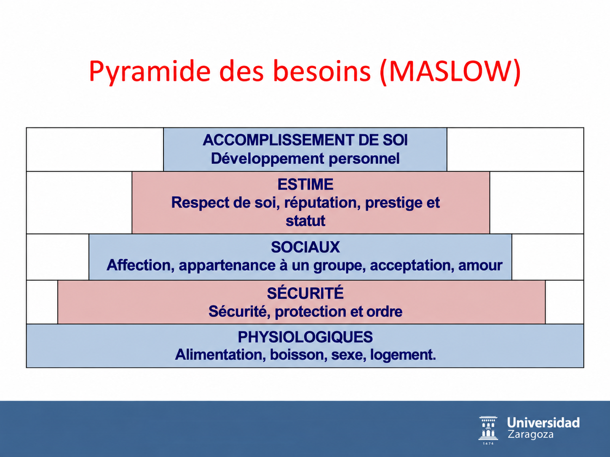
		

		

		
Page 7 · Exemples visuels de produits

			Exemples du support : barres énergétiques Just Loading et Maurten. Sur l’emballage de gauche : « Barre énergétique », « Uniquement des dattes, de la noix de coco et des noix », « Sans gluten », « 100 % naturel, adapté aux végétaliens », 40 g. Les noms de produits et marques sont conservés.
			
		

		

		
Page 8 · Quels besoins expriment ces publicités ?

			Quels besoins reflètent les publicités suivantes ?
			- [Publicité 1](https://www.youtube.com/watch?v=3o8mJADE7ao)
			- [Publicité 2](https://www.youtube.com/watch?v=2iMnnPWcK9w)
			- [Publicité 3](https://www.youtube.com/watch?v=H8D7PjA3S7E)
			- [Publicité 4](https://www.youtube.com/watch?v=6ZERsGrWUHk)
			- [Publicité 5](https://www.youtube.com/watch?v=Tz2643pkb6k)
			- [Publicité 6](https://www.youtube.com/watch?v=3ni8QugZoOY)
			- [Publicité 7](https://www.youtube.com/watch?v=DFvalQ7KUCg)
			*Liens présents dans le support ; le contenu des vidéos n’est pas transcrit dans le PDF.*
		

		

		
Page 9 · Client, consommateur et produit

			**Client :** prend la décision d’achat.
			**Consommateur :** utilise ou consomme le produit.
			**Produit :** tout bien matériel, service ou idée qui possède de la valeur pour le client ou l’utilisateur et qui est susceptible de satisfaire un besoin.
			- **Bien matériel :** objet physique, tangible, consommable ou durable. Exemple : aliments.
			- **Service :** intangible, non stockable, périssable. Exemples : téléphonie, université, restaurant.
			- **Idée :** concept, philosophie, opinion, image. Exemples : programmes des partis politiques, brevets.
		

		

		
Page 10 · Valeur et satisfaction

			**Valeur :** perception subjective de la différence entre les bénéfices tangibles et intangibles apportés par le produit et les coûts, monétaires et non monétaires, supportés par le consommateur.
			**Satisfaction :** différence entre la valeur reçue du produit et les attentes concernant ce que l’on pensait recevoir.
			Illustrations du support : bouteille d’eau et crème adhésive pour prothèses dentaires Corega, sans goût.
		

		

		
Page 11 · Valeur perçue, attentes et satisfaction

			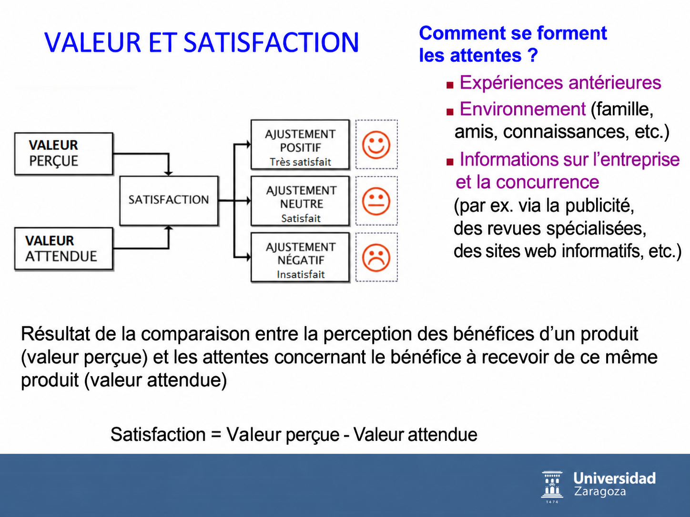
		

		

		
Page 12 · Choisir, créer et communiquer la valeur

			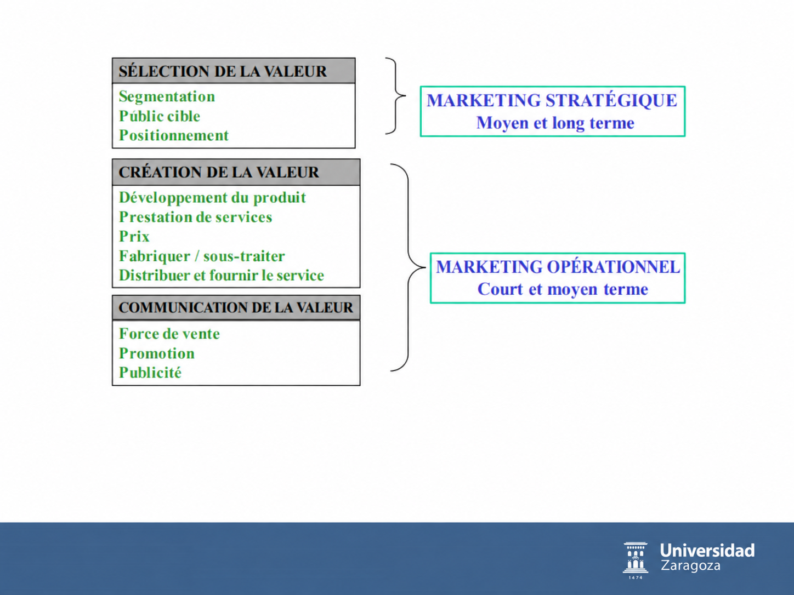
		

		

		
Page 13 · Échange, marché et offre

			**Échange :** acte consistant à obtenir d’une autre personne un produit désiré en lui offrant quelque chose qu’elle apprécie en contrepartie. Conditions nécessaires :
			- Il existe deux parties.
			- Chacune possède quelque chose ayant de la valeur pour l’autre.
			- Chacune est capable de communiquer et de livrer.
			- Chacune peut accepter ou refuser l’échange.
			- Chacune considère approprié de traiter avec l’autre.
			**Marché :** toute personne ou tout groupe avec lequel une relation d’échange peut apparaître. Marchés de consommation ou marchés industriels.
			**Offre :** produits proposés pour satisfaire la demande.
		

		

		
Page 14 · De la transaction à la relation

			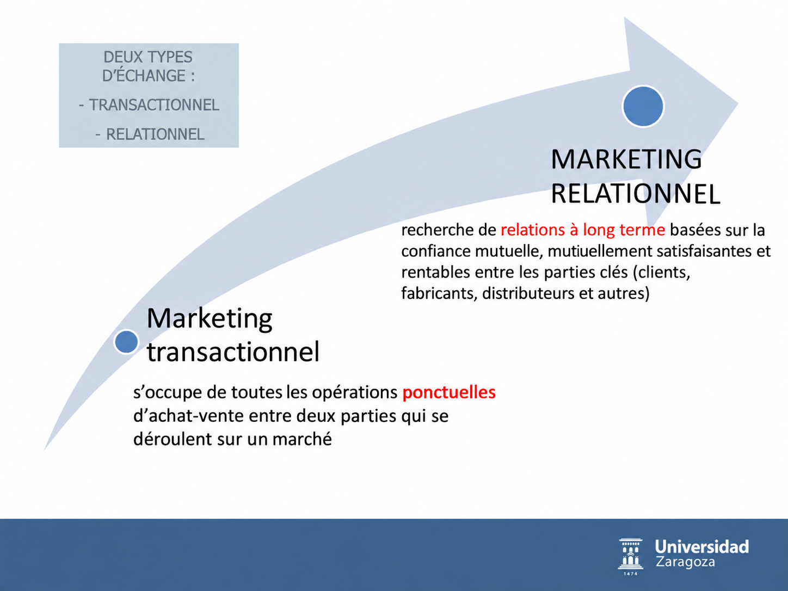
		

		

		
Page 15 · Marketing relationnel

			- Obtenir non seulement une transaction, mais une relation durable avec le client.
			- Les bases de données, Internet et les nouvelles technologies de l’information permettent de le mettre en œuvre sur des marchés de masse.
			- **CRM, Customer Relationship Management : gestion de la relation client.** Mieux connaître le client permet de mieux le satisfaire et de mieux le fidéliser.
			- Marketing **one-to-one : personnalisation**.
		

		

		
Page 16 · Exemples de personnalisation

			Exemples visuels du support : Spotify Wrapped ’25, le bilan personnel de l’année, et différentes vignettes Netflix pour Stranger Things. Les noms des services et de la série restent inchangés.
			
		

		

		
Page 17 · Segmentation du marché

			Subdiviser un marché en sous-ensembles distincts de clients qui se comportent de la même façon ou présentent des besoins similaires. La stratégie de commercialisation est différente pour chaque sous-ensemble.
			**Stratégies :**
			- **Indifférenciée :** servir le marché global avec le produit, sans distinguer les consommateurs.
			- **Différenciée :** lancer un produit différent pour chaque groupe de consommateurs visé.
			- **Concentrée :** travailler sur un seul segment du marché.
			**Variables de segmentation :** géographiques (lieu, zone), démographiques (âge, sexe, revenus, cycle de vie…), psychographiques (personnalité, mode de vie), comportementales (moment d’utilisation, attitude, bénéfices recherchés, degré de fidélité…).
		

		

		
Page 18 · Illustrations de segmentation

			Exemples du support : glaces sans sucre, glaces pour enfants et glaces au chocolat, illustrées par les Simpson ; téléphone Alcatel OneTouch. « Sin azúcar » signifie « sans sucre », « nuevo » signifie « nouveau ».
			[Article cité dans le support](https://elpais.com/economia/2015/11/19/actualidad/1447958733_497448.html).
			
		

		

		
Page 19 · Automobile : stratégie indifférenciée

			**Ford modèle T.** Le support présente Ford comme l’inventeur de la chaîne de montage, ayant développé une automobile standard destinée à l’ensemble du marché à un prix inférieur. Illustrations : Henry Ford, modèle T et logo Ford.
		

		

		
Page 20 · Automobile : stratégie différenciée

			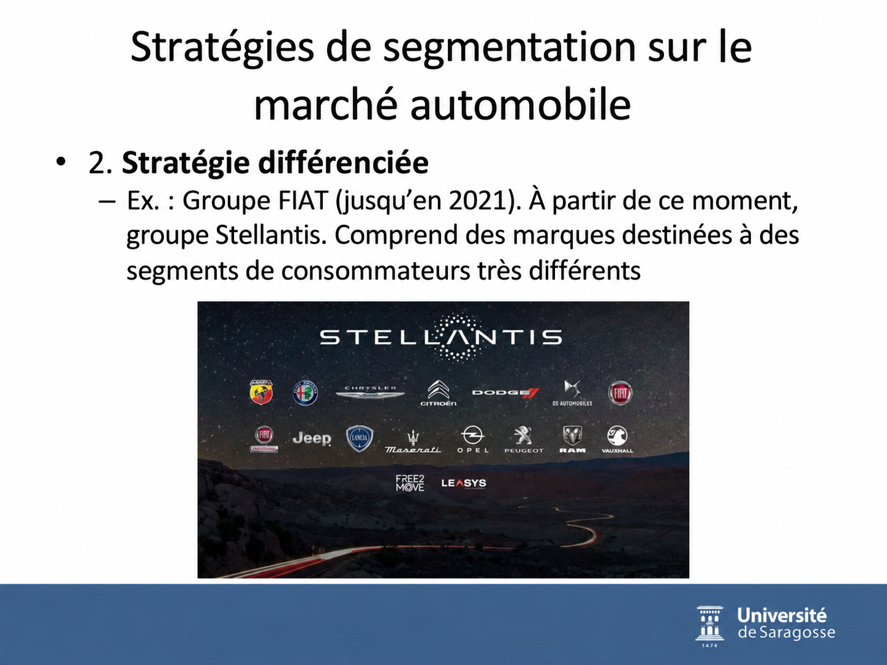
		

		

		
Page 21 · Automobile : stratégie concentrée

			**Rolls-Royce ne fabrique que des automobiles de luxe.**
			- Ses atouts : confort, silence, protection et finitions réalisées à la main.
			- Les modèles sont fabriqués sur commande et payés à l’avance.
			- Ils sont entièrement personnalisés et peuvent inclure toutes sortes d’extravagances.
			Illustrations : automobile et emblème Rolls-Royce.
		

		

		
Page 22 · Du besoin à la satisfaction durable

			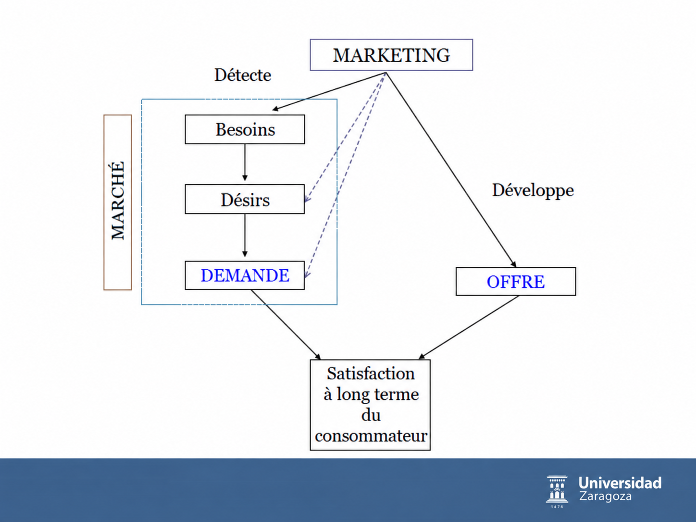
		

		

		
Page 23 · Évolution des orientations marketing

			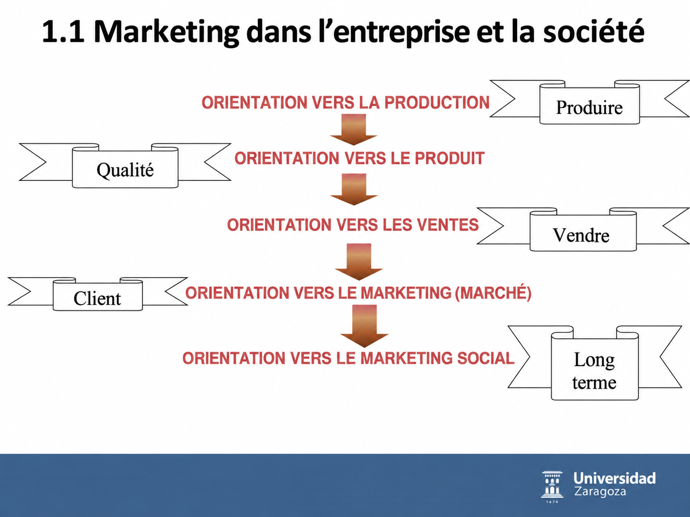
		

		

		
Page 24 · Tableau des orientations

			**Production, jusqu’aux années 1950.** Environnement stable et contrôlable ; demande supérieure à l’offre. Clé : production de masse à faible coût. Fonction dominante : production, capacité et productivité. Marketing limité et passif.
			**Produit, jusqu’aux années 1960.** Concurrence accrue ; équilibre offre-demande. Clé : produits de haute qualité. Fonction dominante : production, perfectionnement du produit. Marketing limité et passif, centré sur la qualité.
			**Vente, années 1950 et 1960.** Offre supérieure à la demande, concurrence, libre-service. Clé : vente agressive. Fonction dominante : direction des ventes et organisation commerciale efficace. Marketing actif, visant à convaincre le consommateur.
			**Marché, philosophie marketing, des années 1970 à aujourd’hui.** Marchés matures et fragmentés, mondialisation, concurrence. Clé : identifier les besoins et les satisfaire mieux que la concurrence. Fonction dominante : marketing, orientation marché et concurrence. Rôle du marketing : identifier besoins et désirs, apporter une valeur nette supérieure.
		

		

		
Page 25 · Exemple visuel : Läderach

			Photographies du support : coffret de chocolats et boutique Läderach, chocolatier suisse.
			
		

		

		
Page 26 · Direction du marketing en ligne

			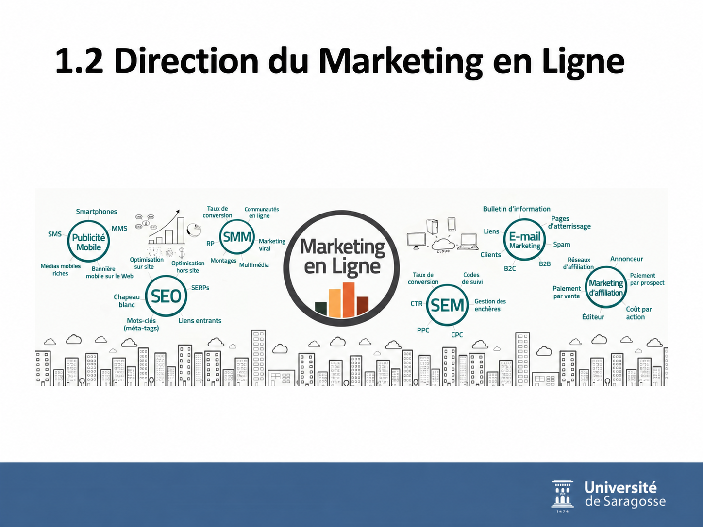
		

		

		
Page 27 · Importance des réseaux sociaux

			Trois apports du point de vue du marketing :
			1. Influence entre consommateurs.
			2. Gestion des connaissances.
			3. Bénéfices relationnels et fidélité accrue.
		

		

		
Page 28 · Influence sur les autres consommateurs

			**Influence acquise, earned.** Les consommateurs peuvent, par leurs commentaires sur les réseaux sociaux, influencer la perception que d’autres consommateurs ont des marques, produits et services (Kozinets, 2002).
			Exemples : réseaux d’évaluation comme Tripadvisor ; commentaires sur Twitter (X), Instagram, etc.
		

		

		
Page 29 · Pouvoir de recommandation

			- **Confiance plus élevée :** les consommateurs préfèrent faire confiance à des sources personnelles et informelles, par exemple d’autres consommateurs, plutôt qu’à de grandes campagnes publicitaires (Bansal et Voyer, 2000).
			- **Caractère non commercial :** généralement, les émetteurs n’ont rien à gagner de mes actions futures (Schiffman et Kanuk, 1997).
			Conséquence : une information plus objective et une source plus fiable.
		

		

		
Page 30 · Avis en ligne et webrooming

			Chiffres cités dans le support :
			- **89 %** des Espagnols consultent des avis en ligne avant d’acheter, étude Skeepers 2024 auprès de 10 000 Espagnols. [Source du support](https://marketing4ecommerce.net/resenas-online/).
			- **75 %** consultent des avis en ligne avant d’acheter dans un magasin physique, Baromètre eCommerce 2024. [Source du support](https://directivosygerentes.es/marketing/noticias-marketing/barometro-ecommerce-2024-opiniones-online).
			- **63 %** regardent comment les marques répondent aux avis négatifs, même étude.
			**ROPO, Research Online, Purchase Offline :** recherche en ligne, achat hors ligne, également appelé **webrooming**.
			*Données reproduites telles que présentées dans le cours, sans actualisation.*
		

		

		
Page 31 · Conséquences pour les entreprises

			- Source de nouveaux clients grâce aux commentaires positifs publiés sur les réseaux sociaux.
			- Entraide entre consommateurs : réduction des coûts des services techniques.
			- Communication entre consommateurs : possibilité de marketing viral, remplaçant en partie de grandes campagnes marketing.
			Conséquence mise en évidence : **diminution des coûts**.
		

		

		
Page 32 · Gestion des connaissances

			Les réseaux sociaux, par les commentaires et évaluations, permettent de connaître les goûts, désirs et besoins des consommateurs qui s’expriment, de segmenter le marché plus efficacement, d’identifier les crises, etc. (Kozinets, 2002).
		

		

		
Page 33 · Études de marché et réclamations

			Une bonne gestion des connaissances passe par :
			**Les études de marché :** favoriser le développement de nouveaux produits, améliorer les produits existants et segmenter les marchés.
			**La gestion des réclamations :** identifier les crises et les utilisateurs influents ; gérer la réputation.
		

		

		
Page 34 · Réseaux sociaux et développement des produits

			Les idées, suggestions et problèmes exprimés par les consommateurs sur les réseaux sociaux peuvent inspirer le développement de nouveaux produits ou aider à améliorer les produits existants.
		

		

		
Page 35 · My Starbucks Idea

			Les clients sont invités à proposer leurs idées pour améliorer l’expérience Starbucks. Chaque idée est évaluée par les autres utilisateurs. Certaines sont mises en œuvre dans les établissements :
			- **277 idées appliquées en cinq ans, de 2008 à 2013.**
			- Aucune récompense n’est versée aux utilisateurs pour leurs idées.
			- Exemples : Wi-Fi gratuit, Hazelnut Macchiato et cartes-cadeaux électroniques.
			**Objectif : co-création**, afin d’obtenir de nouvelles idées et un engagement plus fort envers l’entreprise.
		

		

		
Page 36 · Interface My Starbucks Idea

			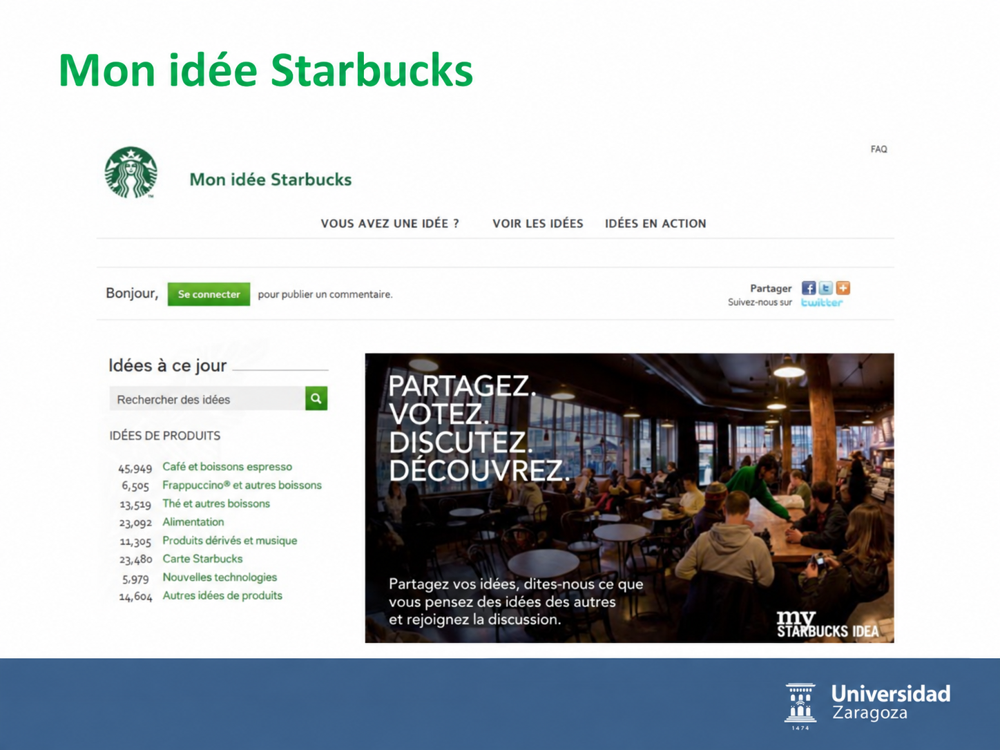
		

		

		
Page 37 · Cinq ans d’idées Starbucks

			
		

		

		
Page 38 · Gestion des réclamations

			Utilisation croissante des réseaux sociaux pour se plaindre et exprimer des opinions négatives sur des produits ou entreprises.
			Le support cite **15 %** reconnaissant s’être plaints sur les réseaux sociaux (eMarketer), **31 %** des consommateurs qui le feraient et jusqu’à **40 %** chez les plus jeunes (NewVoiceMedia).
			**Les réclamations sont, pour la plupart, des opportunités et non des menaces.**
		

		

		
Page 39 · Une réclamation est un trésor

			Le client nous dit gratuitement ce que nous faisons mal : cela facilite la détection des problèmes, leur correction et la prévention des erreurs.
			**Paradoxe du client reconquis :** une réclamation résolue procure des bénéfices qui n’auraient pas été obtenus sans cette réclamation :
			- Satisfaction plus élevée du client à l’origine de la réclamation.
			- Meilleure réputation de l’entreprise.
			- Bouche-à-oreille positif entre consommateurs.
		

		

		
Page 40 · United Breaks Guitars

			**David contre Goliath.** La guitare de David Carroll est endommagée lors d’un voyage avec United Airlines. Après trois mois à réclamer les **3 500 dollars** de sa guitare, il publie sur YouTube une vidéo parodiant la situation et le traitement reçu. Deux suites paraissent ensuite.
			Conséquences indiquées dans le support : plus de **18 millions de vues**, dont **5 millions le premier mois** ; hausse des réclamations, perte de réputation et baisse de **10 %** du cours de l’action les premiers jours.
			*Nom et chiffres conservés tels que présentés dans le support.*
		

		

		
Page 41 · Exemple de crise : Balenciaga

			
		

		

		
Page 42 · Exemple : California Pizza Kitchen

			
		

		

		
Page 43 · Bénéfices relationnels et fidélité

			- **Accroître la confiance du consommateur :** multiplier les contacts entre l’entreprise et le consommateur.
			- **Augmenter les coûts de changement de fournisseur :** développer des liens intangibles entre les membres et créer une barrière à l’entrée de nouveaux concurrents.
			- **Différencier le produit :** créer des liens émotionnels avec les produits de l’organisation ; tout s’organise autour d’eux.
			- Faciliter la création et le développement de la marque.
		

		

		
Page 44 · Exemples de communautés et de marques

			
		

# Direction stratégique {toggle="true" color="blue"}
	**Intitulé original :** Dirección estratégica
	## Chapitre 1 · Avantage concurrentiel et création de valeur {toggle="true"}
		**Source :** Transparencias Tema 1 2024-25.pdf
		

		
Page 1 · Avantage concurrentiel et création de valeur

			Chapitre 1. Direction stratégique.
			© L. Fuentelsaz, J. Gómez et J. Maícas.
		

		

		
Page 2 · Plan et bibliographie

			1.1. Introduction
			1.2. Qu’est-ce qu’un avantage concurrentiel ?
			1.3. Approches de la mesure de l’avantage concurrentiel
			1.4. Bénéfice économique et bénéfice comptable
			1.5. Le triple bilan
			**Bibliographie :** Navas, J. E. et Guerras, L. A. (2015), chap. 2, p. 73–106 ; édition 2022, chap. 3, p. 114–126. Grant, R. (2014), chap. 2, p. 61–91. Barney, J. B. et Hesterly, W. S. (2006), chap. 1, p. 2–31. Rothaermel (2021), chap. 5, p. 154–189 ; p. 144–178 dans la 4e édition, p. 112–135 dans la 3e.
		

		

		
Page 3 · 1.1. Introduction

			1.1. Introduction
			1.2. Qu’est-ce qu’un avantage concurrentiel ?
			1.3. Approches de la mesure de l’avantage concurrentiel
			1.4. Bénéfice économique et bénéfice comptable
			1.5. Le triple bilan
		

		

		
Page 4 · Objectifs

			1. Reconnaître l’importance de créer de la valeur dans l’entreprise.
			2. Identifier l’avantage concurrentiel comme concept central de la stratégie.
			3. Aborder ce concept dans ses différentes dimensions.
			4. Illustrer les différences entre bénéfice comptable et bénéfice économique (boursier).
		

		

		
Page 5 · La création de valeur en pratique

			« Nestlé est la multinationale de l’industrie alimentaire pionnière dans l’adoption d’une stratégie de valeur partagée intégrée à son modèle économique depuis dix ans. »
			« Nous ne fusionnerons avec Sabadell que s’il y a création de valeur. » Onur Genç, directeur général de BBVA.
			« Un indicateur fondamental de notre réussite est la valeur que nous sommes capables de créer pour nos actionnaires à long terme. » Jeffrey P. Bezos.
			« Nous nous sommes engagés à créer de la valeur… à travers le Plan directeur de création de valeur partagée 2020. » Tomás Pascual.
			« La meilleure façon de créer de la valeur au XXIe siècle est de relier la technologie à la créativité. » Steve Jobs.
			Citations et contexte historique reproduits du support.
		

		

		
Page 6 · 1.2. Qu’est-ce qu’un avantage concurrentiel ?

			1.1. Introduction
			1.2. Qu’est-ce qu’un avantage concurrentiel ?
			1.3. Approches de la mesure de l’avantage concurrentiel
			1.4. Bénéfice économique et bénéfice comptable
		

		

		
Page 7 · L’exemple Apple

			Selon les chiffres présentés dans le support, Apple représente :
			- 13 % des unités vendues dans le monde ;
			- 40 % du chiffre d’affaires total du secteur ;
			- 75 % du bénéfice total.
			Ces proportions illustrent la différence entre volume vendu et valeur captée.
		

		

		
Page 8 · Parts des fabricants de smartphones

			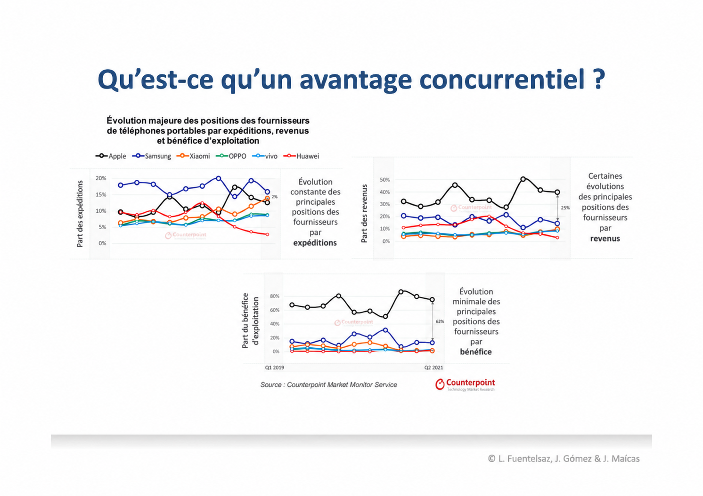
		

		

		
Page 9 · Définition de l’avantage concurrentiel

			Une entreprise possède un **avantage concurrentiel** (*competitive advantage*) par rapport à un ou plusieurs concurrents lorsqu’elle est capable de créer davantage de valeur qu’eux.
		

		

		
Page 10 · Avantage, parité et désavantage

			Un avantage concurrentiel peut être :
			- **Temporaire** : il ne dure qu’une courte période.
			- **Durable** : il se prolonge dans le temps.
			**Parité concurrentielle** : l’entreprise crée autant de valeur que ses concurrents.
			**Désavantage concurrentiel** : elle crée moins de valeur que ses concurrents. Il peut être temporaire ou durable.
		

		

		
Page 11 · Les implications pour les décisions

			1. **Prendre de bonnes décisions.** Obtenir une rentabilité supérieure au coût des ressources utilisées. Les concurrents influencent généralement notre rentabilité. Comment la mesurer : en termes économiques, comptables ou boursiers ?
			2. **Raisonner sur les attentes futures, et non sur le passé.** Le futur est incertain : la rentabilité attendue s’accompagne d’un risque qu’il faut connaître, accepter et, si possible, maîtriser. Les attentes doivent être réalistes et atteignables, les responsables doivent s’engager et des mécanismes de suivi sont nécessaires.
			3. **Mobiliser toute l’organisation.** L’avantage concurrentiel constitue une mission collective.
		

		

		
Page 12 · Deux tâches pour l’équipe dirigeante

			L’avantage concurrentiel suppose un bénéfice ou une rentabilité supérieurs à ceux des autres concurrents du secteur. Il faut donc :
			- mesurer correctement le bénéfice de son entreprise ;
			- le comparer à celui des concurrents ou à une moyenne du secteur.
			Cela conduit aux différentes approches de la mesure de l’avantage concurrentiel.
		

		

		
Page 13 · 1.3. Mesurer l’avantage concurrentiel

			1.1. Introduction
			1.2. Qu’est-ce qu’un avantage concurrentiel ?
			1.3. Approches de la mesure de l’avantage concurrentiel
			1.4. Bénéfice économique et bénéfice comptable
			1.5. Le triple bilan
		

		

		
Page 14 · Trois approches de mesure

			1. La valeur économique.
			2. Le bénéfice comptable.
			3. La valeur pour l’actionnaire.
		

		

		
Page 15 · La valeur économique

			Une entreprise possède un avantage concurrentiel lorsqu’elle crée davantage de valeur économique que ses concurrents.
			La **valeur économique** est la différence entre le bénéfice perçu par le consommateur, c’est-à-dire le montant maximal qu’il est prêt à payer pour le produit (**V**), et le coût de ce produit (**C**).
			**Valeur économique créée = V − C.**
			L’ampleur de l’avantage concurrentiel correspond à la différence entre la valeur créée par l’entreprise et celle créée par ses concurrents.
		

		

		
Page 16 · Création et partage de la valeur

			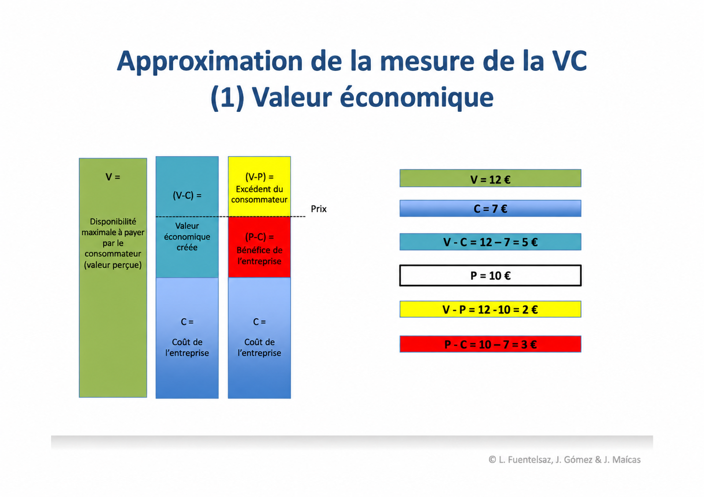
		

		

		
Page 17 · Créer et capter la valeur

			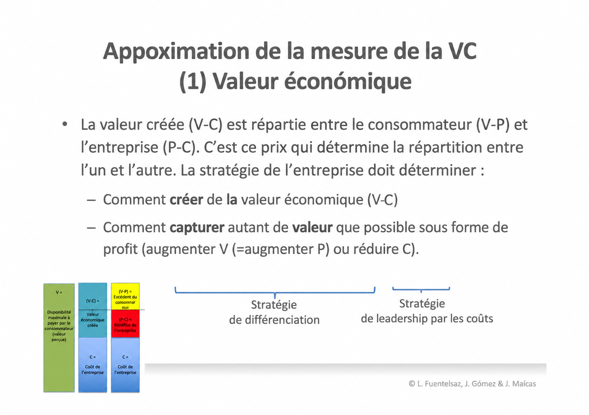
		

		

		
Page 18 · Deux sources d’avantage concurrentiel

			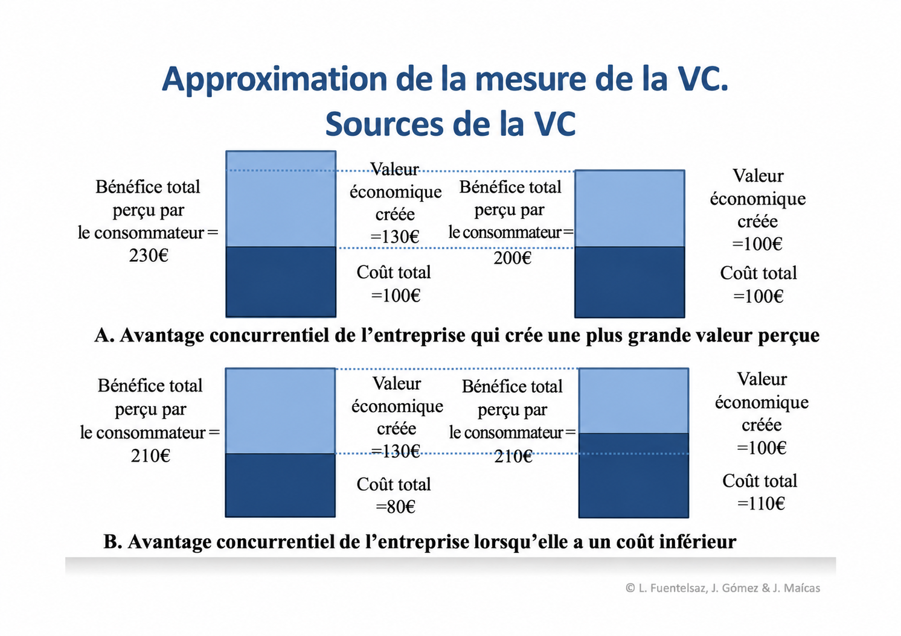
		

		

		
Page 19 · Limites pratiques de la valeur économique

			Comprendre la création de valeur économique est un bon point de départ pour comprendre l’avantage concurrentiel. Toutefois :
			1. Déterminer la valeur d’un produit aux yeux du consommateur n’est pas simple.
			2. Cette valeur n’est pas unique : elle varie selon les préférences, le moment, etc.
			3. Évaluer l’avantage concurrentiel d’une entreprise exige d’estimer la valeur créée par tous ses produits et services, ce qui complique le processus.
		

		

		
Page 20 · Passer à des chiffres utilisables

			Le concept de valeur économique est intuitif et utile pour mesurer l’avantage concurrentiel. En pratique, les dirigeants ont toutefois besoin de **chiffres concrets** (*hard numbers*) pour l’approcher. Deux possibilités :
			- les indicateurs comptables ;
			- les indicateurs boursiers.
		

		

		
Page 21 · Le bénéfice comptable

			Approcher l’avantage concurrentiel à travers la rentabilité comptable consiste à utiliser des mesures standard issues des états financiers publiés par les entreprises.
		

		

		
Page 22 · Indicateurs comptables

			Le support présente les indicateurs suivants sous l’intitulé « indicateurs fondés sur les flux de trésorerie » :
			- bénéfice avant intérêts et impôts ;
			- bénéfice après intérêts et impôts ;
			- bénéfice avant intérêts, impôts, dépréciations et amortissements (**EBITDA**).
		

		

		
Page 23 · Les bénéfices comptables en comparaison

			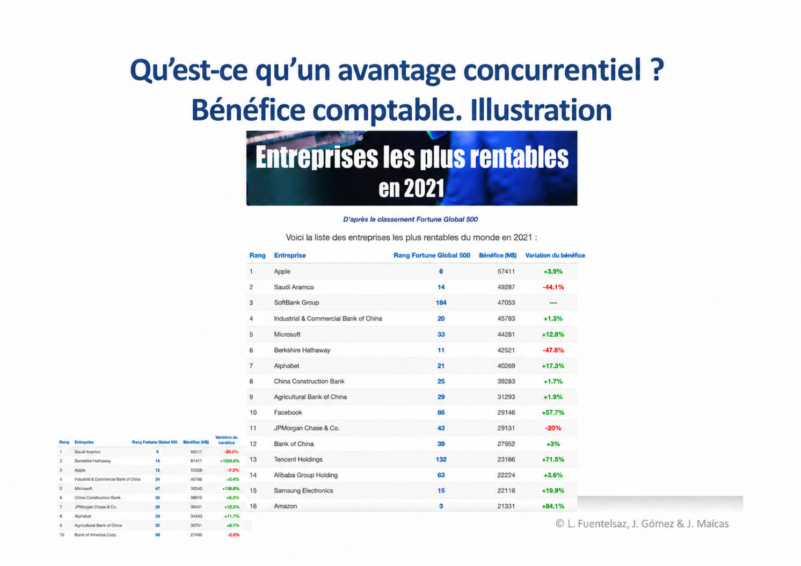
		

		

		
Page 24 · Comparer les bénéfices

			Les chiffres de la page précédente sont-ils directement comparables ?
			**Il faut corriger l’effet de la taille des entreprises.**
		

		

		
Page 25 · Ratios de rentabilité

			**Rentabilité économique (ROA)** = bénéfice avant intérêts et impôts / total de l’actif.
			**Rentabilité financière (ROE)** = bénéfice après intérêts et impôts / capitaux propres.
			**Marge brute** = (ventes − coût des ventes) / ventes.
			**Bénéfice par action (EPS)** = bénéfice après impôts / nombre d’actions.
			**Price earnings ratio (PER)** = valeur de marché par action / bénéfice par action.
			**Flux de trésorerie par action**, selon la formule du support = (bénéfice après impôts + dépréciation) / nombre d’actions.
		

		

		
Page 26 · Tenir compte du temps et du secteur

			Toutes les entreprises sont-elles directement comparables ?
			**Il faut corriger l’effet de l’horizon temporel et du secteur d’activité.**
		

		

		
Page 27 · Évolution de la rentabilité économique

			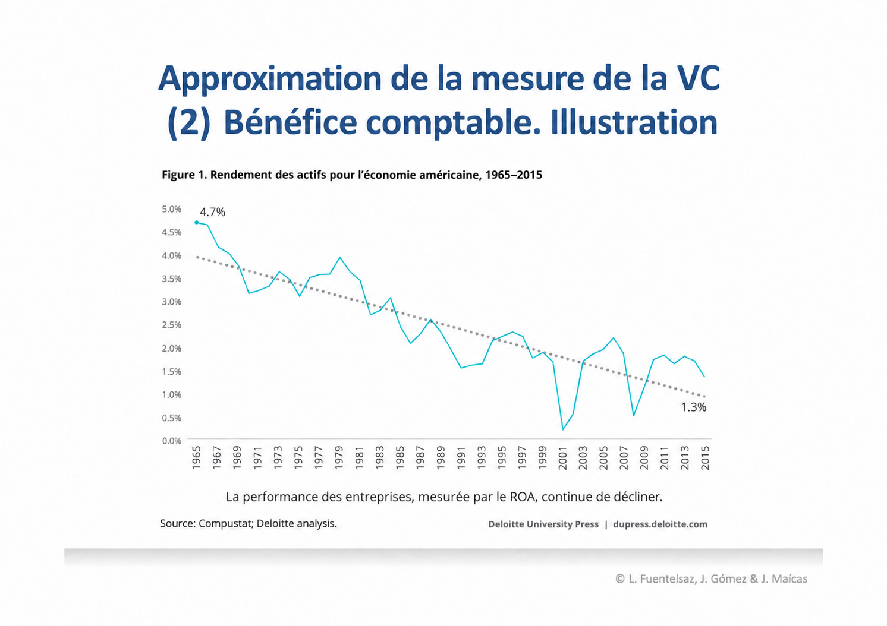
		

		

		
Page 28 · Les dix entreprises Fortune 500 les plus bénéficiaires en 2015

			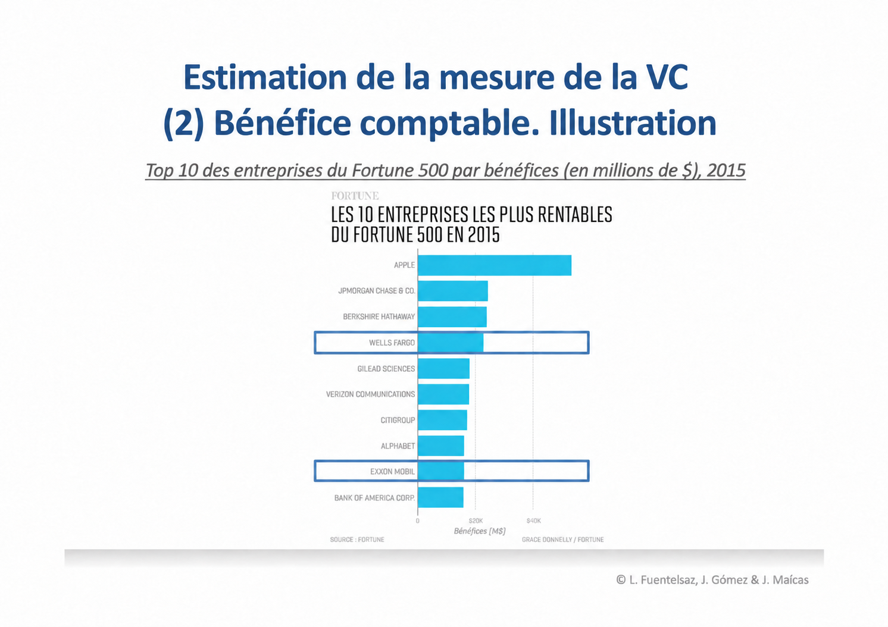
		

		

		
Page 29 · Comparaison 2015 et 2020

			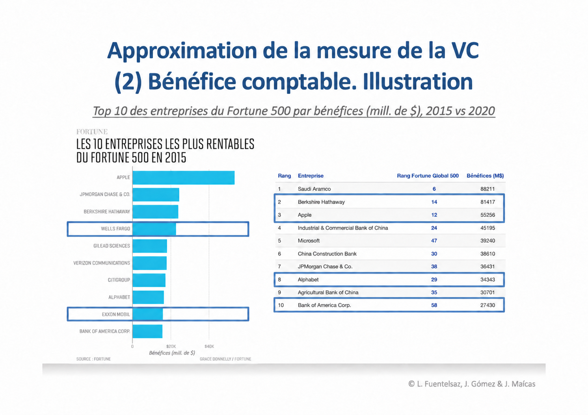
		

		

		
Page 30 · ROI dans l’industrie pharmaceutique

			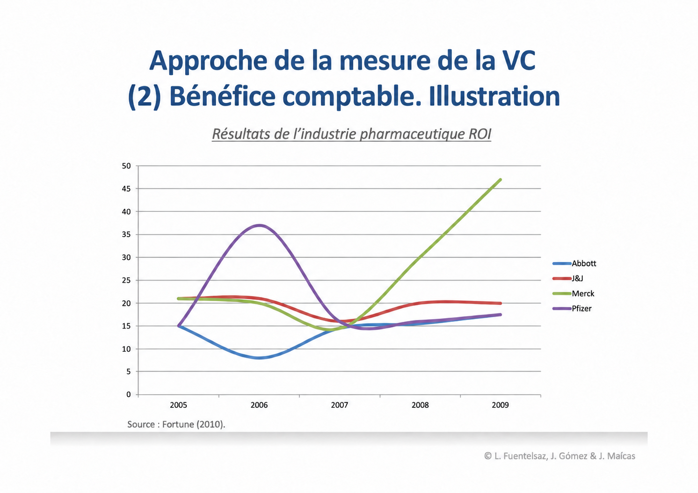
		

		

		
Page 31 · Création ou destruction de valeur

			Si la rentabilité obtenue par une entreprise est **supérieure à son coût du capital**, elle crée de la valeur. Si elle est inférieure, l’entreprise détruit de la valeur.
		

		

		
Page 32 · Limites des indicateurs comptables

			- Les données comptables sont historiques : le passé ne garantit rien pour l’avenir.
			- L’information économique est disponible avec un retard important. Utiliser uniquement l’information comptable pour prendre des décisions stratégiques revient à conduire en regardant dans le rétroviseur.
			- La comptabilité ne prend pas en compte les éléments hors bilan.
			- Le support souligne qu’elle privilégie les actifs tangibles et ne reflète pas des actifs tels que la réputation, le service client ou la capacité à développer une technologie, alors que l’importance relative des actifs tangibles diminue.
			La formulation du support sur les actifs est simplificatrice : le point pédagogique porte sur les actifs immatériels absents ou insuffisamment reflétés dans les comptes.
		

		

		
Page 33 · La valeur pour l’actionnaire

			- Pour l’actionnaire, ce qui compte est la rentabilité du capital investi : **hausse du cours de l’action + dividendes reçus**.
			- Contrairement aux données comptables, ce rendement est un indicateur externe.
			- L’idée sous-jacente est que le cours de l’action intègre les informations sur le passé, la situation actuelle et les perspectives futures de l’entreprise : c’est l’**hypothèse d’efficience des marchés**.
			- Les investisseurs ajustent leurs anticipations au fil du temps.
		

		

		
Page 34 · Évolution des cours des laboratoires

			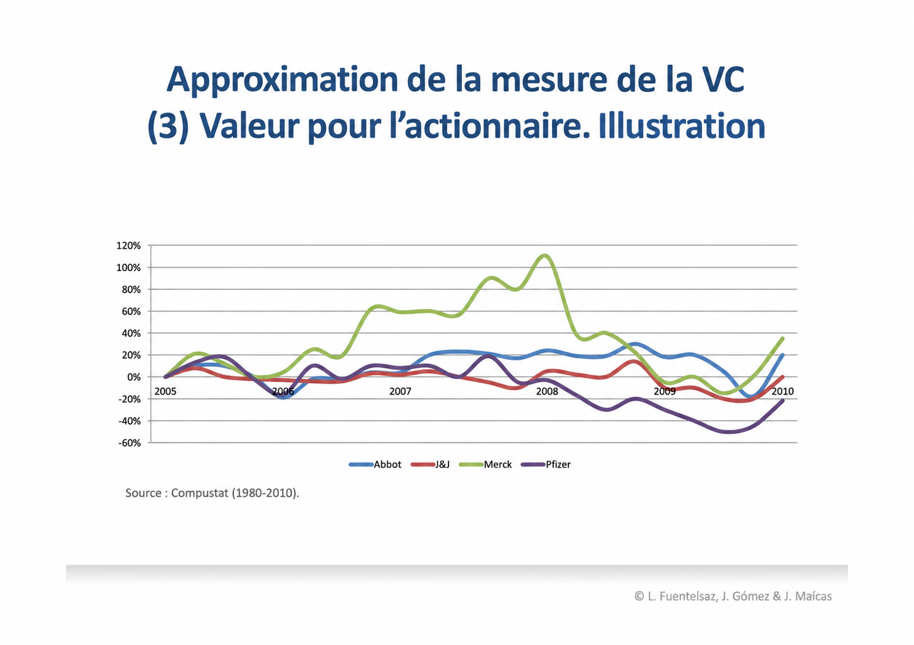
		

		

		
Page 35 · ROI et cours boursiers

			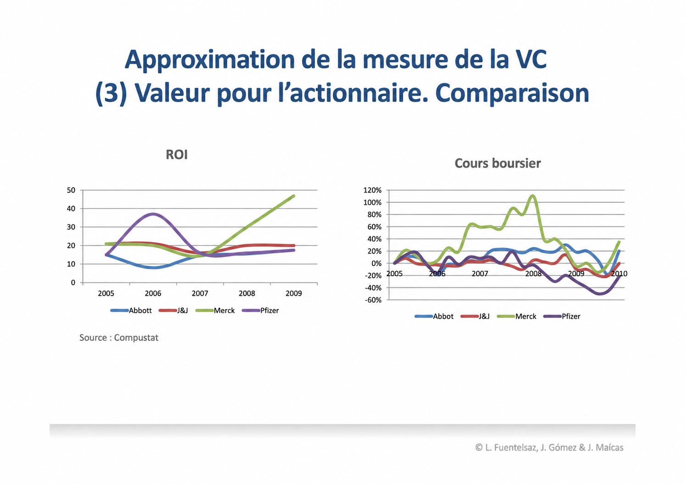
		

		

		
Page 36 · Évolution des principales entreprises

			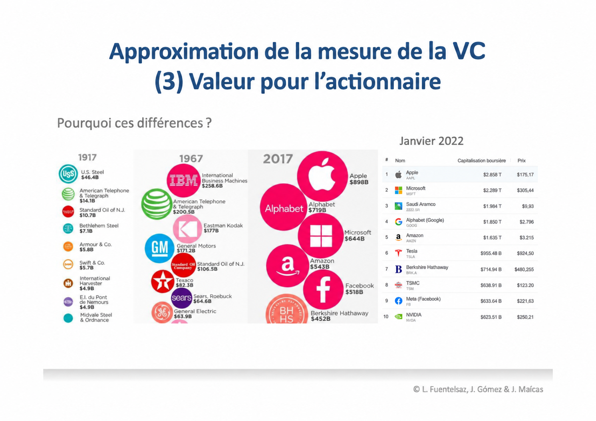
		

		

		
Page 37 · Pourquoi ces différences ?

			Il y a cinquante ans, l’activité des entreprises reposait principalement sur les actifs physiques et la fabrication et la distribution de produits matériels : électroménager, voitures, énergie, etc.
			Aujourd’hui, les plateformes numériques, les réseaux virtuels et le traitement des données prennent une place croissante.
		

		

		
Page 38 · Valeur comptable et valeur non inscrite au bilan

			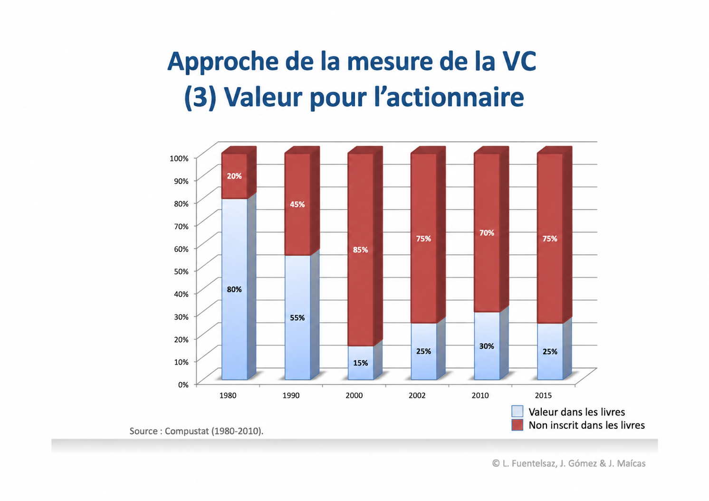
		

		

		
Page 39 · L’importance des actifs immatériels

			En Espagne, selon l’étude IVIE citée, les actifs immatériels sont passés de **28 % des actifs productifs en 2004 à 34 % en 2011**. Leur poids reste inférieur à celui observé dans d’autres pays européens, d’où un potentiel de croissance.
			« Les actifs immatériels sont à l’économie de la connaissance ce que les machines sont à l’économie manufacturière. » Claudia Canals, La Caixa.
			Quels actifs ? Le capital intellectuel ; l’information (bases de données et logiciels) ; la connaissance (R&D et innovation, expérience, brevets, savoir-faire des personnes) ; le capital organisationnel (talents spécifiques, production flexible, capacité de coordination et de motivation).
		

		

		
Page 40 · Conséquences pour le financement

			Les banques doivent adapter leurs modèles d’évaluation et de supervision à ce nouveau profil des PME. « Le risque plus élevé des actifs immatériels entraînera une augmentation du coût de financement des entreprises. » J. Maudós.
			Ces actifs sont généralement bien valorisés par les investisseurs en actions, mais rarement pris en compte sur les marchés du crédit et de la dette, pourtant particulièrement importants pour les PME espagnoles. Ce problème deviendra de plus en plus visible. V. Salas.
		

		

		
Page 41 · Limites des indicateurs boursiers

			- Les cours sont très volatils, ce qui complique l’évaluation des résultats, au moins à court terme.
			- Ils dépendent de facteurs macroéconomiques : croissance, taux d’intérêt, inflation, etc.
			- Le comportement des prix peut parfois être irrationnel.
		

		

		
Page 42 · Conflits d’intérêts et horizon temporel

			Un conflit entre actionnaires et dirigeants peut conduire à sacrifier la valeur à long terme pour des gains à court terme. Selon Asker et al. (2013), les entreprises cotées :
			- investissent moins : **4,4 % de leurs actifs**, contre **6,8 %** pour un groupe d’entreprises comparables ;
			- investissent moins en R&D, activité plus incertaine ;
			- distribuent une proportion plus élevée de dividendes.
			La maximisation de la valeur pour l’actionnaire doit-elle être le cadre de référence ? Les actionnaires sont-ils les seuls propriétaires à considérer ? Qu’en est-il des salariés, fournisseurs, clients et détenteurs d’obligations ?
		

		

		
Page 43 · Conclusions sur les mesures

			Les indicateurs comptables et boursiers ont des limites, mais permettent d’approcher la création de valeur.
			- Les indicateurs comptables, malgré leurs imperfections, constituent un point de départ important pour analyser l’avantage concurrentiel.
			- À moyen et long terme, les indicateurs boursiers les complètent : ils reflètent notamment les attentes futures et la valeur des actifs immatériels.
			**Problème : toutes les entreprises ne sont pas cotées.** D’où la distinction entre bénéfice comptable et bénéfice économique.
		

		

		
Page 44 · 1.4. Bénéfice économique et comptable

			1.1. Introduction
			1.2. Qu’est-ce qu’un avantage concurrentiel ?
			1.3. Approches de la mesure de l’avantage concurrentiel
			1.4. Bénéfice économique et bénéfice comptable
			1.5. Le triple bilan
		

		

		
Page 45 · Le bénéfice comptable suffit-il ?

			Supposons des marchés efficients : bénéfice économique = bénéfice boursier.
			Le bénéfice comptable mesure-t-il la création de valeur ? Inclut-il tous les coûts supportés ? Fournit-il suffisamment d’informations pour prendre des décisions stratégiques ?
		

		

		
Page 46 · Les coûts pertinents

			**Bénéfice comptable = valeur des biens produits − coût explicite des ressources utilisées − amortissements.**
			Inclut-il tous les coûts pertinents ?
			- Coût d’utilisation du capital.
			- Investissement dans les actifs immatériels.
			- Dépréciation économique.
			- Plus-values et moins-values des actifs.
		

		

		
Page 47 · Mesurer le bénéfice économique

			On utilise des indicateurs qui corrigent le bénéfice comptable afin d’approcher la véritable création de rentes économiques.
			**Bénéfice économique = valeur des biens produits − coût de toutes les ressources utilisées.**
			**Bénéfice comptable = valeur des biens produits − coût explicite des ressources utilisées − amortissements.**
		

		

		
Page 48 · Le coût du capital

			Toutes les ressources utilisées par l’entreprise, humaines, physiques, financières ou en capital, ne reçoivent pas le même traitement.
			Le **coût du capital** est la rémunération que l’entreprise doit verser aux apporteurs de capitaux pour qu’ils investissent. C’est la rentabilité minimale nécessaire pour satisfaire deux parties prenantes importantes : les intermédiaires financiers et les propriétaires.
			Une entreprise est attractive si sa rentabilité dépasse ce coût. Elle obtient alors un bénéfice économique positif, dit extraordinaire ; le support rattache cette situation à l’avantage concurrentiel durable.
		

		

		
Page 49 · Coût moyen pondéré du capital

			**CMPC (WACC) = coût moyen de la dette × (dette / actif) + coût des capitaux propres × (capitaux propres / actif).**
			Le coût moyen de la dette est ajusté de l’impôt comme indiqué à la page suivante.
			Une rentabilité supérieure au coût du capital permet d’attirer des capitaux supplémentaires, propres ou empruntés. L’entreprise dégage alors un bénéfice économique supérieur à la normale.
		

		

		
Page 50 · Coût de la dette après impôt

			Le coût moyen de la dette représente le taux moyen payé lorsque l’entreprise finance ses investissements par emprunt. Dans le cadre présenté par le support, les charges financières sont déductibles de l’impôt sur les sociétés : on tient donc compte du taux marginal d’imposition.
			**Coût moyen de la dette après impôt = coût de la dette × (1 − taux marginal d’imposition).**
		

		

		
Page 51 · Coût des capitaux propres

			Les capitaux propres n’ont pas de coût explicite, mais ont un **coût d’opportunité** : le revenu que l’entreprise ou l’actionnaire aurait obtenu en les plaçant dans un autre investissement.
			**Coût des capitaux propres = taux sans risque + (rentabilité du marché − taux sans risque) × bêta.**
		

		

		
Page 52 · Estimer le coût du capital

			Le calcul n’est pas simple, surtout pour une entreprise non cotée. Pour une entreprise cotée, on peut s’appuyer sur :
			- **La notation de crédit**, qui apprécie la capacité à rembourser la dette. Plus le risque de défaut est élevé, moins la note est bonne.
			- **Le taux marginal d’imposition (t).**
			- **Le bêta**, présenté dans le support comme un paramètre reliant la valeur du titre à celle du marché, relativement facile à déterminer pour un titre coté.
			- **Le taux de rentabilité sans risque**, approché par le rendement de la dette à long terme.
			- **La rentabilité du marché** sur les années étudiées.
		

		

		
Page 53 · Échelles de notation de crédit

			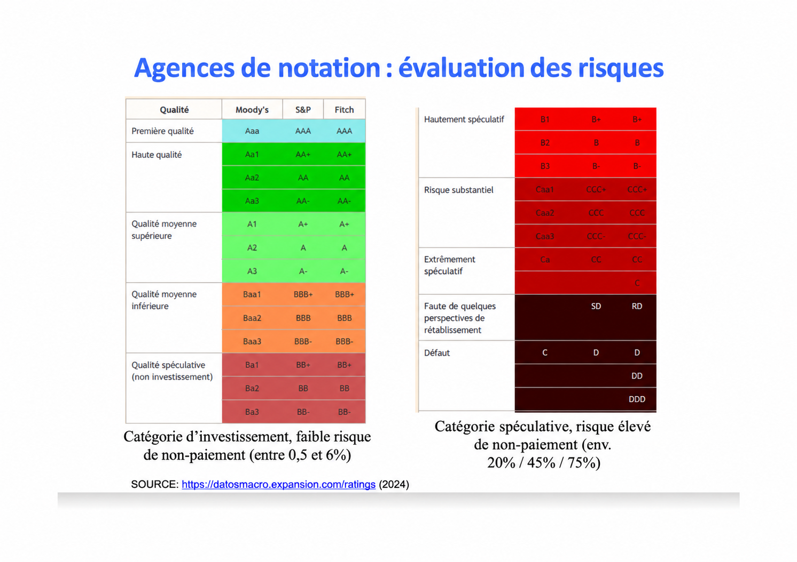
		

		

		
Page 54 · Notations des pays en septembre 2024

			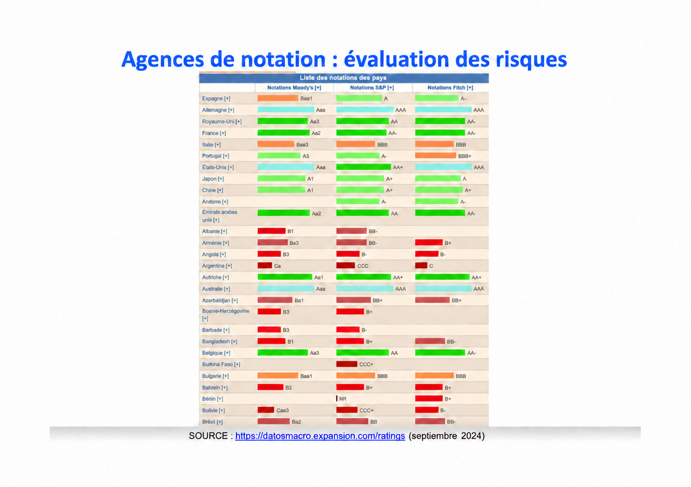
		

		

		
Page 55 · Notation du Royaume d’Espagne, données 2024

			**Moody’s** : note à long terme Baa1 ; perspective positive ; note à court terme P-2 ; dernière révision le 15/03/2024.
			**Standard & Poor’s** : note à long terme A ; perspective stable ; note à court terme A-1 ; dernière révision le 15/03/2024.
			**Fitch** : note à long terme A− ; perspective stable ; note à court terme F1 ; dernière révision le 17/05/2024.
			Données historiques du support.
		

		

		
Page 56 · Exercice : calcul du CMPC

			Source : Barney, J. B. et Hesterly, W. (2012).
			Une entreprise notée **BBB** supporte un coût de dette avant impôt de **9 %** et un taux marginal d’impôt sur les sociétés de **30 %**. Le taux sans risque est de **6 %**, la rentabilité moyenne du marché de **10 %** et le bêta de **1,2**. La dette représente **40 %** du financement.
			**Calculer le coût moyen pondéré du capital.**
		

		

		
Page 57 · Correction du calcul

			- Coût de la dette après impôt : **9 × (1 − 0,30) = 6,3 %**.
			- Coût des capitaux propres : **6 + (10 − 6) × 1,2 = 10,8 %**.
			- Le coût des capitaux propres n’étant pas fiscalement déductible dans cet exemple, son montant avant et après impôt reste identique.
			- Avec 40 % de dette et 60 % de capitaux propres : **CMPC = 0,4 × 6,3 + 0,6 × 10,8 = 9,00 %**.
			La structure de financement réelle peut être beaucoup plus complexe, mais cette procédure fournit une approximation raisonnable du CMPC. Source : Barney et Hesterly (2012).
		

		

		
Page 58 · 1.5. Le triple bilan

			1.1. Introduction
			1.2. Qu’est-ce qu’un avantage concurrentiel ?
			1.3. Approches de la mesure de l’avantage concurrentiel
			1.4. Bénéfice économique et bénéfice comptable
			1.5. Le triple bilan
		

		

		
Page 59 · Créer une valeur compatible avec le bien-être

			« Parler des affaires, c’est parler de la manière de créer de la valeur, ce qui, en soi, n’est pas mauvais… Il nous faut simplement commencer à nous demander si la valeur que nous voulons créer est compatible avec le bien-être social et environnemental. »
			Peter Senge, MIT.
		

		

		
Page 60 · Au-delà de l’actionnaire

			- Dans des marchés imparfaits et un contexte incertain, maximiser la valeur pour l’actionnaire devient plus complexe. Des mécanismes de contrôle interne sont nécessaires.
			- La rémunération variable des dirigeants a fortement augmenté, souvent avec des formules liées à la hausse du cours des actions, mais pas à leur baisse. Cela peut favoriser des mécanismes pervers : privilégier les bénéfices à court terme et sacrifier les gains futurs pour satisfaire les attentes du marché. Le problème est particulièrement visible dans les entreprises cotées.
			- Les salariés, fournisseurs, clients et la société ont également des relations contractuelles avec l’entreprise ou subissent les effets de ses décisions.
			- Le débat sur l’objectif que doivent poursuivre les entreprises reste ouvert.
		

		

		
Page 61 · Trois dimensions de la performance

			On demande de plus en plus aux dirigeants du XXIe siècle des résultats **économiques, sociaux et écologiques**.
			Les interactions entre ces trois dimensions augmentent : les facteurs non économiques influencent davantage les résultats. Adopter une démarche proactive sur les dimensions non économiques peut donc aussi avoir un intérêt économique.
		

		

		
Page 62 · Les trois rentabilités et la stratégie durable

			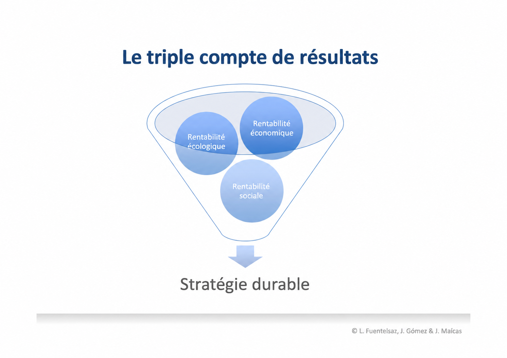
		

		

		
Page 63 · Définition du triple bilan

			Le **triple bilan** (*triple bottom line*) est une vision de l’activité qui associe les objectifs économiques classiques au respect des valeurs éthiques, des personnes et de l’environnement.
			- Satisfaire de manière équilibrée les différentes attentes des parties prenantes.
			- S’engager à contribuer positivement et de façon significative au développement social durable de la communauté, en intégrant les nouvelles préoccupations sociales et environnementales aux préoccupations commerciales et économiques traditionnelles.
			- Adopter une vision à plus long terme, davantage liée à la création de richesse qu’à la seule obtention d’un bénéfice.
		

		

		
Page 64 · Les trois responsabilités

			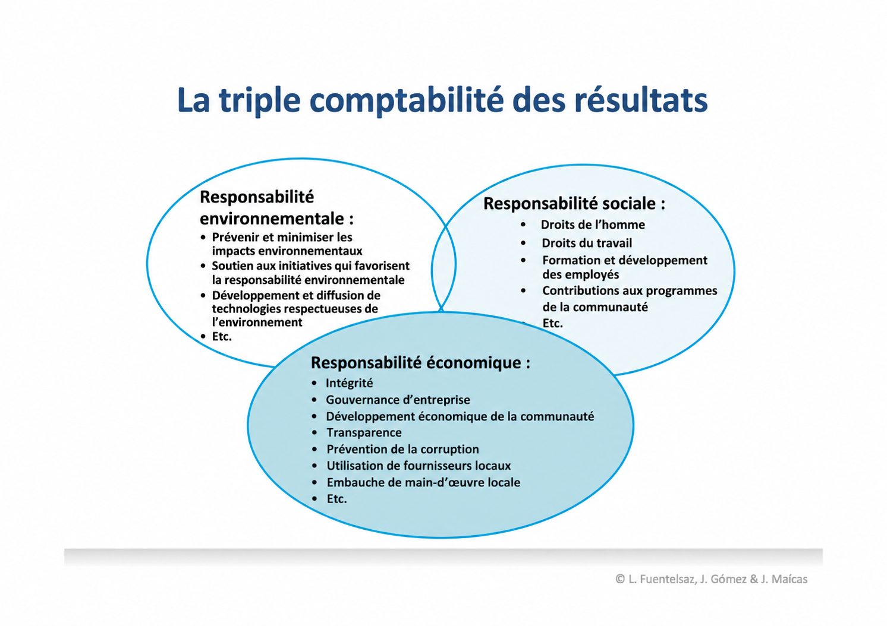
		

		

		
Page 65 · Exemple Acciona

			Illustration du triple bilan avec Acciona.
			[Vidéo indiquée dans le support](https://www.youtube.com/watch?v=08FzQvuxevY).
		

		

		
Page 66 · Acciona : indicateurs du triple bilan

			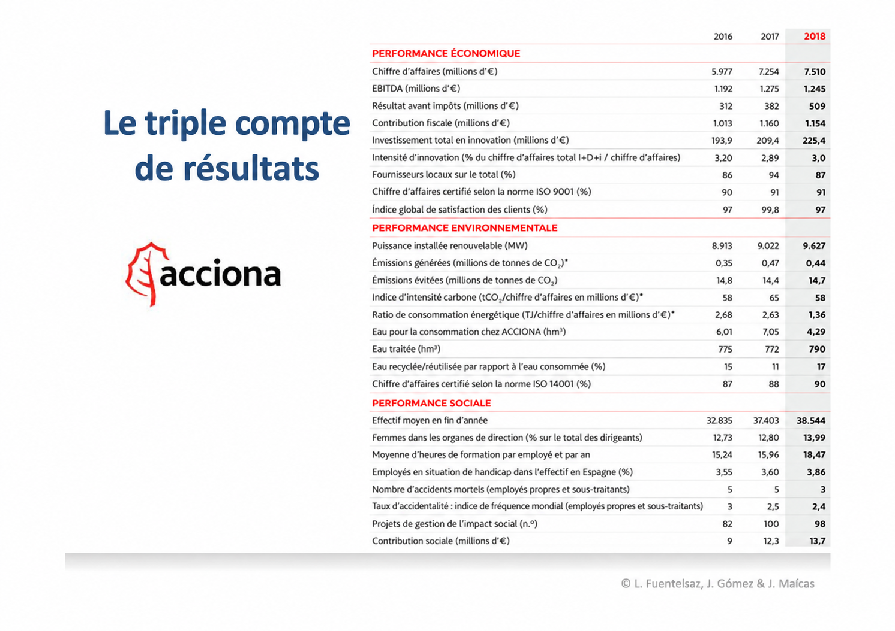
		

		

		
Page 67 · Fin du chapitre

			Chapitre 1. Avantage concurrentiel et création de valeur.
			Direction stratégique.
			© L. Fuentelsaz, J. Gómez et J. Maícas.
		

	## Chapitre 2 · Stratégie et gestion {toggle="true"}
		**Source :** T2  Estrategia y Gestión.pdf
		

		
Page 1 · Introduction au management

			Introduction à l’administration et à la gestion des organisations.
		

		

		
Page 2 · Fonction du management

			Résoudre le problème organisationnel de l’entreprise :
			- diviser le travail pour profiter des avantages de la division du travail et de la spécialisation ;
			- motiver les détenteurs de ressources pour qu’ils accomplissent leur travail ;
			- coordonner le fonctionnement de l’ensemble.
		

		

		
Page 3 · Évolution du management

			Le management varie selon les sociétés et au fil du temps. La dynamique du changement organisationnel repose sur l’adaptation et l’évolution pour gérer efficacement :
			- rationalité de l’imitation des solutions efficaces ;
			- passage du global au régional puis au local ;
			- mise en valeur des techniques de gestion.
			Une obsolescence fonctionnelle peut apparaître.
		

		

		
Page 4 · Management et entreprise

			**3. Le management et le concept d’entreprise.** Il n’est pas « visible » dans les documents comptables ni dans les comptes annuels. Il repose sur la qualité des ressources humaines.
			**4. Le système de management.** Il repose sur la conception d’étapes ou de phases. Il dépend de la réalisation des objectifs des détenteurs de ressources.
		

		

		
Page 5 · Le gestionnaire

			**5. Concept d’administrateur ou de gestionnaire.** Il est responsable du travail d’autres personnes : dirigeant, cadre, chef, gérant, responsable… Au niveau le plus élevé, il s’agit de l’entrepreneur.
			Il doit tenir compte du problème de motivation :
			- les différents détenteurs de ressources ont des objectifs différents ;
			- leur collaboration est interne ou externe selon les contrats ;
			- il faut rechercher la convergence des objectifs.
		

		

		
Page 6 · Le cycle de management

			**6. Planification et contrôle.**
			- Planification : objectifs et stratégies. L’organisation détermine les ressources matérielles et humaines.
			- Contrôle : retour d’information (*feedback*).
			La direction conçoit le système : grandes lignes de coordination et de motivation, type de direction à adopter.
			Le travail quotidien d’impulsion consiste à coordonner l’information, négocier, décider, mettre en œuvre, vérifier… puis recommencer.
		

		

		
Page 7 · Le système d’information

			**7. Système d’information.** La qualité du management dépend de la quantité, de la qualité et de la disponibilité au bon moment de l’information, interne ou endogène, externe ou exogène.
			**8. Flux d’information en direction participative par objectifs (DPPO / PMBO).**
			1. Flux ascendant : propositions.
			2. Modélisation et négociation.
			3. Prise de décision et mise en œuvre.
			4. Flux descendant : plan.
			5. Révision : nouveau flux ascendant, etc.
		

		

		
Page 8 · La planification

			La planification.
		

		

		
Page 9 · Définition de la planification

			Première tâche du management, la planification conçoit l’avenir à l’avance. Elle produit des documents précisant **qui, quoi, quand, où et comment**.
			Elle comporte des risques et n’est pas une science exacte. L’alternative est le tâtonnement par essais et erreurs : son coût est-il supportable ?
			Elle repose sur l’analyse de la réalité et de la destination souhaitée. Elle aide à distinguer l’essentiel du secondaire.
		

		

		
Page 10 · Classification des plans

			**Selon leur concept :** buts, objectifs, politiques, règles, procédures, stratégies, programmes, budgets.
			**Selon le domaine ou le contenu :** finance, marketing, certification de la qualité ; expansion, diversification, redressement ; logement, éducation, santé, infrastructures.
			**Selon leur nature et leur horizon :** plans courants, annuels ou à court terme ; plans d’investissement, structurels ou à long terme.
		

		

		
Page 11 · Étapes et critères de décision

			**3. Étapes de la planification :** diagnostic (FFOM / SWOT, DAFO en espagnol ; TOWS), fixation des objectifs, définition et évaluation des lignes d’action, sélection, plans dérivés et budgétisation.
			**4. Critères de décision : considérations éthiques.** Justice, équité et efficience.
		

		

		
Page 12 · Avantages et limites

			**5. Avantages.** Un processus ordonné et systématique, du plus général au plus concret. Une prise de conscience des besoins de formation et une attitude positive face aux changements.
			**6. Limites.**
			- Endogènes : inerties culturelles, rigidités du personnel…
			- Exogènes : rigidités culturelles, sociales et des marchés ; évolution rapide de la technologie ou de la conjoncture.
		

		

		
Page 13 · Mettre la planification en place

			**7. Mise en œuvre.** Impulsion de la direction générale. Création d’un département ou recours à un prestataire pour concevoir le système. Cela peut, et souvent doit, s’accompagner d’une restructuration.
			**8. Techniques de planification.** Planification simultanée et successive.
		

		

		
Page 14 · Organisation, direction et contrôle

			Organisation, direction et contrôle.
		

		

		
Page 15 · L’organisation

			Équipes de personnes, ressources et interactions entre elles.
			Principes d’organisation verticaux et horizontaux. Les structures organisationnelles appliquent ces principes : structures hiérarchiques, fonctionnelles, mixtes, matricielles et divisionnelles.
			Systèmes de communication et organigrammes.
		

		

		
Page 16 · La direction et le contrôle

			**2. La direction : l’intelligence du système.**
			Types de direction : planifiée ou guidée par les événements ; autoritaire ou participative ; bureaucratique ou flexible ; par exception.
			**3. Le contrôle.** Comparaison entre ce qui était prévu et ce qui a été obtenu : contrôle « normal » ou a posteriori.
		

		

		
Page 17 · Phases du contrôle

			1. Établir des standards.
			2. Mesurer ou comparer.
			3. Corriger les écarts.
			Sélectionner ce que l’on contrôle en fonction du rapport coût/bénéfice. Appliquer le principe d’exception.
			Trois causes possibles des erreurs : mauvaise planification, mauvaise exécution, accident.
		

		

		
Page 18 · Systèmes de contrôle

			Le temps est une variable critique : délai entre l’apparition de l’erreur et sa correction.
			**Contrôle anticipé :** décomposer l’horizon en moyen, court et très court terme, jusqu’au temps réel.
			**Contrôle préventif :** essayer de résoudre les problèmes avant qu’ils ne surviennent.
			Le contrôle a priori est la base de la qualité totale.
		

		

		
Page 19 · Types de contrôle et rôle des dirigeants

			**6. Types de contrôle.** Il en existe autant que d’objectifs et de plans : compte de résultat, ROI, ROE, contrôle budgétaire ; rapports, statistiques, graphes ; audits internes, comptables, opérationnels…
			**7. Les dirigeants et le contrôle.** L’institutionnaliser et lui donner un calendrier fixe. Adopter une approche positive tournée vers l’efficience. La négligence devrait être la dernière cause envisagée.
		

		

		
Page 20 · Objectifs et tableau de bord

			Objectifs et tableau de bord.
		

		

		
Page 21 · Objectifs et bénéfice

			**1. Les objectifs.** Base de la planification, ils quantifient précisément le plan de l’entreprise, évitent la dispersion des efforts et participent à la motivation et aux incitations.
			**2. Le bénéfice.** Objectif de survie du facteur humain ; rapports entre propriétaires et travailleurs ; possibilité de croissance et capacité à résister à une récession.
		

		

		
Page 22 · Objectifs généraux et caractéristiques

			**3. Objectifs généraux.** Rentabilité, bénéfice, productivité ; croissance et développement harmonieux ; grande ou petite entreprise ; cas des entreprises publiques déficitaires.
			**4. Caractéristiques.** Les objectifs doivent être quantifiés, légaux, réalistes, couvrir les aspects fondamentaux du travail, être hiérarchisés, décomposés, coordonnés, publics et assortis d’un calendrier. Leur élaboration optimale est participative.
		

		

		
Page 23 · Schéma Du Pont

			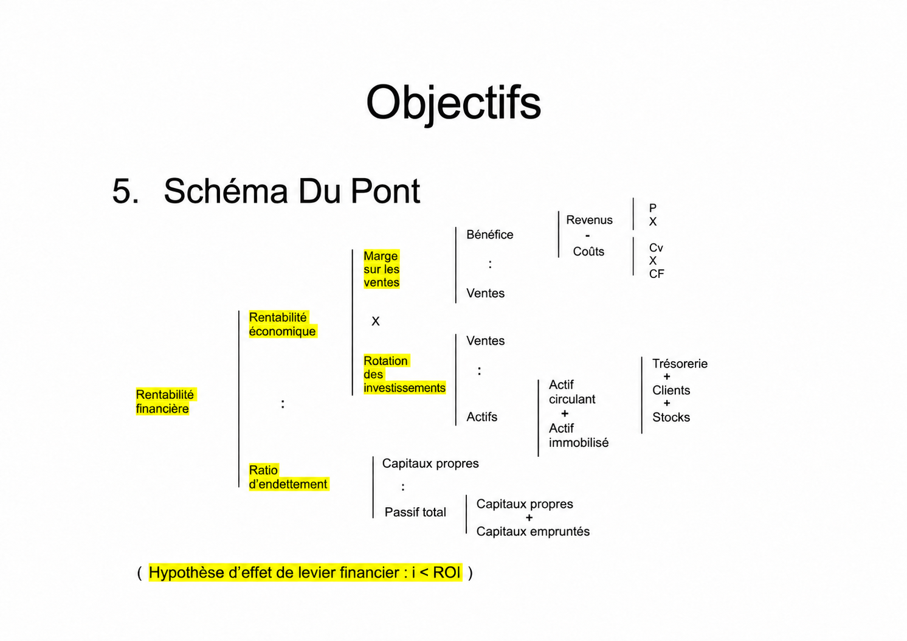
		

		

		
Page 24 · Du Pont : effets des variations

			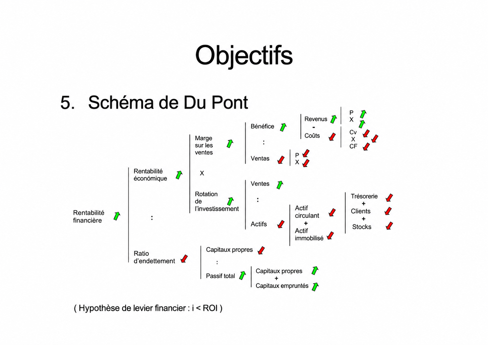
		

		

		
Page 25 · Du Pont : cohérence des leviers

			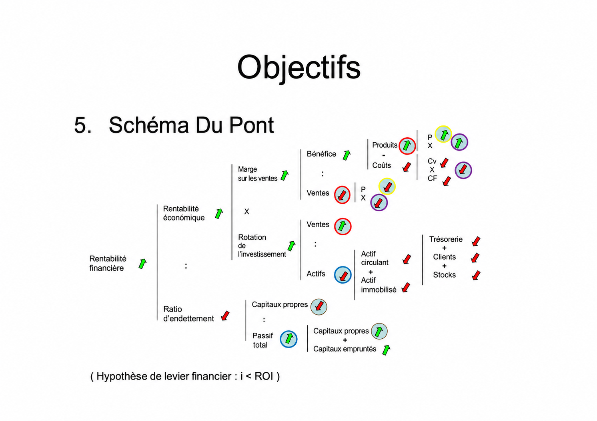
		

		

		
Page 26 · Du Pont : relations algébriques

			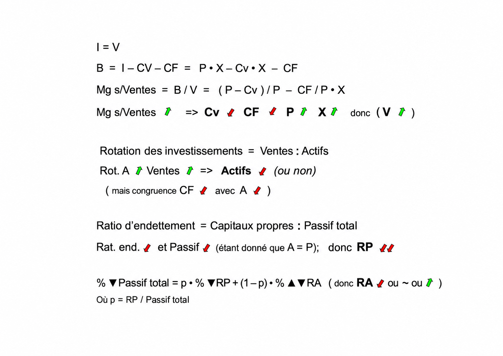
		

		

		
Page 27 · Du Pont : combinaison des leviers

			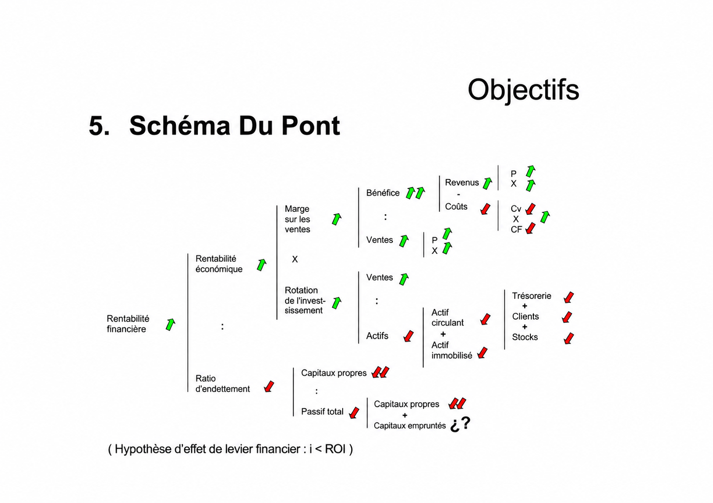
		

		

		
Page 28 · Tableau de bord prospectif : finances et clients

			**6. Tableau de bord prospectif (*Balanced Scorecard*).**
			**Perspective financière, Du Pont :** croissance et diversification des revenus ; réduction des coûts et amélioration de la productivité ; utilisation des actifs et stratégies d’investissement.
			**Clients :** part de marché, fidélisation, acquisition, rentabilité et satisfaction des clients. Propositions de valeur en fonction de différents attributs.
		

		

		
Page 29 · Tableau de bord : processus internes

			**Processus internes :**
			- Innovation : part des ventes de nouveaux produits, introduction de nouveaux produits, temps nécessaire au développement…
			- Opérations : qualité, durée du cycle, coût…
			- Service après-vente.
		

		

		
Page 30 · Tableau de bord : apprentissage et croissance

			- **Capacités des salariés :** satisfaction, fidélisation et productivité. Elles dépendent notamment de la participation aux décisions, de l’initiative et de la créativité, de la reconnaissance du travail bien fait, de l’accès à une information suffisante et du soutien du dirigeant.
			- **Capacités des systèmes d’information :** processus avec retour d’information en temps réel…
			- **Motivation, délégation du pouvoir et cohérence des objectifs.**
		

		

		
Page 31 · Direction par objectifs

			**7. Direction par objectifs (DPO / MBO).** Planifier en visant des résultats tangibles, constituer des équipes pour les atteindre, disposer d’un instrument d’amélioration continue et renforcer le système d’incitation.
			**8. Direction participative par objectifs (DPPO / PMBO).** Renforcer le réalisme et l’adaptation aux capacités et aux besoins ; développer le sentiment de maîtrise des moyens et des résultats.
		

		

		
Page 32 · Concevoir l’entreprise

			Concevoir l’entreprise.
		

		

		
Page 33 · Principes et outils d’organisation

			**Principes :** autorité, hiérarchie, responsabilité, délégation, décentralisation, unité de commandement, étendue du contrôle, division du travail, spécialisation, départementalisation et divisionnalisation.
			**Mise en forme :** structures organisationnelles, manuel d’organisation, manuel de procédures et organigrammes.
		

		

		
Page 34 · L’entreprise comme système d’information

			L’entrepreneur agit comme **coordinateur**. Le contrat d’autorité produit naturellement un flux **hiérarchique vertical descendant** : les ordres descendent, dans un système planifié.
			L’entrepreneur conçoit les postes et les départements pour limiter les interdépendances. Dans le meilleur des cas, une direction participative par objectifs organise des flux verticaux ascendants et descendants, plus ou moins fréquents.
		

		

		
Page 35 · Cycle de planification et de contrôle

			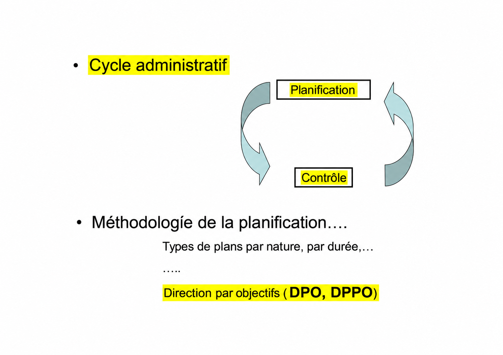
		

		

		
Page 36 · Flux verticaux d’information

			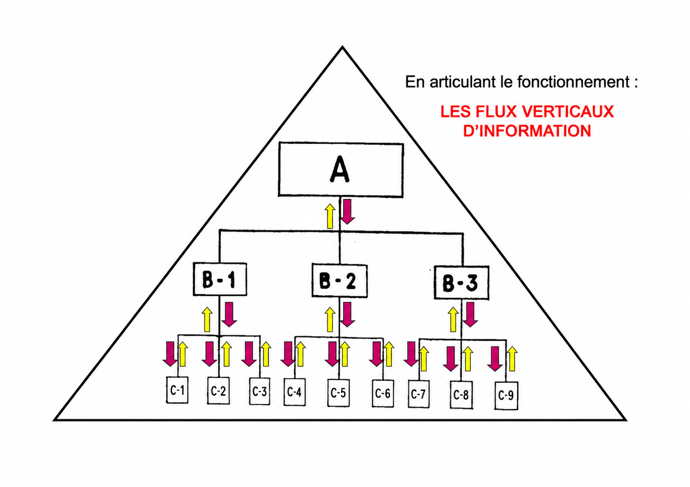
		

		

		
Page 37 · Flux horizontaux d’information

			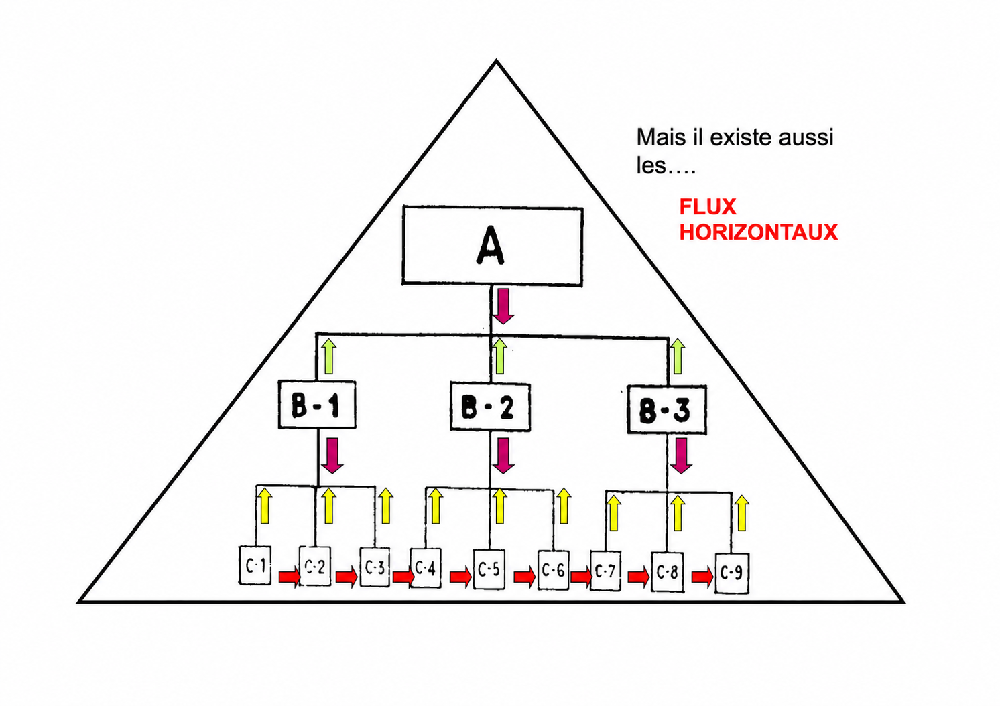
		

		

		
Page 38 · Le contexte : l’environnement

			- Excès d’offre.
			- Pression concurrentielle qui stimule l’ingéniosité : innovation vers des structures mieux capables d’affronter la concurrence.
			- Hausse du niveau de revenu et de formation dans la société.
			Les clients deviennent plus sélectifs et exigeants. Le système d’incitation se sophistique.
		

		

		
Page 39 · Concurrence et qualité totale

			La concurrence pousse vers la **qualité totale**. Cela pose un problème de conception interne.
			Variables à concevoir : postes de travail, flux d’information et systèmes d’information, processus participatifs et incitations en général.
			Leviers : reconception, flexibilité, modularité et technologie.
		

		

		
Page 40 · Management de la qualité totale

			Management de la qualité totale (*Total Quality Management*, TQM).
		

		

		
Page 41 · Pourquoi rechercher le produit parfait ?

			**Pourquoi ?** Pour pouvoir affronter la concurrence et survivre dans un marché en excès d’offre.
			**Comment ?** C’est un problème d’organisation ou de conception de l’entreprise.
			**Pourquoi un problème de conception ?** Parce qu’il concerne la manière dont fonctionne une entreprise ou une organisation.
		

		

		
Page 42 · Quels flux d’information sont critiques ?

			Les **flux horizontaux** reproduisent l’historique ou la traçabilité entre les entrées et les sorties (*inputs–outputs*).
			Avec les flux verticaux, on perd du temps et des incitations : le problème peut paraître lointain.
		

		

		
Page 43 · Production et suppression des stocks

			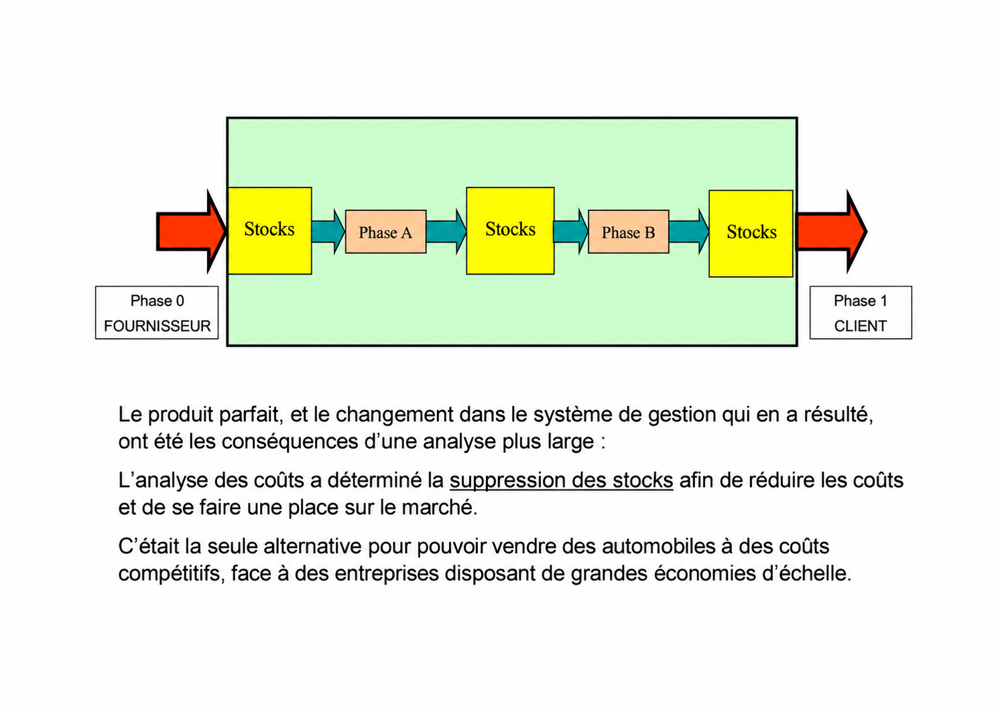
		

		

		
Page 44 · Le rôle amortisseur des stocks

			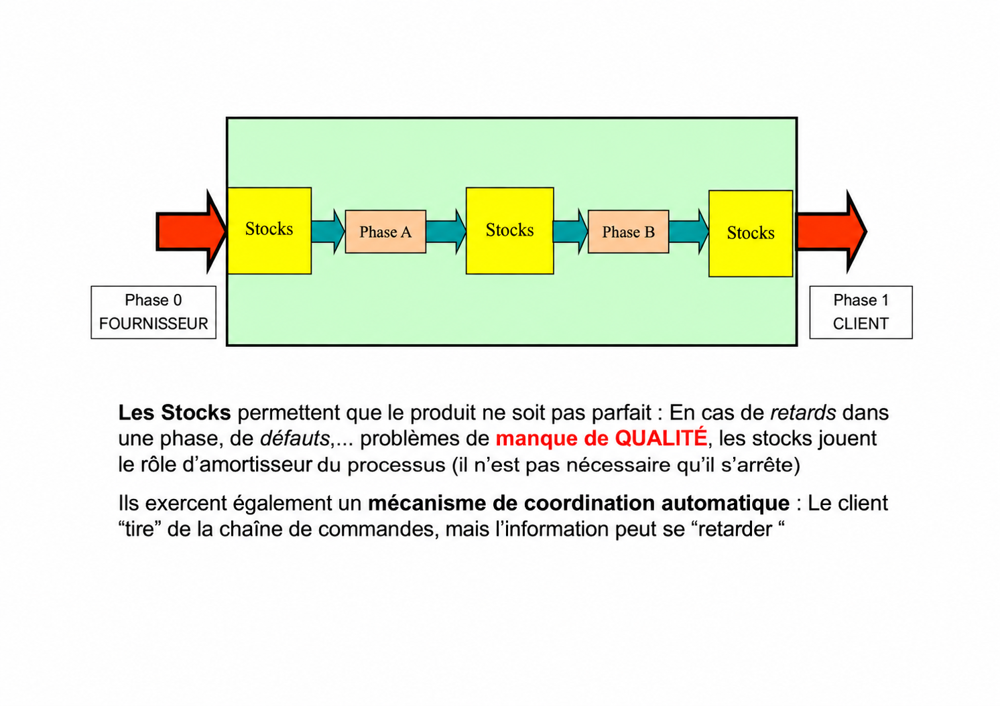
		

		

		
Page 45 · Conséquences de la suppression des stocks

			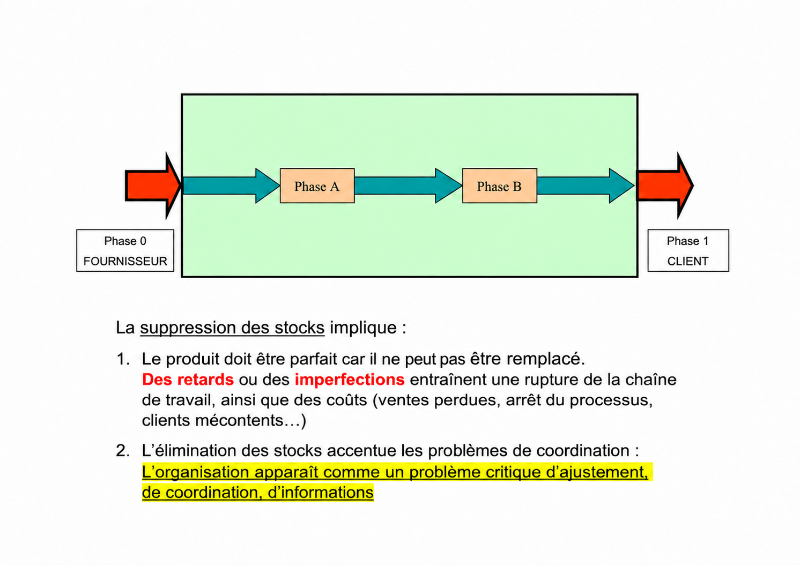
		

		

		
Page 46 · Le cas des services

			Un service ne peut pas être stocké ni remplacé comme un produit pris en stock. L’exigence du **produit parfait** est donc plus forte : réussir du premier coup ou supporter des coûts de compensation. Le pire résultat est un client mécontent.
			Il faut des solutions rapides : on ne peut pas perdre du temps dans le cheminement classique des flux verticaux. L’information la plus rapide, et donc la plus importante, est horizontale.
			**Conséquences organisationnelles et informationnelles :** réduire les niveaux hiérarchiques et organiser par processus lorsque c’est possible ; former les salariés et leur donner la capacité de décider à leur poste ; amélioration continue ; système d’incitation.
		

		

		
Page 47 · Des processus qui convergent vers le client

			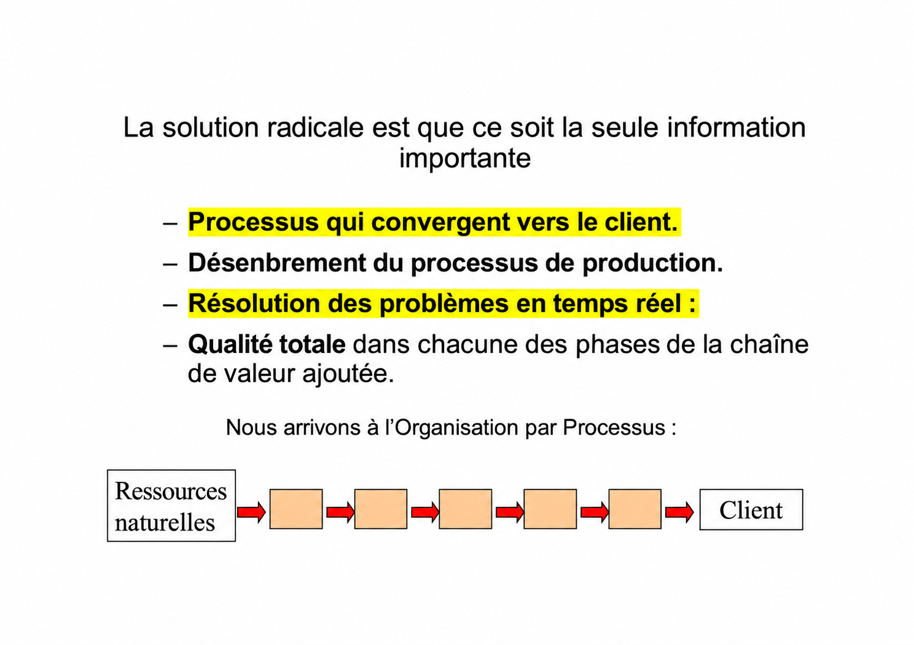
		

		

		
Page 48 · Organisation par processus

			La hiérarchie disparaît dans le modèle présenté : aplatissement total de la pyramide.
			Avantages des petites équipes :
			- meilleure efficience grâce à des problèmes de coordination réduits ;
			- meilleure conception des incitations : résultats partiels des sous-groupes, sentiment de liberté et autogestion, participation, création, accomplissement de soi, pression sociale, solidarité, leadership et propriété privée.
		

		

		
Page 49 · Contrôle en temps réel et limites

			Le contrôle se fait en temps réel : **qualité totale = zéro défaut**.
			Cela n’est pas toujours possible : le processus doit pouvoir être fractionné en résultats partiels. La perte de complémentarités doit être compensée par les gains d’efficience.
		

		

		
Page 50 · Assurance qualité et excellence

			Il peut suffire, ou être seulement possible, de faire évoluer la structure dans la bonne direction et d’adopter des **techniques d’assurance qualité**.
			Références présentées dans le support : normes ISO-UNE-EN ; excellence des entreprises ; prix Deming ; prix Malcolm Baldrige ; prix d’excellence EFQM.
		

		

		
Page 51 · Le vocabulaire de la qualité

			- Juste-à-temps (*Just in time*).
			- Amélioration continue.
			- Six Sigma.
			- Production au plus juste (*Lean manufacturing*).
			- Externalisation (*Outsourcing*).
			- Réduction de taille (*Downsizing*).
			- Ajustement à la bonne taille (*Rightsizing*).
			- « Leanning », « Pevo », « Phca », « Peca », « Fase » : termes ou sigles présentés sans développement dans le support.
			- Reconfiguration des processus (*Reengineering*).
			- Télétravail.
			- Etc.
		

		

		
Page 52 · Modèle EFQM du support

			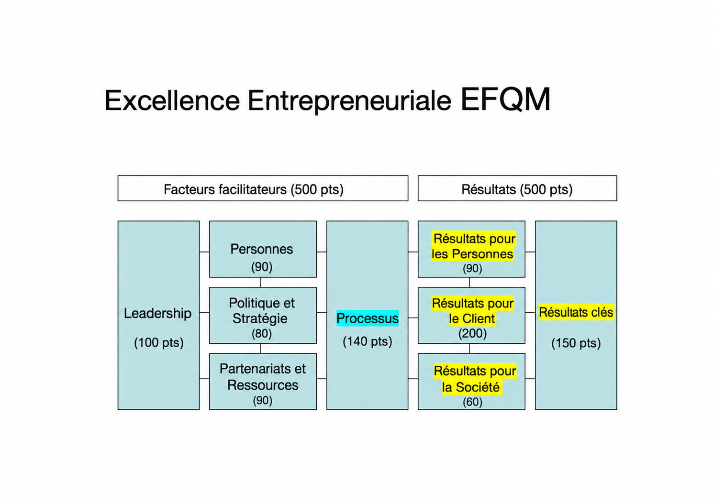
		

		

		
Page 53 · EFQM : leadership

			Les facteurs facilitateurs. **1. Leadership.**
			- Les dirigeants développent la mission, la vision, les valeurs et les principes éthiques ; ils incarnent la culture de l’excellence.
			- Ils s’impliquent personnellement et garantissent le développement, la mise en place et l’amélioration continue du système de management.
			- Ils échangent avec les clients et les représentants de la société.
			- Ils renforcent cette culture parmi les membres de l’organisation.
			- Ils définissent et impulsent le changement.
		

		

		
Page 54 · EFQM : politique et stratégie

			**2. Politique et stratégie.**
			- Partir des besoins et attentes présents et futurs des parties prenantes.
			- S’appuyer sur les indicateurs, la recherche, l’apprentissage et les activités externes.
			- Développer, réviser et actualiser la politique et la stratégie.
			- Les communiquer et les déployer grâce à un ensemble de processus clés.
		

		

		
Page 55 · EFQM : personnel

			**3. Personnel.**
			1. Planifier, gérer et améliorer les ressources humaines.
			2. Identifier, développer et maintenir les connaissances et les capacités des membres de l’organisation.
			3. Favoriser leur implication et leur prise de responsabilités.
			4. Développer le dialogue entre les personnes et l’organisation.
			5. Récompenser, reconnaître et prendre soin des personnes.
		

		

		
Page 56 · EFQM : partenariats et ressources

			**4. Partenariats et ressources : planification et gestion**
			1. Des partenariats externes.
			2. Des ressources économiques et financières.
			3. Des bâtiments, équipements et matériaux.
			4. De la technologie.
			5. De l’information et des connaissances.
		

		

		
Page 57 · EFQM : processus

			**5. Processus.**
			- Concevoir et gérer systématiquement les processus.
			- Introduire les améliorations nécessaires par l’innovation pour satisfaire pleinement clients et parties prenantes et créer davantage de valeur.
			- Concevoir et développer les produits et services à partir des besoins et attentes des clients.
			- Assurer la production, la distribution et le service associé aux produits et services.
			- Gérer et améliorer les relations avec les clients.
		

		

		
Page 58 · EFQM : résultats

			**6. Résultats pour les clients :** mesures de perception et indicateurs de performance.
			**7. Résultats pour le personnel :** mesures de perception et indicateurs de performance.
			**8. Résultats pour la société :** mesures de perception et indicateurs de performance.
			**9. Résultats clés :** mesures de perception et indicateurs de performance, selon la présentation du support.
		

		

		
Page 59 · Responsabilité sociale des entreprises

			La responsabilité sociale, ou sociétale, des entreprises (**RSE**, RSC/RSE dans le support espagnol ; *Corporate Social Responsibility*, CSR).
		

		

		
Page 60 · Répartition de la valeur créée

			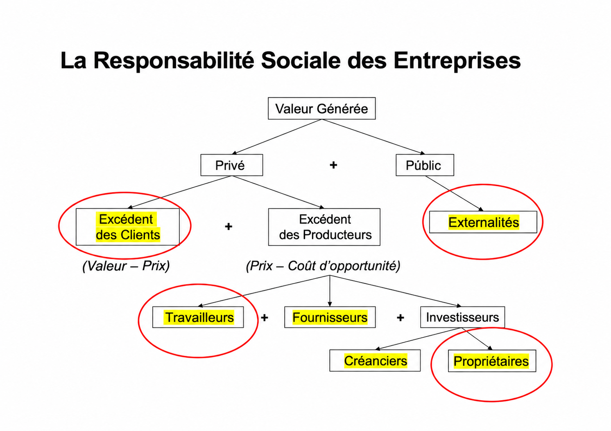
		

		

		
Page 61 · De la qualité totale à l’éthique globale

			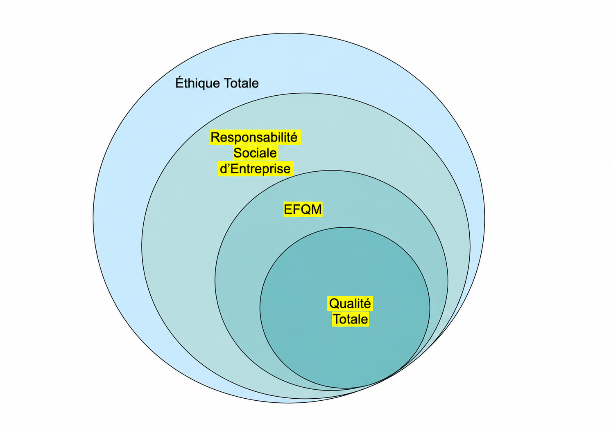
		

# Contrôle de gestion {toggle="true" color="blue"}
	**Intitulé original :** Control de gestión
	## Chapitre 1 · Systèmes de planification et de contrôle {toggle="true"}
		**Source :** tema 1 TEORIA.pdf
		

		
Page 1 · Contrôle de gestion et budget

			**Première partie : contrôle de gestion et budget.**
			Pour aborder le champ et la finalité du contrôle de gestion, il est utile de préciser le sens du mot « contrôle ». En comptabilité de gestion, ce terme a notamment servi à désigner la mise au point de systèmes de coûts dont les rapports permettent aux utilisateurs internes de maîtriser les conditions dans lesquelles leur entreprise ou organisation exerce son activité économique.
			Cette finalité concerne aussi bien les systèmes classiques, comme les coûts standards, qui contrôlent l’exécution par l’analyse des écarts, ou les coûts partiels, qui guident les décisions selon une rationalité économique, que les approches innovantes. Ainsi, la gestion stratégique des coûts (*Strategic Cost Management*, SCM) adapte les analyses fondamentales de coûts des systèmes comptables aux besoins des organisations actuelles. Cette adaptation a nécessité de nombreuses techniques et instruments destinés à améliorer la performance de l’activité.
			Le mot espagnol « control », probablement influencé par la tradition doctrinale française et une longue pratique culturelle de la surveillance, est souvent compris comme révision ou vérification. Dans les pratiques et définitions anglo-saxonnes, il renvoie plutôt à la maîtrise de l’action. Il correspond alors au sens du mot dans une phrase comme : « Grâce à une grande capacité de concentration, il lui est facile de maîtriser sa propre conduite. »
		

		

		
Page 2 · La finalité : maîtriser la gestion

			Vérifier une conduite observable n’est qu’un moyen de constater la présence d’une maîtrise dans une activité, une organisation ou un système. La vérification ne doit donc généralement pas devenir une fin en soi. L’objectif est de maîtriser l’organisation, et non d’obtenir des indicateurs attestant un contrôle qui n’existe pas réellement.
			**Définition proposée :** le contrôle de gestion vise la maîtrise de la gestion de l’entreprise, c’est-à-dire l’amélioration de la performance des actions analysées dans un environnement incertain. Il doit donc intégrer, outre des critères d’évaluation des actions, un système d’aide à la décision appuyé sur une information relative à la réalité de l’entreprise.
			Les paragraphes suivants d’Abtey et Vinay, adaptés pour en faciliter la compréhension, éclairent le champ des techniques et instruments employés.
			La maîtrise de la gestion des ressources doit être assurée, que la structure soit organisée ou non. Elle mobilise des moyens matériels et humains, formellement ou informellement. Cette mission concerne spécialement le contrôleur de gestion, mais aussi tout responsable souhaitant rationaliser ses décisions, dans un esprit d’ouverture et de dialogue.
			Il s’agit d’aider l’entrepreneur à améliorer les résultats de ses décisions en examinant attentivement, parfois de façon critique mais toujours constructive, le système d’information qui les fonde et les personnes chargées de les exécuter dans les principales fonctions de l’entreprise.
			Cette évaluation exige franchise et humilité : il faut accepter de remettre en question les habitudes, procédures, techniques ou relations personnelles qui ne se justifient plus, compte tenu des évolutions d’un environnement soumis aux exigences de concurrence, de risque et de survie.
		

		

		
Page 3 · Une démarche critique pour toute entreprise

			La gestion quotidienne masque souvent l’esprit critique. Le contrôle de gestion doit être abordé avec un regard neuf, une curiosité naturelle et un esprit critique nourri par la diversité des situations. C’est le regard du conseil externe, constamment confronté à des cas nouveaux. Il ne s’agit pas d’apprendre des recettes, mais d’examiner chaque fois les conséquences de l’application des techniques jugées les plus adaptées ou les plus courantes.
			Lorsque l’on passe de l’application quotidienne des instruments à la systématisation des techniques, puis à la définition des concepts qui donnent une cohérence à leurs principes, il est normal de rencontrer des questions comme celle de l’ambiguïté même de la définition du contrôle de gestion.
			Contrairement à une croyance répandue, celui-ci ne doit pas être seulement un mécanisme corrigeant les conséquences d’erreurs dans les grandes sociétés. Quelle que soit la taille de son entreprise, un responsable a besoin d’informations pertinentes, fiables et disponibles à temps sur les activités qu’il anime et coordonne, afin de donner des instructions rapides et précises. Le contrôle de gestion peut donc exister dans une PME sans contrôleur de gestion officiellement désigné.
		

		

		
Page 4 · Page de séparation

			Page blanche dans le document source.
		

		

		
Page 5 · 1.1. Entreprise et systèmes d’information

			**Chapitre 1. Introduction aux systèmes de planification et de contrôle de l’entreprise.**
			**1.1.1. Le système comptable dans la gestion de l’entreprise.**
			Le concept de système d’information, utilisé pour situer les différents modèles et systèmes comptables, permet également d’articuler les concepts du contrôle de gestion.
			L’entreprise est avant tout une organisation dans laquelle des décisions sont prises. Selon leur domaine, elles relèvent d’organes situés à différents niveaux hiérarchiques ou de compétence : stratégique ou de direction, tactique ou de gestion, logistique ou opérationnel.
			À chacun de ces niveaux, la responsabilité ne peut être exercée sans un système d’information étroitement lié à la vie de l’entreprise. Son efficacité dépend de sa capacité à répondre aux besoins de la planification stratégique et de la gestion courante, ainsi qu’à permettre l’évaluation de l’efficacité des principales activités.
		

		

		
Page 6 · Niveaux de décision et structure de l’information

			**Tableau 1. Comparaison des niveaux de décision.**
			**Stratégique :** porte sur l’entreprise dans son ensemble. Complexité très grande, liée à l’interaction de nombreuses variables. Incertitude très élevée. Processus non structurés dans leur forme : une méthode de raisonnement permet d’aborder les problèmes. Concerne la direction générale. Activité intellectuelle très diversifiée, fondée sur la créativité. Horizon à long terme. Résultat : définir les objectifs.
			**Tactique, ou de gestion :** porte sur toute l’entreprise à travers l’organisation de ses fonctions. Complexité raisonnable, les modèles quantitatifs facilitant les décisions. Incertitude modérée. Méthodes et processus très structurés, mais responsabilité fonctionnelle uniquement. Concerne tous les cadres de la hiérarchie. Activité administrative et sociale. Horizon à court et moyen terme. Résultat : mettre en place les moyens.
			**Opérationnel :** porte sur chaque activité et tâche, opérationnelle ou non. Complexité relativement limitée : tâches identifiables et contrôlables. Incertitude très faible. Processus rationnels et logiques très structurés, avec responsabilité opérationnelle. Concerne les responsables des opérations. Activité technique et sociale. Horizon quotidien. Résultat : atteindre les objectifs.
			**1.1.2. Structure de l’information dans les systèmes de contrôle de gestion.**
			Les modèles de comptabilité analytique et de prévision budgétaire doivent produire une information compréhensible et utile pour les meilleures décisions. Outre la pertinence et la fiabilité des rapports, les modèles doivent permettre leur confrontation aux faits.
			Le contrôle comptable et budgétaire de la gestion courante intervient dans trois domaines : fixer les procédures de prévision et de contrôle budgétaire ; définir la mesure de la contribution au bénéfice ; convenir des méthodes d’évaluation de la performance. Les systèmes doivent donc intégrer les trois familles de modèles présentées à la page suivante.
		

		

		
Page 7 · Les trois familles de modèles

			**Modèles de traitement de l’information :** le système d’information repose généralement sur les modèles de comptabilité financière et analytique.
			**Modèles d’aide à la décision :** systèmes de coûts et de formation du résultat, intégrant des critères de calcul adaptés pour guider et contrôler les décisions.
			**Modèles de vérification et d’évaluation :** indicateurs de gestion permettant d’évaluer la performance et de tirer parti de leur capacité de motivation.
			À chaque niveau de décision, stratégique, tactique ou opérationnel, correspond une séquence de ces modèles. Les variables d’entrée des uns peuvent être les variables de sortie des autres.
			Toute décision doit s’appuyer sur un ensemble organisé de rapports. Les observations provenant de l’entreprise et de son environnement sont techniques, humaines, commerciales, financières, etc. Ces données sont enregistrées, classées et transformées systématiquement en information pertinente pour chaque décision. Elles alimentent une réflexion reposant, consciemment ou non, sur un ou plusieurs modèles d’aide à la décision.
			Chaque modèle d’aide à la décision identifie des variables d’entrée issues des rapports d’information, les traite à l’aide de critères d’optimisation ou de simulation et détermine des variables de sortie ou objectifs : les orientations pour décider aux différents niveaux.
			Pour être efficient, un modèle de décision doit être contrôlable. Il convient donc d’ajouter un modèle de vérification-évaluation. Ses entrées comprennent les sorties du modèle d’aide à la décision et les informations sur les réalisations. Ses sorties indiquent si les décisions prises ou étudiées satisfont aux exigences du contrôle, principalement définies dans le modèle d’information prévisionnelle.
		

		

		
Page 8 · Articulation du système de contrôle

			Le modèle de vérification doit généralement comprendre un ensemble d’instruments de mesure permettant d’évaluer différents niveaux de réalisation. La figure 1 présente l’organisation habituelle des relations entre l’entreprise, son environnement, le système d’information, l’aide à la décision et l’évaluation.
			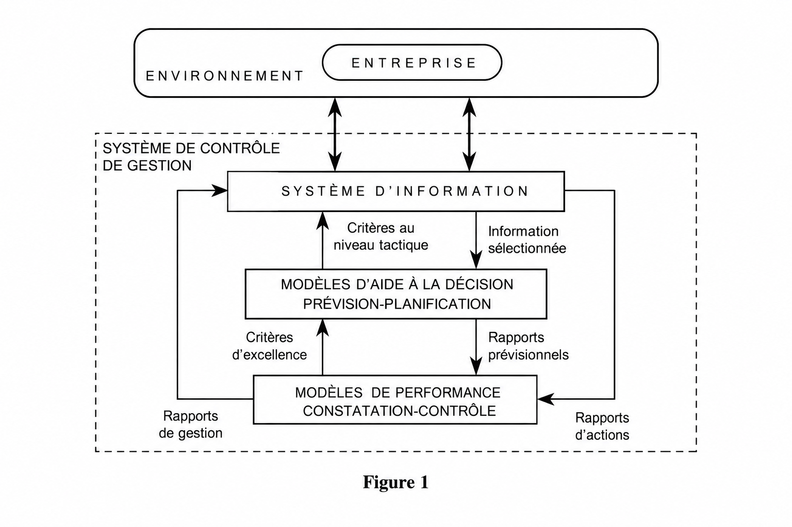
		

		

		
Page 9 · 1.2. Évolution des modèles de gestion

			**1.2.1. Évolution récente.**
			Parmi les descriptions de l’évolution des modèles utilisés par les entreprises pour contrôler leur action, celle de Philippe Lorino se distingue. Elle associe les changements observables à la recherche des transformations plus profondes, donc moins visibles, de l’organisation et de l’environnement. Elle tient aussi compte de l’influence mondiale des techniques fondées sur les nouveaux principes de gestion.
			Le métier et les techniques du contrôle de gestion connaissent un renouvellement sans équivalent depuis soixante-quinze ans, selon le contexte historique du texte. La maîtrise de la gestion devient un facteur essentiel de différenciation dans un marché mondialisé, au même titre que la technologie du produit ou du procédé de production.
			Un nouvel état de l’art se construit par la reconception d’instruments de mesure longtemps restés stables. Cette évolution dépasse les techniques d’une profession : toute la vision économique de l’entreprise et les philosophies de gestion qui en découlent se transforment.
			Le faible intérêt porté pendant si longtemps aux outils du contrôle de gestion peut surprendre. La gestion avait certes inventé des méthodes en marketing, stratégie, qualité ou ressources humaines. Mais son fondement, la rationalité économique exprimée par la comptabilité analytique, l’évaluation des investissements, le contrôle budgétaire et la rentabilité des produits ou activités, autrement dit la mesure qui fonde la décision, avait peu changé depuis 1910 et l’apparition du ROI chez Du Pont de Nemours, selon la datation retenue dans ce passage.
		

		

		
Page 10 · Le renouvellement des outils

			Bien que les défauts des anciens outils soient connus, on tendait, ouvertement ou discrètement, à se protéger en s’éloignant des chiffres. La gestion « par les chiffres » avait mauvaise réputation et l’on risquait de jeter le bébé avec l’eau du bain, comme si l’action pouvait se passer de mesure et d’analyse. À partir des années 1970, sous l’effet de chocs multiples, les fondements des outils de contrôle ont été rapidement révisés, voire réinventés, par une part importante de l’industrie mondiale.
			Le groupe coopératif CAM-I (*Computer Aided Manufacturing–International*) a été créé en 1972 à l’initiative de grands groupes industriels américains pour financer collectivement la recherche sur la productivité. Il a conduit une douzaine de programmes : langages de commande numérique, conception assistée par ordinateur, génération automatique de gammes, etc. En 1986, plusieurs membres industriels, des universités comme Harvard et Stanford et de grands cabinets anglo-saxons d’audit et de conseil ont lancé le programme CMS (*Cost Management System*), consacré cette fois à la gestion plutôt qu’à la technologie.
			La justification demeure la même : le contrôle est devenu un avantage, ou un désavantage, concurrentiel décisif. Il s’agit d’un mouvement de fond, qui a progressivement reconstruit l’ensemble des outils. À partir de la comptabilité analytique, CMS s’intéresse aux investissements, au cycle de vie du produit et aux indicateurs. Les progrès, qualité totale, juste-à-temps, comparaison des meilleures pratiques (*benchmarking*), coûts cibles, nécessitent de nouveaux principes pour donner un cadre commun aux instruments.
			Les sections suivantes opposent les caractéristiques du contrôle traditionnel aux critères qui orientent les approches nouvelles.
		

		

		
Page 11 · Les fondements du contrôle traditionnel

			**1.2.2. Les bases du contrôle de gestion traditionnel.**
			Elles sont liées aux méthodes développées dans la seconde moitié du XIXe siècle dans les grandes entreprises industrielles américaines, Du Pont, General Motors et General Electric, sous l’influence de F. Taylor. Le texte situe en 1907 l’introduction du ROI chez Du Pont par Donaldson Brown : en reliant marge sur chiffre d’affaires et rotation des actifs, ce ratio a permis un modèle unique, global et cohérent, réunissant comptabilité financière et comptabilité des coûts.
			Selon P. Lorino, l’édifice « comptabilité générale, comptabilité analytique, contrôle des opérations par les coûts et contrôle des investissements par la rentabilité » était alors établi. Il reste une base de la gestion et du contrôle chargé d’en surveiller la qualité.
			**Quatre principes tayloriens :**
			1. **Stabilité.** Les mécanismes de performance et les savoirs opérationnels permettant l’efficacité sont stables dans le temps : permanence des standards.
			2. **Information parfaite.** Le décideur possède une information parfaite sur les mécanismes de performance du système qu’il dirige : établissement des standards.
			3. **Performance productive assimilée à la minimisation du coût.** L’efficacité économique consiste à fournir la valeur maximale en consommant le minimum de facteurs. Lorsque la valeur de la production est garantie dans un marché dominé par l’offre, minimiser les coûts suffit.
			4. **Coût global assimilé au coût d’un facteur dominant.** Un facteur déterminant commande les variations du coût total. Un facteur clé, la main-d’œuvre directe, sert de base à l’affectation et à la mesure de l’ensemble des coûts.
		

		

		
Page 12 · Corollaires et nouvelles bases de la compétitivité

			**Corollaires.**
			**A. Modèle de productivité industrielle.** La combinaison des principes 3 et 4 fait de la minimisation du coût du facteur dominant la performance recherchée. Le produit du travail (*output*) est mesuré par le temps standard nécessaire, ce qui permet de dépasser l’hétérogénéité des produits. Le coût des facteurs (*inputs*) est mesuré en heures réelles. Le rapport des deux détermine la productivité.
			**B. Modèle de contrôle.** Les principes 1 et 2 supposent que le diagnostic et la compréhension du système et de sa performance sont fixés hors du modèle. La pertinence de la mesure, quoi mesurer et pourquoi, est donnée. Le contrôle vérifie simplement la conformité des comportements à l’optimum prévu : productivité de la main-d’œuvre directe, écarts budgétaires ou écarts aux coûts standards.
			**C. Comptabilité orientée vers la reddition des comptes.** La nécessité de produire pour les utilisateurs externes des chiffres incontestables favorise l’objectivité comptable, parfois au détriment de la pertinence des informations.
			**1.2.3. Nouvelles bases de la compétitivité.**
			La mondialisation, l’évolution rapide des marchés et l’accélération de l’innovation rendent les principes de stabilité et d’information parfaite inadaptés. Les marchés dominés par les offreurs laissent place à des marchés dominés par les demandeurs. Une mesure exclusivement fondée sur le coût doit donc intégrer d’autres variables, notamment le délai et la qualité. Enfin, l’automatisation et la robotisation des tâches élémentaires renforcent le poids des facteurs de production autres que la main-d’œuvre directe, rendant obsolètes les principes 3 et 4.
		

		

		
Page 13 · Diagnostic permanent et information limitée

			**1. Nouveau modèle de contrôle.** Il ne repose plus sur la stabilité et l’information parfaite, mais sur un diagnostic permanent permettant de répondre à une innovation permanente. Les figures A et B montrent le changement de la boucle de retour dans le contrôle-évaluation : modèle conventionnel et modèle actuel.
			**2. Décider avec une information limitée.** L’incertitude concernant le futur et la complexité des problèmes empêchent une information parfaite. La précision des données doit céder la priorité à leur pertinence. Une seule personne ne peut détenir toute l’information : l’ensemble du personnel doit participer à l’amélioration. Les figures C et D illustrent cette évolution du cycle PDCA.
			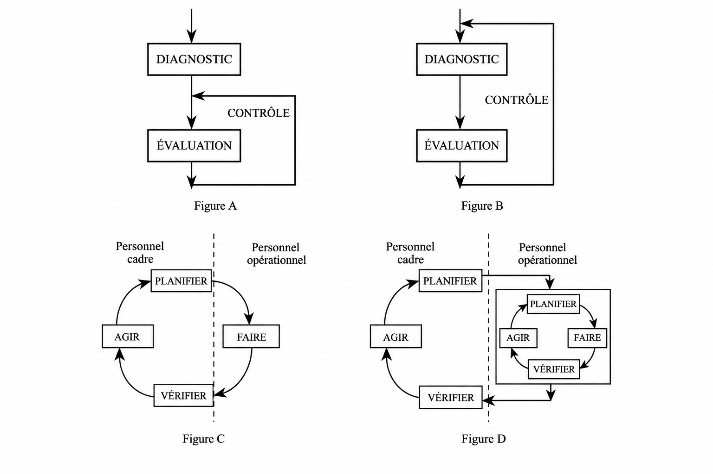
		

		

		
Page 14 · Gérer la valeur et le changement

			La séparation taylorienne entre dirigeants et exécutants, les uns pensent et les autres exécutent, illustrée par la figure C, fait place à une organisation qui partage l’information, figure D. La conception du cycle d’amélioration Planifier–Faire–Vérifier–Agir (*Plan–Do–Check–Act*) est ainsi modifiée.
			**3. Gérer la valeur plutôt que les seuls coûts.** Cette évolution découle des transformations des marchés. Contrairement au coût, la valeur ne peut être mesurée directement et objectivement qu’au moment de la vente. On peut toutefois l’estimer par la qualité, la gamme, le délai de livraison, l’innovation et le renouvellement des gammes ou l’efficacité du service après-vente. La plupart de ces composantes nécessitent des indicateurs financiers et non financiers. Des systèmes comme le *Balanced Scorecard* rendent la gestion de la valeur opérationnelle, à condition d’identifier précisément les caractéristiques qualitatives qui, pour les clients, donnent de la valeur au produit. Selon Lorino : « Gérer la valeur ressemble à la gestion de la santé d’un individu : elle ne se mesure pas par un chiffre unique, mais peut être suivie par plusieurs indicateurs. »
			**4. Gérer le changement.** Les progrès technologiques, l’amélioration des qualifications et le positionnement stratégique transforment continuellement la production. Il ne suffit pas de gérer en tenant compte des changements : l’entreprise doit viser elle-même ceux qui servent ses intérêts.
			Le contrôle de gestion apparaît donc comme un ensemble de techniques de communication sur la performance. Cette communication doit être permanente puisque les objectifs évoluent sans cesse. Aucun outil n’est définitivement pertinent : la pertinence de chaque rapport doit être vérifiée et, si nécessaire, reconstruite.
		

		

		
Page 15 · 1.3. Contrôle de gestion et contrôle budgétaire

			**1.3.1. Éléments de définition.**
			Pour concevoir le système, retenir les principes suivants issus du tableau 1 :
			1. Le contrôle administratif porte sur les opérations courantes. Les objectifs, politiques, structures, lignes de produits, implantations et capacités sont fixés par la planification stratégique.
			2. Les systèmes doivent être coordonnés ou intégrés : un ensemble de sous-systèmes articulés convient mieux qu’un système unique.
			3. Couvrant toute l’entreprise, le contrôle utilise généralement une structure financière qui dépasse l’hétérogénéité des facteurs et produits en les exprimant en monnaie.
			4. Le bénéfice et la trésorerie ne peuvent être les seuls critères, ni toujours les plus importants. Il faut aussi des mesures quantitatives, part de marché, productivité, unités produites, et qualitatives, qualité, image, coopération.
			5. Une part importante du contrôle est informelle : rapports internes, circulaires, réunions, conversations et autres signes de communication difficiles à traiter systématiquement.
			Les systèmes informels naissant spontanément, le chapitre se concentre sur la conception des systèmes formels et leur structure.
		

		

		
Page 16 · Structure du processus de contrôle

			**1.3.2. Structure du processus.**
			Anthony et Young, dans *Management Control in Nonprofit Organizations*, présentent un processus cyclique organisé en plusieurs phases.
			**Programmation, ou planification.** Il s’agit de décider des actions de la période suivante en accord avec la stratégie. La programmation est généralement réalisée par produit, département, activité ou fonction, et facteur. Elle prévoit les quantités de ressources nécessaires et les produits obtenus, ainsi que les modalités et calendriers d’achat, de consommation, de production et de vente, en tenant compte des capacités installées et de la demande prévisible.
			**Formulation coordonnée des prévisions : fixation de critères et de normes.** Le programme est traduit en responsabilités pour ceux qui l’exécutent. C’est une négociation entre responsables de centres et supérieurs. Elle alterne communications descendantes, orientations de la direction générale, et ascendantes, propositions des responsables selon les ressources disponibles. Ces engagements peuvent être exprimés en termes non monétaires ; la suite précise leur traduction habituelle en budget.
			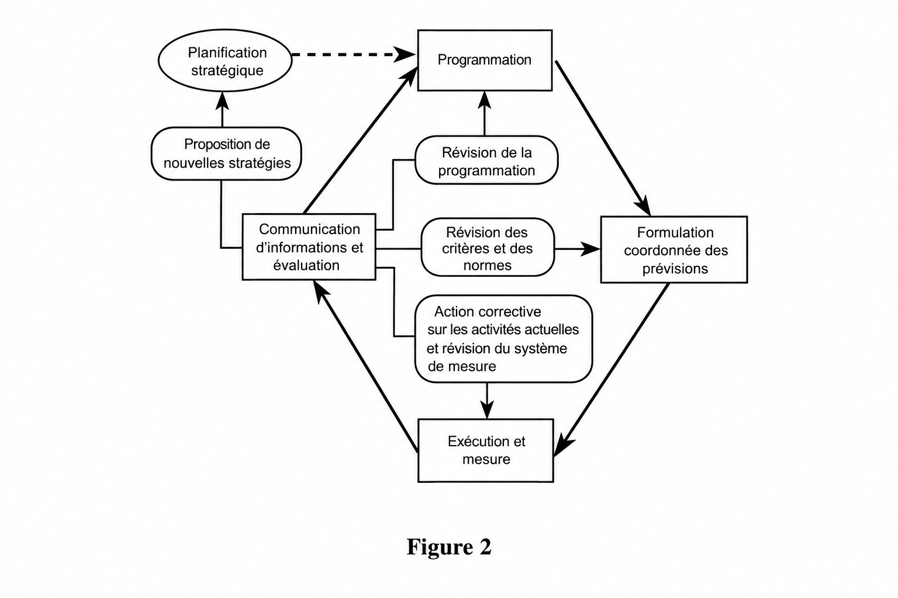
		

		

		
Page 17 · Exécution, mesure et évaluation

			Les engagements sont généralement exprimés en monnaie, surtout lorsqu’ils couvrent de manière intégrée toutes les activités d’exploitation d’une période sous la forme d’un budget d’exploitation.
			**Exécution et mesure : action et enregistrement.** Pendant les actions planifiées, la direction supervise et enregistre ressources consommées, activités réalisées et production obtenue. Le modèle comptable conventionnel est généralement utilisé.
			**Communication de l’information et évaluation : contrôle.** La comptabilité et les autres informations permettent de produire, interpréter et transmettre à la direction ce qui se passe et le degré de réalisation des prévisions. La comparaison du prévu et du réalisé sert à :
			a) **Maîtriser les activités courantes.** Vérifier la coordination et le respect des normes. Selon la direction par exception, les corrections se concentrent sur les effets négatifs des écarts pour les objectifs.
			b) **Évaluer les résultats des actions.** Attribuer les responsabilités, fonder une critique constructive de l’exécution et, si nécessaire, promouvoir, confirmer, réaffecter ou démettre les responsables.
			c) **Évaluer l’adéquation du système de contrôle.** Déterminer si le programme ne conduit pas aux objectifs, en raison d’erreurs de planification ou de coordination, ou de changements imposant une révision générale.
			**1.3.3. Contrôle budgétaire et contrôle de gestion.** Selon R. Anthony, le contrôle budgétaire représente une partie importante du contrôle de gestion ; comme le précise F. Blanco Illescas, il ne faut toutefois pas les confondre.
		

		

		
Page 18 · Le budget et les conditions de son utilité

			Le processus budgétaire rend visible le rythme des deux processus, qui suivent des étapes et une périodicité prédéfinies.
			Le **budget** est un plan d’action quantifié, doté d’une structure financière, qui guide et évalue les actions des responsables. Il résulte d’une négociation visant les objectifs de l’entreprise avec efficacité et efficience.
			Sa structure financière repose sur la comptabilité. Comme il intègre les charges et produits des activités prévues, il s’appuie sur les systèmes de coûts ; les coûts standards sont particulièrement utiles pour les comparaisons.
			La forte formalisation permet de rédiger un manuel, comme un plan de comptes pour le système comptable : procédure de chaque phase, niveaux ou personnes à consulter, responsables des propositions, des calculs et de leur supervision, échéances, modalités d’approbation et de révision.
			Le budget est aussi une base du contrôle financier, où les responsables des centres sont évalués à partir des résultats de leur division.
			**1.3.4. Cycle budgétaire.** Avant de le décrire, il faut préciser ses conditions d’utilité. La structure doit délimiter les centres de responsabilité et attribuer aux directeurs des compétences permettant d’évaluer leur performance et de corriger les écarts. La décentralisation facilite l’implantation du système budgétaire, qui la renforce en retour. Il peut aussi fonctionner dans une structure centralisée, sous les conditions précisées à la page suivante.
		

		

		
Page 19 · Motivation et cycle budgétaire

			Dans une structure centralisée, le contrôle budgétaire reste utile si l’attribution des compétences et la séparation des fonctions permettent d’évaluer les activités.
			Les facteurs de motivation sont essentiels à l’acceptation du budget. Celui-ci est généralement plus efficace et efficient lorsqu’il résulte d’une négociation entre niveaux. Les principes de réussite sont la participation de ces niveaux, l’utilisation du budget pour faciliter l’exécution plutôt que pour surveiller, et la compatibilité entre objectifs individuels et intérêts de l’organisation.
			Chaque année, le processus formalisé comprend des activités réparties dans le temps :
			1. Émission des directives.
			2. Préparation des premiers calculs approximatifs.
			3. Communication des documents à tous les niveaux.
			4. Révisions intégrant l’expérience, les attentes et les capacités de chacun.
			5. Approbation par la direction générale.
			6. Diffusion du budget approuvé.
			7. Exécution et supervision.
			8. Élaboration et communication des rapports d’exécution.
			9. Évaluation et communication éventuelle des corrections ou révisions du budget.
		

		

		
Page 20 · 1.4. Classification des budgets

			Les chapitres suivants étudient l’enchaînement fonctionnel des budgets courants et l’utilité des modèles de coûts. Les autres techniques, par exemple le budget par programmes (PPBS) ou le budget base zéro, sont donc exclues des classifications suivantes.
			**1.4.1. Selon le degré de formalisation :**
			- Estimations personnelles sans système formel, en dehors de la comptabilité.
			- Compte de résultat prévisionnel global, sans analyse par activité ou produit.
			- Système de coûts standards par produit et centre de responsabilité, exploitant ses techniques de planification, d’enregistrement et d’évaluation.
			- Même base de coûts standards, intégrée aux plans financiers de court et long terme et aux investissements de long terme ; la comptabilité coordonne et intègre les activités budgétées.
			**1.4.2. Selon la durée couverte :**
			Les budgets pluriannuels couvrent par exemple la restructuration des installations, le changement de lignes de production ou l’entrée sur de nouveaux marchés. Ils constituent un instrument essentiel de la planification stratégique.
		

		

		
Page 21 · Durée et articulation fonctionnelle des budgets

			- **Budgets annuels :** planification et contrôle des activités d’un exercice comptable.
			- **Budgets de moins d’un an :** découpage du budget annuel en semaines ou mois. Il est fréquent de détailler mensuellement le premier trimestre et de conserver des montants trimestriels pour les suivants. À la fin de chaque mois, on ajoute le détail du mois suivant pour affiner les prévisions.
			- **Budgets glissants :** on dispose toujours d’une prévision à douze mois, en ajoutant un mois ou trimestre à mesure qu’un autre s’achève. Cela oblige la direction à considérer constamment un horizon de douze mois.
			**1.4.3. Classification fonctionnelle : le budget directeur, ou budget général (*master budget*). Figure 3.**
			**Budget d’exploitation :** budget des ventes ; budget de production comprenant matières, main-d’œuvre, coûts indirects et niveaux de stocks ; budget du coût de la production vendue ; budgets des frais commerciaux et administratifs.
			**Budget financier :** budget de trésorerie avec encaissements et décaissements liés aux opérations courantes et aux opérations en capital.
			**États financiers prévisionnels :** compte de résultat, bilan et tableau des emplois et ressources.
		

		

		
Page 22 · 1.5. Élaboration du budget directeur

			**1.5.1. Enchaînement des étapes du budget directeur.**
			La figure 4 montre la succession des prévisions de ventes, des budgets opérationnels, de la trésorerie et des états financiers. Même si ce processus peut sembler être un calcul automatique à partir des données fournies, celles-ci résultent de décisions de direction : politique commerciale, lignes de produits, investissements, organisation de la production, délimitation des centres de responsabilité, politique du personnel, etc.
			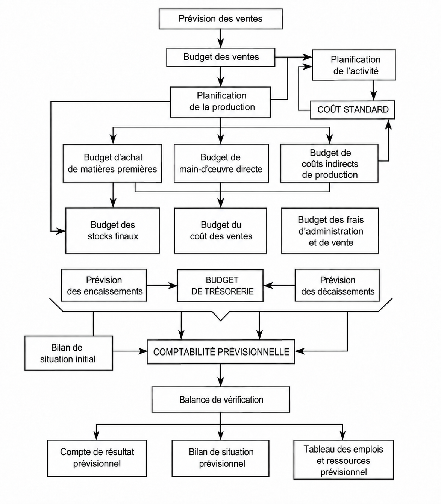
		

		

		
Page 23 · Coordonner les budgets courants

			**1.5.2. Le budget directeur comme outil de coordination.**
			Le budget directeur coordonne toutes les activités de l’année déjà définies dans les budgets fonctionnels approuvés. Il permet finalement d’établir les états financiers prévisionnels qui montrent globalement le résultat de la planification de la période suivante, conformément aux objectifs généraux de l’entreprise.
		

		

		
Page 24 · 1.6. Intégration comptable et informatique

			Le système d’information soutient le contrôle de gestion. Le système comptable en constitue habituellement le noyau, donc la partie la plus formalisée.
			Les trois niveaux de décision ont des champs différents : l’ensemble de l’entreprise, ses fonctions, puis chaque processus ou groupe technique d’opérations. Le contrôle doit donc avoir une structure **modulaire**, intégrable à l’échelle de l’organisation et compatible avec son évolution dans le temps et l’espace. Intégration, flexibilité et adaptabilité conditionnent efficacité et efficience.
			La figure 5 associe, au moins théoriquement, chaque unité de décision à un module de contrôle intégrable aux autres. Pour simplifier, elle utilise la classification fonctionnelle du groupe 9 du plan comptable général espagnol, sans vouloir imposer une structure réelle, bien plus variée et complexe.
			Même dans une petite entreprise, la comptabilité est généralement informatisée. Cela a nécessité de normaliser et rationaliser de nombreuses tâches opérationnelles et administratives et d’adopter un plan de comptes, généralement celui du pays et du secteur.
			Cette rationalisation conduit à intégrer les logiciels comptables avec ceux des achats, d’une part croissante de la production et de la facturation. La suite complète cette liste.
		

		

		
Page 25 · Des modules intégrés horizontalement et verticalement

			L’intégration inclut également les encaissements et paiements issus des opérations, donc le budget courant de trésorerie lui-même.
			La figure 5 présente les niveaux stratégique, tactique et opérationnel, les fonctions de l’entreprise et le module reliant système d’information, aide à la décision et indicateurs de gestion.
			Plus le système d’information à la base des modules est dominé par la comptabilité, moins les modèles d’aide à la décision (MAD) et les indicateurs distincts du résultat comptable y prennent de poids. Cette configuration facilite l’implantation du contrôle et l’intégration des modules.
			Cependant, la comptabilité conventionnelle est conçue en réponse aux obligations de reddition des comptes des dirigeants envers les agents économiques disposant d’un droit à l’information sur l’activité. Cette finalité limite sa capacité à fournir l’étendue et la flexibilité d’information discutées à la page suivante.
			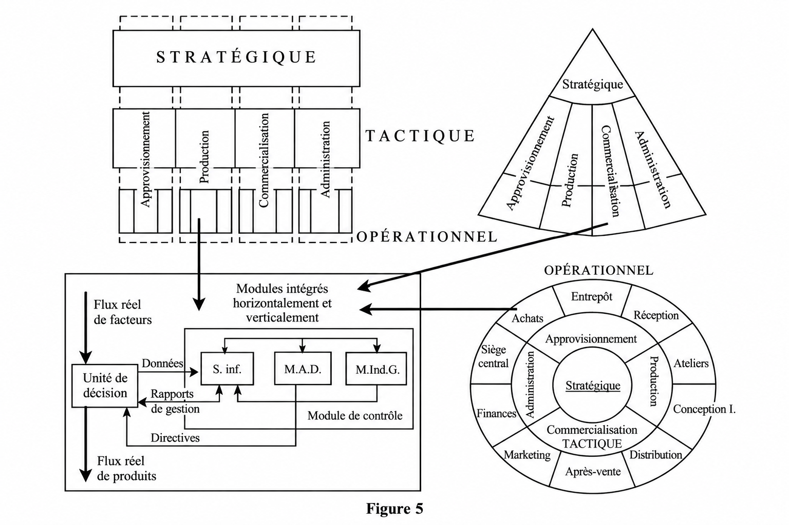
		

		

		
Page 26 · Limites et ouverture du système d’information

			Les systèmes comptables conventionnels peinent à fournir une information suffisamment large, sur les réalisations mais aussi le potentiel de l’activité, et flexible pour les modèles de contrôle actuels.
			Leur rigidité reflète mal la diversité des situations et des modes d’organisation des unités de décision, et s’adapte difficilement à leur évolution rapide. Elle finit par annuler les avantages initiaux : intégration plus facile, objectivité accrue et nombre limité de données.
			Avec la complexité croissante des affaires, l’accélération technologique et la mondialisation, un système de gestion doit ajouter aux données comptables des informations sur l’environnement. Il doit soutenir les décisions courantes et opérationnelles, mais surtout les décisions stratégiques assurant un avantage concurrentiel durable.
			Chaque module doit donc intégrer aux informations comptables des bases de données sur l’environnement économique. La connexion à des systèmes externes permet d’accéder à des bases générales ou aux fichiers des entreprises et organisations partenaires, par les réseaux, l’EDI, Internet et les réseaux internes, ou intranets.
			L’intégration de modules appartenant à différentes unités, surtout de niveaux de décision différents, est particulièrement complexe. Le degré de formalisation des bases alimentant systèmes d’information, modèles d’aide à la décision et indicateurs varie fortement, alors que ces éléments doivent rester pertinents pour chaque module.
		

# Organisation et gestion interne {toggle="true" color="blue"}
	**Intitulé original :** Organización y gestión interna
	## Chapitre 1.1 · L’économie des coûts de transaction {toggle="true"}
		**Source :** T1 a  La Economía de los Costes de Transascción..pdf
		

		
Page 1 · Introduction à l’économie des coûts de transaction

			**1.1. L’économie des coûts de transaction. 1. Introduction.**
			L’économie des coûts de transaction ouvre l’étude de l’économie des organisations. À première vue, le problème économique consiste à articuler activités de consommation et de production. L’unité de base de la consommation est l’individu, avec quelques ajustements comme la famille. Celle de la production est l’entreprise, qui peut compter d’une personne à un effectif de l’ordre du million (10⁶). Le problème d’organisation concerne les deux types d’activités, mais apparaît surtout dans la production : comment faire collaborer individus, institutions ou entités pour bénéficier de la division du travail et de la spécialisation ?
			L’économie des coûts de transaction (ECT) définit les règles expliquant l’existence des entreprises comme des marchés. La théorie traditionnelle, centrée sur le marché, avait largement laissé de côté la logique de l’existence et du fonctionnement de l’entreprise. Celle-ci restait une « boîte noire » (*black box*) que les contributions de Coase (1937) et surtout de Williamson (1975) ont commencé à ouvrir. Elles éclairent l’existence des marchés, des entreprises et des multiples formes intermédiaires aux frontières parfois floues.
			Aux concepts techniques d’offre, de structure optimale des coûts, de taille efficiente et de coûts de production, étudiés en microéconomie et en économie industrielle, s’ajoutent désormais les **coûts de transaction**, apportant une perspective nouvelle.
			Cette approche est essentielle pour déterminer le périmètre et les limites de l’entreprise : grandes ou petites structures, rapprochements et séparations, groupes et coopérations. L’intégration ou la désintégration verticale et horizontale et la diversification dépendent aussi des coûts d’organisation. Cela éclaire des notions comme l’externalisation (*outsourcing*), la réduction de taille (*downsizing*), l’ajustement de taille (*rightsizing*), l’allègement (*leaning*) ou la reconfiguration (*reengineering*).
			Aux deux extrêmes, toute la production pourrait se dérouler dans une seule entreprise, avec de très nombreuses transactions internes, ou dans une infinité de minuscules entreprises et indépendants échangeant sur le marché. Celui-ci est donc aussi une solution possible au problème d’organisation et relève, à ce titre, de l’économie des organisations.
		

		

		
Page 2 · Introduction méthodologique

			Inclure le marché dans l’économie des organisations est logique, mais reste une proposition audacieuse compte tenu de la place historique centrale du marché dans la théorie économique.
			Institutions, individus et agents participent à des activités de **production** et d’**échange**, qui engendrent respectivement des coûts de production et des coûts de transaction. Les deux sont décisifs pour la forme, la taille et le périmètre d’activité de l’organisation. La conception et la reconception de l’entreprise, ainsi que les changements de son périmètre, étant au cœur de la stratégie et de son impulsion par la direction, il faut en comprendre les mécanismes.
			**2. Introduction méthodologique à l’ECT.**
			Définir une organisation suppose d’identifier les agents participants, leurs dotations et les ressources apportées, leurs fonctions d’utilité, de coûts et de production et leurs caractéristiques, ainsi que le système ordonné de production et d’échanges et les conditions qui en expliquent la nature.
			Les limites entre intérieur et extérieur peuvent être relativisées afin de représenter plus finement la complexité actuelle et la tension entre confrontation et coopération. Une fois les frontières fixées, généralement juridiquement, les transactions entre étapes de production peuvent être internes, intragroupe ou réalisées sur le marché ouvert.
			La production est organisée par des entreprises ou leurs réseaux, avec des échanges internes et externes. La fonction de production doit présenter une **complémentarité multiplicative**, au niveau d’une entité comme d’un groupe : les synergies.
			La **création de richesse** est une condition nécessaire à l’existence de l’unité ou du groupe. La condition suffisante doit garantir à l’avance, dans un contexte de liberté des agents, leur participation grâce à l’appropriation d’une part de l’excédent. Cet excédent potentiel dépend des coûts de production et de transaction. Le système organisationnel, désormais appelé **contrat**, sera logiquement choisi pour minimiser les coûts de transaction. Ceux-ci dépendent des phases de contractualisation, des caractéristiques de l’objet échangé et du contrat utilisé.
		

		

		
Page 3 · Phases du contrat et caractéristiques des transactions

			**3. Phases de la contractualisation.**
			**1. Information.** Le demandeur doit trouver qui possède ce qu’il cherche, et l’offreur qui pourrait être intéressé par ce qu’il souhaite céder. La demande cherche l’offre et réciproquement. Les technologies de l’information et de la communication ont considérablement réduit les coûts de cette mise en relation.
			**2. Négociation.** Une fois les partenaires trouvés, il faut convenir des termes de l’échange, principalement la prestation et la contrepartie. Chacun met en balance ce qu’il donne et ce qu’il reçoit. Tout échange comporte un coût d’opportunité : quelque chose est cédé contre autre chose. Selon les cas, la négociation est plus ou moins coûteuse.
			**3. Garantie.** Les parties doivent s’assurer du respect du contrat et de la conformité exacte de ce qui est échangé aux caractéristiques négociées.
			**4. Caractéristiques de l’objet de la transaction.**
			Trois critères : quantité et répartition de l’information, spécificité et possibilités d’usage alternatif, fréquence et horizon temporel.
			**Information :** elle peut être totale ou partielle et répartie symétriquement ou asymétriquement entre les parties. Le support associe l’information partielle à l’asymétrie. Une asymétrie **ex ante** concerne des caractéristiques cachées qu’une partie ignore avant la transaction. Une asymétrie **ex post** concerne une action cachée après la conclusion du contrat, ignorée de l’autre partie et conduisant à son non-respect.
			**Spécificité :** les biens à usage général ont des usages alternatifs, donc un coût d’opportunité. Les biens spécifiques n’ont pas d’usage alternatif dans le modèle présenté ; la suite précise les formes de spécificité.
		

		

		
Page 4 · Transactions simples, complexes et contrats complets

			Les biens spécifiques sont présentés comme dépourvus d’usage alternatif et donc de coût d’opportunité dans cet usage. Trois formes de spécificité : **physique, de localisation et de connaissance**.
			Un marché initialement concurrentiel avec de nombreux offreurs et demandeurs peut devenir un **monopole bilatéral** après un investissement spécifique : c’est la **transformation fondamentale de Williamson**.
			**Fréquence :** transaction occasionnelle ou récurrente. **Horizon :** court ou long terme.
			**Transactions simples :** information totale, identique et symétrique entre les parties ; bien à usage général ; échange occasionnel à court terme ; rationalité illimitée des agents ; technologie séparable, permettant d’isoler les conséquences de chaque transaction. Il suffit qu’une de ces conditions ne soit pas satisfaite pour que la transaction ne soit plus simple.
			**Transactions complexes :** information incomplète et asymétrique, et/ou bien spécifique, et/ou fréquence élevée sur un horizon long. Les agents ont une rationalité limitée et les effets ne sont pas individuellement séparables, donc la technologie est non séparable.
			**5. Typologie des contrats.**
			Une transaction suppose un accord entre deux parties qui ont besoin l’une de l’autre. Trois critères classent les contrats : degré de définition, formalisation et récurrence.
			**1. Degré de définition : contrats complets ou incomplets.** Les premiers définissent tous les termes, prestations et contreparties. Ils sont **déterministes** si tous les éléments sont connus exactement, ou **contingents** si les engagements dépendent d’événements vérifiables. Exemple déterministe : l’achat courant en magasin de nourriture ou de vêtements, avec information supposée complète et prix fixé. Le contrat devient contingent lorsque certaines caractéristiques peuvent varier et que des actions sont prévues en fonction de ces variations.
		

		

		
Page 5 · Autorité, formalisation et formes types

			Les contrats indexés, par exemple des loyers dont le montant évolue avec l’indice des prix, illustrent les contrats complets contingents.
			Les **contrats incomplets** ne déterminent pas toutes les caractéristiques de la transaction. Il faut préciser qui peut les compléter. Si ce pouvoir appartient à une partie, le contrat est **d’autorité** ; s’il appartient à un tiers, il est soumis à **arbitrage**. Le contrat de travail illustre l’autorité : toutes les obligations ne sont pas définies à l’avance et l’employeur attribue des tâches selon ses besoins de flexibilité ou les circonstances.
			**2. Degré de formalisation.** Les contrats **explicites** sont documentés, généralement par écrit. Les contrats **implicites** ne disposent pas de support physique ou informatique.
			Quel que soit le contrat, chacun doit se protéger contre l’inexécution de l’autre. La phase de garantie protège contre les comportements opportunistes. Pour faire respecter un contrat explicite, complet ou incomplet, l’information doit être **vérifiable**, c’est-à-dire démontrable devant un tiers comme un juge, afin d’identifier la partie défaillante. Les contrats implicites, tacites ou oraux, nécessitent d’autres mécanismes, notamment la **confiance mutuelle** et la **réputation**.
			**3. Récurrence.** Les contrats de court terme couvrent une transaction ou un ensemble limité dans le temps. Ceux de long terme permettent une succession de transactions.
			**Deux contrats types selon Oliver Williamson.**
			Le **contrat de marché** est complet, sans autorité, explicite et de court terme. Il est multilatéral et traite toutes les parties de la même manière. Les agents disposent d’une pleine liberté pour créer une infinité de spécifications contractuelles selon leurs besoins.
			Le **plan ou la hiérarchie** est un contrat incomplet, complété par l’autorité, implicite et de long terme. Il est bilatéral au sens où chaque groupe reçoit un traitement distinct. La suite précise ses limites.
		

		

		
Page 6 · Coûts de transaction et diversité des contrats

			Dans la hiérarchie, les possibilités contractuelles sont limitées par l’autorité : les agents ne sont pas libres d’improviser en fonction de leurs besoins ou aspirations.
			**6. Coûts de transaction.**
			Les phases d’information, de négociation et de garantie génèrent les **coûts explicites** de transaction. Leur niveau dépend de la combinaison d’un contrat et d’une transaction donnée.
			Dans le modèle théorique, **une transaction simple régie par un contrat de marché a des coûts d’information, de négociation et de garantie tous nuls**. Ce résultat fonde la référence au marché comme institution maximisant l’efficience, ou l’« utopie » du marché parfait, uniquement lorsque ses conditions techniques sont satisfaites. Dans les autres combinaisons, les coûts sont positifs. Le support présente le contrat d’autorité ou de hiérarchie comme adapté aux transactions complexes.
			Les **coûts implicites**, ou **perte résiduelle**, correspondent à la valeur qui aurait pu être créée dans une situation contractuelle optimale, mais ne l’a pas été.
			**Coûts totaux de transaction = coûts explicites + coûts implicites.**
			Le problème d’organisation se divisant en coordination et motivation, on peut aussi distinguer **coûts de coordination** et **coûts de motivation**.
			**7. Éventail des contrats.**
			La réalité est beaucoup plus riche que l’opposition précédente. Entre marché pur et hiérarchie pure existent de nombreuses relations intermédiaires, notamment les réseaux de fournisseurs liés par des contrats d’approvisionnement à long terme. La liste se poursuit à la page suivante.
		

		

		
Page 7 · Formes intermédiaires et conclusion

			Autres formes intermédiaires entre marché et hiérarchie :
			- groupements de fournisseurs ou cartels ;
			- division de l’organisation en unités d’activité, départements ou usines avec prix internes ou prix de transfert de référence ;
			- sous-traitance externe d’activités ;
			- contrats de concession et de franchise ;
			- co-investissements ou coentreprises (*joint ventures*).
			Le problème organisationnel consiste donc à **rechercher la forme contractuelle adaptée à chaque type de transaction afin de minimiser les coûts d’organisation**.
			Sur le plan stratégique, le périmètre de l’entreprise ainsi que l’étendue et l’intensité de ses liens avec son environnement dépendent non seulement des coûts de production, mais aussi des coûts de transaction.
		

	## Lecture · Introduction à l’économie de l’entreprise, Vicente Salas Fumás {toggle="true"}
		**Source :** Intr. libro V.Salas.pdf
		

		
Page 1 · Introduction · Les deux problèmes de l’économie

			L’économie étudie deux grands types de problèmes : choisir entre des possibilités mutuellement exclusives selon un critère préétabli, et organiser les relations entre des agents qui coopèrent dans des activités de production et d’échange.
			Le premier est le problème de décision rationnelle. Robinson Crusoé l’illustre lorsqu’il doit répartir son temps et les ressources à sa disposition entre production et consommation. Il correspond également aux problèmes du consommateur et de l’entreprise étudiés en microéconomie. Ceux-ci ne sont pas séparés des autres agents par les « eaux d’un océan », mais par un système social dans lequel un paramètre, le prix, permet de dissocier leurs problèmes de décision respectifs.
			Le passage du modèle de l’agent isolé à celui de l’organisation collective, qui autorise la spécialisation par la division du travail et encourage les échanges entre individus et groupes, soulève un problème d’organisation. Ce chapitre examine pourquoi il faut étudier les problèmes organisationnels dans une économie qui a choisi le marché comme mécanisme d’allocation à l’échelle macrosociale.
			Traditionnellement, l’économie des systèmes comparés oppose deux grandes possibilités : le marché et la planification centrale. Une fois le marché choisi, le problème d’organisation était réputé résolu : on supposait qu’il réglait tous les problèmes de coordination, d’intégration et de contrôle issus des relations entre individus et groupes. Entre les agents individuels atomisés et le système social global, aucune forme intermédiaire d’action collective, dont il faudrait étudier le fonctionnement interne, n’était explicitement envisagée. La « main invisible » transforme les comportements rationnels individuels guidés par les prix en fonctionnement ordonné du système collectif.
			Une section ultérieure étudiera les fondements institutionnels du système de prix… \[Suite à la page suivante.\]
		

		

		
Page 2 · Marché, entreprise et coûts de transaction

			…du marché comme mécanisme d’organisation des relations collectives. Elle précisera les conditions permettant au marché de résoudre le problème d’organisation économique avec des agents atomisés dont les relations collectives sont néanmoins ordonnées. Techniquement, le marché doit pouvoir assurer cette fonction à un coût d’utilisation nul, ou du moins très faible. Sinon, son remplacement par d’autres mécanismes d’allocation devient envisageable.
			La comparaison institutionnelle en économie suggère souvent que, si le marché rencontre une limite dans sa fonction d’organisation et d’allocation, l’alternative est la planification centrale ou l’intervention publique. Coase (1937) a été l’un des premiers à préciser que, dans une économie de marché et à l’initiative volontaire des agents privés, apparaissent des formes d’action collective, les entreprises, qui remplacent le marché lorsque celui-ci supporte des coûts de transaction élevés.
			Leur caractéristique distinctive est que leur fonctionnement interne n’est généralement pas régulé par les prix, mais par des relations hiérarchiques. L’entrepreneur représente l’autorité supérieure : il transmet des instructions et des objectifs ou élabore les plans coordonnant et orientant l’activité des membres. Le marché continue de réguler les relations entre entreprises ; à l’intérieur de celles-ci, l’autorité de l’entrepreneur décide de ce qui est fait et de la manière de le faire.
			L’entreprise utilise donc des mécanismes d’organisation et d’allocation propres à la planification centrale. La discussion des avantages et inconvénients du marché et de la planification conduit à reconnaître que l’entreprise supporte aussi ses propres coûts de transaction. La « main visible » de l’entrepreneur n’a pas le caractère de bien public que nous attribuons au marché dans sa fonction organisationnelle.
			Choisir entre marché et entreprise revient ainsi à comparer leurs coûts de transaction, donc leurs avantages comparatifs relatifs. Ceux-ci favorisent un mécanisme pour certaines transactions et l’autre pour les autres. Entreprises et marchés coexistent dans un même système de marché, sans que l’un soit supérieur en toute situation.
			Coase explique l’existence de l’entreprise par les coûts de transaction associés à l’utilisation du marché, mais ne précise pas quelles circonstances font de l’entreprise ou du marché la forme la plus adaptée à un échange. Arrow (1969), puis surtout Williamson (1975, 1979, 1985), approfondissent les caractéristiques de l’environnement de l’échange à l’origine de ces coûts. L’économie des coûts de transaction s’affirme dès lors comme un domaine important de l’économie industrielle.
			Le fonctionnement logique du marché et les propriétés de l’allocation obtenue, surtout en concurrence, sont bien connus grâce notamment à Arrow, Debreu et Koopmans. L’organisation interne… \[Suite.\]
		

		

		
Page 3 · La conception de l’organisation économique

			…de l’entreprise, en revanche, a été peu étudiée par les économistes. Cela évolue et une ligne de recherche se dessine. La conception de son organisation interne et ses règles de fonctionnement déterminent largement son efficacité comparée au marché. Le chapitre se termine par les modèles économiques fondamentaux de l’organisation interne, avant les chapitres qui les approfondiront.
			**La conception de l’organisation économique**
			L’organisation économique désigne la structure des modes d’interaction entre unités économiques individuelles. Ces interactions interviennent dans l’administration de ressources rares. Les unités concernées sont les individus, les familles, les entreprises et les organismes publics. La structure sociale des droits de propriété délimite leur possibilité de posséder des biens et d’en décider l’usage, généralement par la consommation, la production ou l’échange.
			Pour expliquer le problème économique, on part souvent de Robinson Crusoé. Son problème n’était pas véritablement un problème d’organisation : il disposait de ressources utilisables de plusieurs façons, en y consacrant plus ou moins de temps et d’effort. Selon l’analyse économique conventionnelle, il choisit le meilleur usage possible de ses ressources et de son temps, compte tenu de ses besoins et préférences.
			Si chaque personne satisfaisait directement ses besoins par ses propres moyens, la société ne présenterait qu’un ensemble de problèmes indépendants, semblables à celui de Crusoé. Mais les avantages, et souvent les impératifs, de la division du travail et de la coopération exigent une interaction coordonnée plutôt que l’autosuffisance. Une organisation devient nécessaire.
			Ce problème possède deux dimensions liées mais partiellement séparables : déterminer par quel mécanisme sont décidés les besoins prioritaires et les personnes prioritaires ; disposer d’un mécanisme allouant les ressources et guidant la production destinée à satisfaire la demande. L’entreprise étant spécialisée dans la production, nous étudions ici l’organisation de celle-ci, sans traiter la fixation des priorités.
			Organiser la production exige de résoudre trois sous-problèmes interdépendants :
			1. Définir des procédures attribuant responsabilité et autorité pour accomplir les tâches au sens large. Crusoé n’a jamais rencontré le problème de la division du travail.
			2. Faire circuler entre les unités économiques l’information sur ce que chacune demande et peut offrir aux autres. Crusoé n’avait pas à coordonner ses actions avec celles d’autrui.
			3. Faire en sorte que les intérêts et les préférences… \[Suite.\]
		

		

		
Page 4 · Autorité, information et incitations · Tableau comparatif

			…d’autrui, les priorités, guident effectivement les décisions individuelles, compte tenu de la division du travail et de l’information disponible. Chez Crusoé, le travail à accomplir était directement lié à ses propres désirs.
			Nelson (1981) propose de caractériser un mode de production par le traitement de ces trois fonctions : régimes de responsabilité et d’autorité ; nature des flux d’information utiles à la coordination ; contrôles et incitations déterminant la prise et l’exécution des décisions.
			**Tableau 1. Comparaison des systèmes d’organisation de la production. Source : adapté de Nelson (1981).**
			**1. Autorité et responsabilité**
			- **Entreprise privée :** l’entreprise possède les droits de propriété sur ses machines et ses stocks, et peut les utiliser librement. Elle produit ce qu’elle souhaite, achète et vend les intrants nécessaires auprès des partenaires de son choix. Cela permet l’apparition de sources concurrentes d’offre et de demande.
			- **Planification centrale :** il n’existe pas de propriété privée des moyens de production. Leur utilisation est fixée dans un plan établi par un pouvoir central, qui détermine aussi ce qui doit être produit et avec quelles ressources.
			**2. Flux d’information et coordination**
			- **Entreprise privée :** l’information utile à la coordination est principalement produite au cours des transactions entre unités. Des marchés et des prix parfaitement connus existent pour les biens et services, mais aucun organisme central ne recueille l’information et ne planifie, même à titre indicatif. La prise de décision est explicitement décentralisée. Aucun mécanisme formel ne vérifie la cohérence mutuelle des actions prévues, encore moins leur conformité à un objectif supérieur.
			- **Planification centrale :** les flux d’information sont uniquement verticaux. L’unité centrale décide ce qui doit être fait et le communique aux entreprises pour exécution ; celles-ci lui transmettent leurs possibilités de production pour lui permettre de résoudre le problème d’allocation. La cohérence des plans est garantie, car elle constitue une contrainte explicite de ce problème.
			**3. Incitations et contrôles**
			- **Entreprise privée :** compte tenu de leurs compétences et informations, les entreprises poursuivent leur intérêt tel qu’elles le perçoivent. Le profit est conventionnellement supposé être leur mobile, mais aucune obligation légale ne l’impose. L’automotivation guide et discipline les actions. Il n’existe ni supervision ni évaluation supérieure du comportement des unités, ni mécanisme central donnant des ordres.
			- **Planification centrale :** les entreprises exécutent les plans centraux. Leurs objectifs s’y conforment et toute initiative individuelle est strictement limitée. La discipline est assurée par le pouvoir coercitif de l’unité centrale, qui supervise et évalue les comportements par rapport aux plans.
		

		

		
Page 5 · Mécanismes de coordination et d’allocation

			Le tableau précédent compare donc, selon les trois dimensions proposées, le système d’entreprise privée et la planification centralisée.
			Bien que séparables, ces trois fonctions sont fortement interdépendantes, surtout dans une perspective dynamique. La spécialisation et la division du travail améliorent l’efficacité et la capacité de création de richesse, mais accroissent les interdépendances et les besoins de coordination. Cette coordination n’est efficace que si les décisions suivent des règles établies et si les comportements sont orientés par des incitations et des contrôles adaptés.
			Le choix du mode d’organisation de la production est une décision collective qui prendra probablement en compte l’efficacité et l’équité.
			**Mécanismes de coordination et d’allocation dans le système d’entreprise privée**
			Oscar Lange (1945) distingue deux mécanismes principaux de coordination des initiatives et des actions individuelles : la planification et le marché. Le premier est étroitement lié à la planification centrale, le second à l’entreprise privée. Arrow (1969) et Schotter (1980) ajoutent un troisième mécanisme : les normes éthiques et sociales chez Arrow, les institutions au sens large chez Schotter.
			La planification implique une unité centrale dotée de l’autorité et du pouvoir nécessaires pour influencer les décisions des unités individuelles. Elle peut fixer des quotas de production et de consommation, utiliser impôts et subventions pour freiner ou favoriser des actions, ou imposer des lois. Il s’agit de l’intervention de l’État dans l’allocation des ressources, par son monopole de la coercition ou par des moyens persuasifs.
			À l’échelle de toute l’économie, la planification cherche à intégrer les objectifs nationaux aux plans des entreprises, à organiser leurs relations, à fixer des règles et à fournir des instruments. Elle doit surtout garantir que les organismes, notamment l’unité centrale, reçoivent l’information permettant de vérifier et de corriger les décisions des participants.
			Le marché coordonne les activités par des échanges réguliers et récurrents entre unités capables de décider de leur propre initiative. Cela suppose un moyen de paiement généralisé, la monnaie. Les échanges comportent deux étapes : vendre les produits contre de la monnaie, puis acheter les ressources nécessaires. Le rapport d’échange entre biens et monnaie est le prix. La rencontre sur un marché permet de comparer les offres et les demandes, puis de les ajuster et de les réajuster… \[Suite.\]
		

		

		
Page 6 · Le marché concurrentiel · Définition, hypothèses et résultats

			…ainsi que leurs prix respectifs, jusqu’à la convergence souhaitée, sans intervention extérieure.
			Les marchés concurrentiels méritent une attention particulière en raison des études approfondies dont ils ont fait l’objet. Le tableau 2 résume l’équilibre concurrentiel, ses conditions d’existence et ses propriétés. L’efficacité allocative et la simplicité des interactions nécessaires rendent ce mécanisme très avantageux. Les réserves sur son applicabilité concernent notamment ses limites pour obtenir une certaine distribution des revenus.
			Le système de prix ne peut, à lui seul, obtenir qu’une distribution préservant le statu quo. Pour la modifier, il faut changer les dotations initiales ou recourir à des transferts au moyen de mécanismes collectifs de redistribution.
			**Tableau 2. Présentation synthétique du marché concurrentiel. Source : adapté d’Arrow (1969), qui renvoie aux travaux démontrant les résultats.**
			**Définition de l’équilibre concurrentiel**
			1. Avec leurs dotations initiales et leurs droits sur les bénéfices des entreprises, les consommateurs choisissent les paniers de consommation maximisant leur utilité aux prix donnés.
			2. Les entreprises choisissent les quantités maximisant leurs profits aux mêmes prix.
			3. Les vecteurs de production et de consommation sont cohérents : production agrégée plus disponibilités initiales égale consommation ou demande.
			**Hypothèses institutionnelles**
			1. Les prix sont paramétriques : entreprises et consommateurs les prennent comme des données.
			2. Ils sont identiques pour tous.
			3. Tous les agents connaissent les prix sans coût substantiel. Encaisser et payer sur cette base ne consomme pas non plus de ressources.
			**Hypothèses techniques**
			1. Les préférences des consommateurs et les ensembles de production des entreprises sont convexes.
			2. Les marchés sont universels : chaque bien ou service différenciable possède un prix. Le lieu et la date de l’échange participent à cette différenciation.
			**Principaux résultats**
			1. Si la convexité est satisfaite, l’équilibre concurrentiel existe.
			2. Si les marchés sont universels, il est efficace au sens de Pareto.
			3. Si les deux hypothèses techniques sont satisfaites, toute allocation efficace au sens de Pareto peut être obtenue comme équilibre concurrentiel moyennant une redistribution appropriée des dotations initiales.
			Les éléments clés de cette définition sont les hypothèses institutionnelles… \[Suite.\]
		

		

		
Page 7 · Les limites des prix et le rôle des institutions

			…de prix paramétriques et transparents. Les agents considèrent les prix comme donnés, et non comme des variables modifiables par leurs décisions ; ils sont identiques pour tous. La transparence signifie que chacun peut les connaître et que payer ne consomme pas de ressources. L’universalité des marchés, à la frontière des hypothèses techniques et institutionnelles, attribue un prix à chaque bien et service. Elle sépare les problèmes de décision des agents grâce au système de prix et évite les externalités.
			La « main invisible » prend alors tout son sens : les prix transmettent à tous l’information nécessaire pour que l’optimisation du bien-être individuel conduise à une allocation efficace de toutes les ressources. Cette main invisible n’est autre que l’information produite par les prix. Son caractère de bien public permet à tous de l’utiliser sans diminuer son efficacité informative.
			Mais supposer un prix propre à chaque bien ou service n’est pas réaliste. Aucun prix ne valorise, par exemple, l’air exempt de pollution. Les différents services d’un salarié ne possèdent pas chacun un prix : il existe seulement une rémunération globale de son temps de travail. Un professeur ne reçoit pas de salaire distinct pour enseigner, corriger les examens et recevoir les étudiants.
			Certains biens et services sont donc alloués par d’autres mécanismes. On a traditionnellement pensé que seule la planification liée à l’autorité publique pouvait suppléer l’absence de marché. Une observation plus précise révèle le rôle des normes sociales et des institutions.
			Arrow (1969) distingue des formes d’action collective entre l’atomisme du système de prix et l’action de l’État. Parmi elles, l’entreprise est une forme dans laquelle l’allocation interne des ressources repose sur des contrôles autoritaires et hiérarchiques (p. 62).
			Schotter (1980) les regroupe sous le terme d’institutions sociales : des comportements régulièrement suivis par les membres d’une population, acceptés par tous, prescrivant la conduite dans des situations répétitives et dont le respect est spontané ou assuré par une autorité extérieure (p. 11). Elles ne sont pas imposées par quelqu’un : elles se développent lorsque les membres d’une société cherchent à maximiser leur bien-être individuel.
			Il conclut que les institutions sociales et économiques sont essentiellement des mécanismes produisant une information qui complète les prix concurrentiels lorsque ceux-ci ne coordonnent pas correctement les activités économiques (p. 143).
			L’étude du calcul économique de l’entreprise néoclassique, au chapitre 2, montre la simplification considérable de l’allocation interne des ressources obtenue… \[Suite.\]
		

		

		
Page 8 · L’entreprise comme institution · Introduction aux coûts de transaction

			…lorsque l’entreprise peut acheter et vendre chacune de ses ressources sur un marché extérieur. Le même cadre d’analyse montre que, si une ressource n’a pas de marché extérieur, il n’existe pas non plus d’évaluation immédiate de son coût d’opportunité, un prix, permettant de décider de son affectation à une activité plutôt qu’à une autre.
			Le calcul économique devient alors plus complexe. Il exige des mécanismes administratifs et comptables pour évaluer prix et coûts ; il peut aussi être remplacé par des allocations budgétaires, des quotas indicatifs de production ou d’autres mécanismes.
			L’absence de prix distincts pour toutes les tâches et circonstances d’un poste oblige à utiliser des contrats de travail. Ce sont des contrats de location de services de travail dont l’affectation concrète est décidée par les dirigeants selon les circonstances changeantes.
			Autre illustration : le coût d’utilisation du capital est difficile à déterminer lorsque les machines, équipements et installations n’ont pas de prix sur le marché de l’occasion. Leur prix dépendrait de leur état d’entretien, très coûteux à connaître pour les agents extérieurs. L’entreprise doit recourir à des systèmes élaborés de comptabilité interne, dont les techniques d’évaluation remplacent le prix de marché absent pour ses immobilisations.
			Ces exemples dessinent le rôle de l’entreprise comme institution complétant la production et la transmission d’information par le marché lorsque celui-ci rencontre des difficultés. Les institutions, et notamment les entreprises, apparaissent au sein du système d’entreprise privée : elles coexistent avec le marché et se partagent leurs domaines d’influence.
			**Coûts de transaction : analyse microéconomique de l’organisation de la production**
			L’économie néoclassique place la technologie et les préférences au centre de l’analyse. Certains auteurs institutionnalistes proposent de prendre plutôt la transaction comme unité fondamentale pour expliquer les relations entre agents (Commons, 1934).
			Un modèle de l’entreprise fondé sur la fonction de production explique difficilement les entreprises multisectorielles employant simultanément des technologies peu liées. La solution du problème du monopole ne dépend pas seulement des coûts et de la demande, mais de la capacité à distinguer les groupes de clients et à empêcher les reventes entre eux.
			Le problème des externalités ne vient pas d’une impossibilité théorique d’attribuer un prix aux biens et services concernés. Il vient de ce que ce prix devrait être personnalisé pour chaque agent affecté. Le marché se réduirait alors à un offreur et un demandeur, supprimant la multiplicité des participants nécessaire à la formation de prix paramétriques.
			Pour des auteurs comme Arrow (1969), les coûts de production ne comprennent pas toutes les…
			**Fin de l’extrait fourni :** le document s’interrompt ici au milieu de cette phrase.
		

	## Lecture · La nature de l’entreprise, R. H. Coase {toggle="true"}
		**Source :** R.Coase  La naturaleza de la empresa.pdf
		

		
Page 1 · La nature de l’entreprise · Introduction, p. 33

			R. H. Coase, La empresa, el mercado y la ley, Madrid, Alianza Economía, 1994. Chapitre 2 : **La nature de l’entreprise**. Réimpression de l’article paru dans Economica, nouvelle série, vol. 4, novembre 1937.
			La théorie économique n’a pas, dans le passé, clairement établi ses hypothèses. En construisant leurs théories, les économistes ont souvent omis d’examiner leurs fondements. Cet examen est pourtant essentiel, tant pour éviter les malentendus et les controverses inutiles résultant de l’ignorance des hypothèses que pour exercer le discernement nécessaire au choix entre des ensembles d’hypothèses concurrents.
			On suggère par exemple que le mot « entreprise » peut avoir, en économie, un sens différent de celui que lui donne l’homme ordinaire \[1\]. La théorie semble tendre à commencer l’analyse par l’entreprise individuelle plutôt que par la branche \[2\]. Il devient donc indispensable de définir précisément l’entreprise et de préciser en quoi elle diffère, le cas échéant, de l’entreprise réelle.
			Joan Robinson propose de poser deux questions à propos des hypothèses économiques : sont-elles opératoires et correspondent-elles au monde réel ? \[3\] Elle observe cependant qu’un ensemble est souvent opératoire tandis qu’un autre est réaliste, même si certaines branches de la théorie peuvent réunir ces deux qualités. Cet article cherche à montrer qu’une définition de l’entreprise peut être à la fois réaliste, conforme à ce que l’on entend par entreprise dans le monde réel, et opératoire… \[Suite.\]
			**Notes**
			\[1\] Joan Robinson, Economics Is a Serious Subject, Cambridge, W. Heffer & Sons, 1932, p. 12.
			\[2\] Nicholas Kaldor, « The Equilibrium of the Firm », Economic Journal, vol. 44, p. 60–76 ; la référence reproduite dans le document indique mars 1944.
			\[3\] Robinson, ouvrage cité, p. 6.
		

		

		
Page 2 · I · Prix et autorité, p. 34–35

			…grâce à deux des instruments les plus puissants de l’analyse économique développés par Marshall : la marge et la substitution, qui donnent ensemble la substitution à la marge \[4\]. Notre définition doit donc être liée à des relations formelles susceptibles d’être conçues avec précision \[5\].
			**I**
			Pour définir l’entreprise, examinons le système économique tel que le présentent les économistes. Selon sir Arthur Salter, le système normal fonctionne de lui-même, sans contrôle central ni surveillance quotidienne. Dans l’ensemble des activités et besoins humains, l’offre s’adapte à la demande et la production à la consommation par un processus automatique, souple et sensible \[6\]. L’économiste considère le mécanisme des prix comme le coordinateur du système : la société devient un organisme plutôt qu’une organisation \[7\].
			Cela ne signifie pas que les individus ne planifient pas. Ils prévoient et choisissent entre des possibilités, ce qui est nécessaire à l’ordre du système. Mais cette théorie suppose que l’affectation des ressources dépend directement des prix. Une objection habituelle à la planification économique est d’ailleurs qu’elle cherche seulement à réaliser ce que les prix accomplissent déjà \[8\].
			La description de Salter reste très incomplète. Elle ne correspond pas au fonctionnement interne de l’entreprise. Dans la théorie, l’affectation des facteurs entre usages dépend des prix. Si le facteur A est mieux rémunéré en X qu’en Y, il passe d’Y à X jusqu’à disparition de l’écart, sauf compensation d’autres désavantages. Pourtant, de nombreuses situations réelles diffèrent : un salarié passe du service Y au service X parce qu’on le lui ordonne, non parce que les prix relatifs ont changé.
			À ceux qui objectent que les mouvements de prix règlent déjà le problème de la planification, on peut répondre qu’une planification comparable à la planification économique existe à l’intérieur du système, distincte de la simple prévision individuelle. Ce phénomène couvre une large partie de l’économie moderne.
			Les économistes l’ont reconnu : Marshall fait de l’organisation un quatrième facteur de production ; J. B. Clark attribue une fonction de coordination à l’entrepreneur ; Knight introduit des dirigeants coordinateurs. Robertson évoque des « îlots de pouvoir conscient » dans un océan de coopération inconsciente, comme des morceaux de beurre dans du lait caillé \[9\]. Mais pourquoi ces îlots sont-ils nécessaires si les prix coordonnent déjà l’activité ?
			À l’extérieur de l’entreprise, les mouvements de prix déterminent la production, organisée par des échanges marchands. À l’intérieur, ces échanges sont supprimés et l’entrepreneur coordinateur dirige la production à la place du mécanisme complexe du marché \[10\]. Ce sont deux méthodes alternatives. Si les prix peuvent réguler la production sans organisation, pourquoi celle-ci existe-t-elle ?
			Le degré de remplacement du mécanisme des prix varie fortement. L’attribution des emplacements d’un centre commercial peut résulter d’une autorité ou d’enchères concurrentielles. Dans l’industrie cotonnière du Lancashire, un tisserand peut louer l’énergie et les locaux, et obtenir métier à tisser et fil à crédit \[11\]. La coordination des facteurs est généralement réalisée sans recourir aux prix. L’intégration verticale et la suppression du mécanisme des prix varient donc entre branches et entreprises.
			La caractéristique distinctive de l’entreprise semble être le remplacement du mécanisme des prix. Elle demeure, selon Robbins, reliée à un réseau extérieur de coûts et de prix relatifs \[12\], dont il faut préciser la nature. La distinction entre l’allocation interne et celle du système économique… \[Suite.\]
			**Notes**
			\[4\] J. M. Keynes, Essays in Biography, Londres, Macmillan, 1933, p. 223–224.
			\[5\] L. Robbins, Nature and Significance of Economic Science, Londres, Macmillan, 1932, p. 66.
			\[6\] Description reprise avec autorisation de D. H. Robertson, The Control of Industry, édition révisée, Londres, Nisbet, 1928, p. 85, et d’Arnold Plant, « Trends in Business Administration », Economica, vol. 12, no 35, février 1932, p. 387. Elle figure dans J. A. Salter, Allied Shipping Control, Oxford, Clarendon Press, 1921, p. 16–17.
			\[7–8\] F. A. Hayek, « The Trend of Economic Thinking », Economica, mai 1933.
			\[9\] Robertson, ouvrage cité, p. 85.
			\[10\] Dans la suite, « entrepreneur » désigne la ou les personnes qui, dans un système concurrentiel, remplacent les prix pour diriger les ressources.
			\[11\] Royaume-Uni, Parlement, Comité sur l’industrie et le commerce, Survey of Textile Industries, 1928, p. 26.
			\[12\] Robbins, ouvrage cité, p. 71.
		

		

		
Page 3 · II · Pourquoi l’entreprise apparaît, p. 36–37

			…a été soulignée par Maurice Dobb dans sa discussion de la conception du capitaliste chez Adam Smith. Il existe, au-delà des relations internes à chaque usine dirigée par un entrepreneur, les relations avec le reste de l’économie. L’entrepreneur organise minutieusement la division du travail dans son entreprise, mais il appartient lui-même à une spécialisation économique plus vaste. Il y joue le rôle d’une cellule dans un organisme plus grand, largement inconscient de sa fonction d’intégration \[13\].
			Les économistes reconnaissent donc deux coordinateurs, les prix et l’entrepreneur. Il faut expliquer pourquoi l’un intervient dans certains cas et l’autre ailleurs. L’article entend combler cette faiblesse de la théorie en reliant l’hypothèse d’une allocation par les prix à celle d’une allocation par l’entrepreneur, et en expliquant le choix pratique entre ces deux solutions \[14\].
			**II**
			Pourquoi l’entreprise naît-elle dans une économie spécialisée d’échange ? Le mécanisme des prix pourrait être remplacé parce que la relation qui s’y substitue est recherchée pour elle-même. Certains individus pourraient préférer travailler sous les ordres d’une personne donnée, quitte à recevoir moins, ce qui favoriserait des entreprises organisées autour d’elle. Cette raison paraît cependant secondaire : l’attrait d’être son propre patron suggère plutôt la tendance inverse \[15\].
			Si les personnes veulent commander plutôt qu’être commandées, elles pourraient accepter des sacrifices pour exercer ce pouvoir et payer autrui davantage que ce qu’il obtiendrait sur le marché. Mais les dirigeants paieraient alors pour diriger au lieu d’être rémunérés, contrairement au cas général \[16\]. Une préférence des acheteurs pour les biens fabriqués par les entreprises pourrait également jouer. Pourtant, les entreprises existent même là où cette préférence serait négligeable \[17\]. Il faut donc chercher d’autres raisons.
			La principale semble être le coût d’utilisation du mécanisme des prix. Le plus évident est de découvrir les prix pertinents \[18\]. Des spécialistes vendant cette information peuvent le réduire, mais pas le supprimer. Il faut aussi compter les coûts de négociation et de conclusion d’un contrat pour chaque échange \[19\]. Certains marchés, comme les bourses de marchandises, développent des techniques pour les minimiser sans les éliminer.
			L’entreprise ne supprime pas les contrats, mais en réduit fortement le nombre. Un facteur de production, ou son propriétaire, n’a pas à conclure une série de contrats avec tous les facteurs avec lesquels il coopère dans l’entreprise, comme si cette coopération résultait directement du marché : un seul contrat remplace cette série. Il est alors… \[Suite.\]
			**Notes**
			\[13\] Maurice Dobb, Capitalist Enterprise and Social Progress, Londres, Routledge, 1925, p. 20. Voir aussi H. D. Henderson, Supply and Demand, Londres, Nisbet, 1932, p. 3–5.
			\[14\] Quand l’État dirige une industrie, il remplace le mécanisme des prix. Un entrepreneur fait également quelque chose que les prix pourraient organiser lorsqu’il définit les relations entre ses services. Durbin a donc raison de souligner que les problèmes de calcul de la planification se posent aussi aux entreprises concurrentielles : E. F. M. Durbin, « Economic Calculus in a Planned Economy », Economic Journal, vol. 46, décembre 1936, p. 676–690. La différence essentielle est que la planification est imposée à l’industrie, tandis que les entreprises apparaissent volontairement parce qu’elles organisent plus efficacement la production. Il existe une quantité « optimale » de planification dans un système concurrentiel.
			\[15\] Harry Dawes, « Labour Mobility in the Steel Industry », Economic Journal, vol. 44, mars 1934, p. 86, évoque les ouvriers qualifiés bien rémunérés quittant leur emploi pour le commerce de détail ou l’assurance par désir d’indépendance.
			\[16\] Ce n’est pas entièrement imaginaire : certains petits propriétaires gagneraient moins que leurs salariés.
			\[17\] G. F. Shove, « The Imperfection of the Market: A Further Note », Economic Journal, vol. 43, mars 1933, p. 116, note 1, reconnaît ces préférences, avec un exemple presque inverse.
			\[18\] Nicholas Kaldor, « A Classificatory Note on the Determinateness of Equilibrium », Review of Economic Studies, février 1934, p. 123 : la théorie statique suppose les prix pertinents connus des individus, ce qui n’est pas vrai dans la réalité.
			\[19\] Abbott Usher, An Introduction to the Industrial History of England, Boston, Houghton Mifflin, 1920, p. 13, juge les achats et ventes successifs de produits semi-finis coûteux en énergie, sans approfondir ni expliquer leur persistance.
		

		

		
Page 4 · Contrat, incertitude et réglementation, p. 38–39

			…essentiel de préciser la nature du contrat du facteur employé dans l’entreprise. Contre une rémunération fixe ou variable, celui-ci accepte de suivre les instructions de l’entrepreneur dans certaines limites \[20\]. Le contrat définit principalement les limites du pouvoir de l’entrepreneur ; à l’intérieur de celles-ci, il dirige les autres facteurs de production.
			Le mécanisme des prix présente d’autres coûts. Un contrat de longue durée peut éviter les coûts de plusieurs contrats successifs. Les attitudes envers le risque peuvent aussi le rendre préférable. Mais plus sa durée augmente, plus la prévision devient difficile et moins il est possible, ou souhaitable pour l’acheteur, de définir d’avance exactement ce que fera le fournisseur.
			Les différentes actions peuvent être indifférentes au fournisseur, mais pas à l’acheteur, qui ignore encore celle qu’il préférera. Le service est donc décrit en termes généraux et les détails sont reportés. Le contrat fixe seulement les limites de l’activité du fournisseur ; l’acheteur décidera ensuite des tâches précises. Lorsque la direction des ressources dépend ainsi de l’acheteur, dans les limites contractuelles, on obtient la relation appelée « entreprise » \[21\].
			L’entreprise apparaît probablement lorsque des contrats très courts seraient insatisfaisants. Cela concerne davantage les services, notamment le travail, que les produits : pour ces derniers, les éléments principaux peuvent être définis à l’avance et les détails ultérieurs ont moins d’importance.
			Le marché a donc un coût. Une organisation dans laquelle une autorité dirige les ressources permet d’en économiser une partie. L’entrepreneur doit accomplir cette fonction à un coût inférieur à celui des transactions évitées, en tenant compte de la possibilité d’obtenir des facteurs moins chers. Sinon, le retour au marché reste possible.
			L’incertitude est généralement jugée essentielle à l’équilibre de l’entreprise ; son apparition semble peu probable sans elle. Mais faire, comme Knight, du mode de rémunération le trait distinctif de l’entreprise paraît peu pertinent : certains participants reçoivent un revenu garanti et un autre le revenu résiduel fluctuant. Un entrepreneur peut pourtant vendre ses services contre une somme déterminée et rémunérer ses salariés principalement, voire exclusivement, par une participation aux bénéfices \[22\]. La question importante est pourquoi les ressources ne sont pas directement allouées par les prix.
			Les pouvoirs publics traitent aussi différemment les échanges marchands et les transactions internes. Une taxe sur les ventes frappe les premiers, mais pas les mêmes opérations à l’intérieur d’une entreprise. Puisqu’il s’agit de deux formes d’organisation alternatives, cette différence peut faire apparaître des entreprises autrement injustifiées, ou agrandir celles qui existent déjà.
			De même, les quotas et contrôles de prix entraînant un rationnement, mais ne s’appliquant pas à la production pour usage propre, favorisent la croissance des entreprises. Il est toutefois peu crédible d’y voir l’origine historique des entreprises, même si ces mesures pourraient les faire apparaître en l’absence d’autres causes.
			L’entreprise est ainsi un système de relations qui apparaît lorsque la direction des ressources dépend d’un entrepreneur. Cette définition donne un sens précis à sa croissance et à sa réduction : elle grandit lorsque l’entrepreneur organise des transactions supplémentaires, auparavant éventuellement coordonnées par les prix, et se réduit lorsqu’il les… \[Suite.\]
			**Notes**
			\[20\] Sans limites, il s’agirait d’esclavage volontaire. Selon Francis R. Batt, The Law of Master and Servant, 1re édition, Londres, Pitman, 1929, p. 18, un tel contrat serait nul et inexécutoire.
			\[21\] Il n’existe naturellement pas de frontière absolument tranchée : la direction peut être plus ou moins étendue. Cela ressemble au problème juridique de la distinction entre maître et serviteur, ou mandant et mandataire, examiné plus loin.
			\[22\] La théorie de Knight est discutée plus en détail ultérieurement.
		

		

		
Page 5 · Les limites de la taille de l’entreprise, p. 40–41

			…abandonne. Peut-on étudier les forces déterminant la taille de l’entreprise ? Pourquoi l’entrepreneur n’organise-t-il pas une transaction de plus ou de moins ?
			Knight considère le rapport entre efficacité et taille comme l’un des problèmes théoriques les plus sérieux. Contrairement à l’usine, la taille de l’entreprise dépendrait surtout des personnalités et des accidents historiques, davantage que de principes généraux intelligibles. Pourtant, les profits de monopole encouragent une expansion continue et illimitée ; une force opposée, la diminution de l’efficacité à mesure que la taille augmente, doit la compenser, même en présence de concurrence à la limite \[23\].
			Knight semble ainsi douter d’un traitement scientifique de la taille de l’entreprise. Nous allons néanmoins l’essayer à partir de notre définition.
			Si l’entreprise existe principalement parce que le marché coûte quelque chose, pourquoi les transactions marchandes persistent-elles alors que l’organisation permet d’éliminer certains coûts et de réduire ceux de production \[24\] ? Pourquoi une seule grande entreprise ne réalise-t-elle pas toute la production ? Plusieurs explications sont possibles.
			D’abord, les rendements de l’entrepreneur peuvent diminuer : le coût d’organisation de transactions supplémentaires augmente \[25\]. On atteint alors un point où organiser une transaction de plus coûte autant que l’effectuer sur le marché ou dans une autre entreprise.
			Ensuite, lorsque le nombre de transactions augmente, l’entrepreneur peut mal affecter les facteurs, en ne les plaçant pas dans leurs usages les plus utiles. Les pertes dues à cette mauvaise utilisation finissent par égaler le coût du marché ou les pertes qu’aurait un autre entrepreneur.
			Enfin, le prix de fourniture de certains facteurs peut augmenter parce que les « autres avantages » offerts par une petite entreprise sont supérieurs à ceux d’une grande \[26\]. La limite réelle de croissance peut résulter d’une combinaison de ces facteurs. Les deux premiers correspondent probablement aux « rendements décroissants de la direction » \[27\].
			L’entreprise tend donc à croître jusqu’à ce que le coût d’une transaction supplémentaire en interne égale celui du marché ou d’une autre entreprise. Pourtant, si elle s’arrête alors que son coût reste inférieur au coût du marché ou à celui de l’autre entreprise, une transaction entre les deux producteurs subsistera souvent, hors cas de « combinaison » \[28\], alors que chacun pourrait l’organiser moins cher que le marché. Comment résoudre ce paradoxe ?
			Supposons qu’A achète un produit à B et que chacun puisse organiser cet échange pour moins que son coût marchand actuel. B contrôle probablement plusieurs étapes de production. Pour supprimer tout échange marchand, A doit reprendre l’ensemble de ces opérations ; sinon une transaction subsistera, même sur un autre produit.
			Or, l’expansion diminue par hypothèse l’efficacité et augmente le coût d’organisation des transactions supplémentaires. Les coûts supportés par A pour reprendre les activités de B peuvent donc dépasser ceux de B. A ne reprendra toute l’organisation de B que si ses coûts… \[Suite.\]
			**Notes**
			\[23\] Frank H. Knight, Risk, Uncertainty and Profit, préface de la réédition, Londres, London School of Economics and Political Science, 1933.
			\[24\] Certains coûts, notamment de vente au détail, ne pourraient disparaître qu’avec la suppression de la souveraineté du consommateur. S’ils étaient très élevés, les individus pourraient accepter le rationnement en échange d’une production supplémentaire compensant la perte de choix.
			\[25\] Le raisonnement suppose provisoirement des transactions homogènes, ce qui est faux dans la réalité. Cette difficulté est examinée ensuite.
			\[26\] E. A. G. Robinson, The Structure of Competitive Industry, Londres, Nisbet, 1931. La capacité d’organisation peut devenir plus chère avec la taille, car certains préfèrent diriger une petite entreprise indépendante plutôt qu’un service d’une grande entreprise. Voir Eliot Jones, The Trust Problem in the United States, New York, Macmillan, 1921, p. 231 ; D. H. Macgregor, Industrial Combination, Londres, Bell, 1906, p. 63. Les défenseurs de la rationalisation invoquent souvent cet individualisme pour expliquer pourquoi des entrepreneurs restent indépendants malgré les gains possibles d’unités plus grandes.
			\[27\] Discussion brève et incomplète : voir Kaldor, « Equilibrium of the Firm », et Austin Robinson, « The Problem of Management and the Size of Firms », Economic Journal, vol. 44, juin 1934, p. 242–257.
			\[28\] Le terme « combinaison » est défini plus loin.
		

		

		
Page 6 · Taille, technologie, combinaison et intégration, p. 42–43

			…ne dépassent pas ceux de B d’un montant égal au coût de la transaction marchande évitée. Si l’échange marchand reste avantageux, il est aussi avantageux de répartir la production de sorte que le coût d’organisation d’une transaction supplémentaire soit le même dans chaque entreprise.
			Nous avons jusqu’ici supposé les transactions homogènes. En réalité, elles sont extrêmement diverses, et leurs coûts marchands comme leurs coûts d’organisation interne varient fortement. Même en laissant de côté les pertes de bénéfices, certaines transactions peuvent être plus coûteuses en interne que sur le marché. Cela implique l’existence d’échanges marchands, mais pas nécessairement de plusieurs entreprises : une seule pourrait organiser toutes les activités non coordonnées directement par les prix.
			Les facteurs évoqués semblent déterminants, bien qu’il soit difficile de hiérarchiser les rendements décroissants de la direction et la hausse du prix des facteurs.
			Toutes choses égales par ailleurs, une entreprise tendra à être plus grande :
			a) si ses coûts d’organisation sont faibles et augmentent lentement avec le nombre de transactions ;
			b) si l’entrepreneur commet moins d’erreurs et si leur fréquence augmente moins vite avec ce nombre ;
			c) si le prix de fourniture des facteurs augmente moins fortement avec la taille.
			En dehors des prix des facteurs, les coûts d’organisation et les pertes dues aux erreurs semblent augmenter avec la dispersion géographique, la diversité des transactions et la probabilité de changements des prix pertinents \[29\]. Plus l’entrepreneur organise de transactions, plus elles tendent à différer par leur nature ou leur localisation, ce qui explique aussi la baisse d’efficacité lors de l’expansion.
			Les inventions rapprochant géographiquement les facteurs tendent à agrandir les entreprises \[30\]. Le téléphone et le télégraphe réduisent les coûts d’organisation liés à la distance ; les améliorations des techniques de gestion ont un effet comparable \[31\].
			La définition proposée précise aussi « combinaison » et « intégration » \[32\]. Il y a combinaison lorsque des transactions auparavant organisées par plusieurs entrepreneurs passent sous la direction d’un seul. Il y a intégration lorsque cela comprend des transactions auparavant réalisées entre ces entrepreneurs sur le marché. Une entreprise peut croître de l’une ou l’autre manière. L’ensemble de la structure concurrentielle d’une branche devient ainsi accessible aux outils habituels de l’analyse économique.
			**III**
			Les économistes n’ont pas entièrement négligé le problème étudié. Il faut maintenant expliquer pourquoi notre interprétation de l’apparition de l’entreprise est préférable aux autres. On affirme parfois que l’entreprise existe… \[Suite.\]
			**Notes**
			\[29\] Kaldor, « Equilibrium of the Firm » ; E. A. G. Robinson, Competitive Industry, p. 83–106. Cela suppose, de manière vraisemblable, que l’instabilité des prix accroît davantage les coûts internes que les coûts des échanges marchands.
			\[30\] Robinson, ouvrage cité, p. 27–33 : une unité technique plus grande concentre davantage les facteurs et favorise probablement une entreprise plus grande.
			\[31\] La plupart des inventions modifient les deux catégories de coûts. Leur effet dépend donc de leur impact relatif : si le téléphone réduit davantage le coût du marché que celui de l’organisation, il réduira la taille de l’entreprise. Dobb, Russian Economic Development since the Revolution, New York, Dutton, 1928, p. 68, explique qu’après la disparition du servage, l’usine organisée sous le fouet perdit sa raison d’être, avant que les machines motorisées ne la rétablissent à partir de 1846. Le passage entre travail domestique et usine dépend de forces économiques et peut se faire dans les deux sens. Le servage empêche les prix de fonctionner et impose une direction ; son abolition rétablit le marché. Ce n’est qu’avec le regroupement des ouvriers autour des machines que remplacer les prix par l’entreprise devient de nouveau avantageux.
			\[32\] On parle généralement d’intégration verticale, en parallèle avec l’intégration horizontale.
		

		

		
Page 7 · III · Division du travail et théorie de Knight, p. 44–45

			…à cause de la division du travail. Usher, puis Maurice Dobb, voient dans l’entreprise le résultat de la complexité croissante de cette division. La différenciation économique créerait le besoin d’une force intégratrice sans laquelle apparaîtrait le chaos ; cette force expliquerait les formes industrielles \[33\].
			La réponse est simple : cette force existe déjà, c’est le mécanisme des prix. Montrer que la spécialisation ne conduit pas nécessairement au chaos est peut-être le principal acquis de l’économie \[34\]. L’argument de Dobb ne suffit donc pas. Il faut expliquer le remplacement d’un mécanisme d’intégration par l’autre, l’entrepreneur ou les prix.
			L’explication la plus intéressante, et peut-être la plus admise, se trouve dans Risk, Uncertainty and Profit de Knight. Examinons-la.
			Knight imagine d’abord un système sans incertitude. Des individus libres et sans collusion y organisent l’économie par la division primaire et secondaire du travail, le capital, etc., jusqu’au niveau des États-Unis de son époque. La difficulté d’imagination principale concerne l’organisation interne des groupes productifs. Si chacun possède une connaissance parfaite de la situation, aucune administration responsable ni aucun contrôle de la production n’est nécessaire ; même les transactions marchandes, au sens réaliste, disparaissent. Les matières premières et services productifs parviennent automatiquement au consommateur \[35\].
			Cet ajustement peut être conçu comme le résultat d’une longue expérimentation par essais et erreurs. Il n’est pas nécessaire d’imaginer chaque salarié agissant au moment exact dans une harmonie préétablie. Des dirigeants et surveillants peuvent coordonner les activités, mais leurs fonctions seraient routinières et dépourvues de responsabilité \[36\].
			Knight poursuit : introduire l’incertitude, l’ignorance et l’obligation d’agir sur une opinion plutôt que sur une connaissance, transforme cette situation. L’exécution devient secondaire ; l’essentiel est de décider quoi faire et comment \[37\].
			L’incertitude produit alors deux traits de l’organisation sociale. D’abord, les biens sont fabriqués pour le marché à partir d’une prévision impersonnelle des besoins, plutôt que pour les besoins propres des producteurs. Ceux-ci assument la prévision des besoins des consommateurs. Ensuite, la prévision, une grande partie de la direction technique et le contrôle se concentrent dans un groupe restreint : l’entrepreneur apparaît. Lorsque décider prend le pas sur exécuter, l’organisation interne cesse d’être indifférente ou purement mécanique ; la centralisation de la décision et du contrôle devient impérative, selon Knight \[38\].
			Le changement le plus radical serait le système dans lequel les personnes confiantes et entreprenantes assument le risque, ou sécurisent les plus hésitantes, en leur garantissant un revenu déterminé contre les résultats effectifs. Knight estime qu’il serait impraticable ou inhabituel de garantir à quelqu’un le résultat de ses actions sans pouvoir diriger son travail ; réciproquement, celui-ci ne se soumettrait pas à cette direction sans garantie. L’entreprise et le salariat résulteraient de cette spécialisation des fonctions et directement de l’incertitude \[39\].
			Ces citations exposent l’essentiel de sa théorie : l’incertitude oblige à prévoir, une catégorie de personnes dirige l’activité d’autres personnes rémunérées par des salaires garantis, et cela fonctionne parce qu’un bon jugement s’accompagne généralement de confiance en soi \[40\].
			Mais cette théorie appelle plusieurs critiques. D’abord, posséder un meilleur jugement ou davantage… \[Suite.\]
			**Notes**
			\[33\] Dobb, Capitalist Enterprise and Social Progress, p. 10 ; Usher, Industrial History of England, p. 1–18.
			\[34\] J. B. Clark, The Distribution of Wealth, New York, Macmillan, 1931, présente les théories de l’échange comme une théorie de l’organisation de la société industrielle.
			\[35\] Knight, Risk, Uncertainty and Profit, p. 267.
			\[36\] Ibid., p. 267–268.
			\[37\] Ibid., p. 268.
			\[38\] Ibid., p. 268–295, pagination reproduite dans le support.
			\[39\] Ibid., p. 270.
			\[40\] Ibid., p. 269–270.
		

		

		
Page 8 · IV · Critique de Knight et diversification, p. 46–47

			…de connaissances n’oblige pas à participer activement à la production pour en tirer un revenu. On peut vendre son conseil et ses connaissances. Toute entreprise achète des services de consultants ; on peut imaginer un système où tous les conseils nécessaires seraient achetés au moment voulu.
			On peut également tirer profit d’un meilleur jugement en contractant avec des producteurs sans intervenir dans la production : le négociant qui achète pour livraison future en fournit un exemple. Une rémunération peut donc être garantie sans direction de l’exécution.
			Knight estime pourtant qu’on ne garantit normalement pas à autrui un résultat sans pouvoir diriger son travail. C’est incorrect : de nombreux travaux sont réalisés par des prestataires qui reçoivent une somme garantie pour une tâche, sans que cela implique une autorité sur son exécution. Les prix relatifs sont modifiés et les facteurs sont réalloués \[41\]. L’idée selon laquelle la seconde personne n’accepterait pas une direction sans garantie ne répond pas à notre problème.
			Enfin, Knight reconnaît des coordinateurs même sans incertitude, mais sans responsabilité. Qui les rémunère et pourquoi ? Sa théorie n’explique pas pourquoi remplacer le mécanisme des prix.
			**IV**
			Examinons les conséquences pour la « courbe de coûts de l’entreprise ». On suppose parfois qu’en concurrence parfaite une courbe croissante limite la taille \[42\]. Plus généralement, augmenter la production au-delà du point où coût marginal et recette marginale sont égaux n’est pas rentable \[43\]. Mais une entreprise peut fabriquer plusieurs produits. Pourquoi la pente croissante, ou le fait que le coût marginal ne demeure pas inférieur à la recette marginale en concurrence imparfaite, limiterait-il la taille totale \[44\] ?
			Joan Robinson suppose un seul produit \[45\]. Or, il faut précisément expliquer combien de produits fabrique une entreprise ; une théorie qui suppose ce nombre égal à un manque donc de portée pratique.
			On pourrait soutenir qu’en concurrence parfaite tout peut être vendu au prix courant, et qu’il n’est pas nécessaire de produire autre chose. Mais organiser les transactions d’un nouveau produit peut devenir moins coûteux qu’ajouter des transactions de l’ancien.
			Suivons von Thünen : une ville constitue le centre de consommation, entouré d’industries en anneaux. Dans le schéma, **A, B et C sont des industries différentes**. Un entrepreneur commence à contrôler les transactions depuis **X**. Lorsqu’il étend ses activités dans le même produit B, le coût d’organisation augmente jusqu’à égaler celui d’un autre produit géographiquement plus proche. En poursuivant son expansion, l’entreprise inclut alors plusieurs produits, A et C. Il est… \[Suite.\]
			**Notes**
			\[41\] Un système d’initiative privée sans entreprises est ainsi concevable. Dans la pratique, l’initiative, qui modifie les prix relatifs en anticipant les besoins et en agissant, et l’administration, qui prend les prix comme donnés, sont souvent exercées par les mêmes personnes. Il faut néanmoins les distinguer théoriquement ; le point est repris ensuite.
			\[42\] Kaldor, « Equilibrium of the Firm », et Robinson, « Problem of Management ».
			\[43\] Austin Robinson appelle cela la solution de concurrence imparfaite à la survie de la petite entreprise.
			\[44\] La conclusion d’Austin Robinson, « Problem of Management », p. 249, semble erronée, comme celle d’Horace J. White Jr., « Monopolist and Perfect Competition », American Economic Review, décembre 1936, p. 645, note 27, selon laquelle la taille serait manifestement limitée en concurrence monopolistique.
			\[45\] Joan Robinson, The Economics of Imperfect Competition, Londres, Macmillan, 1933, p. 17.
			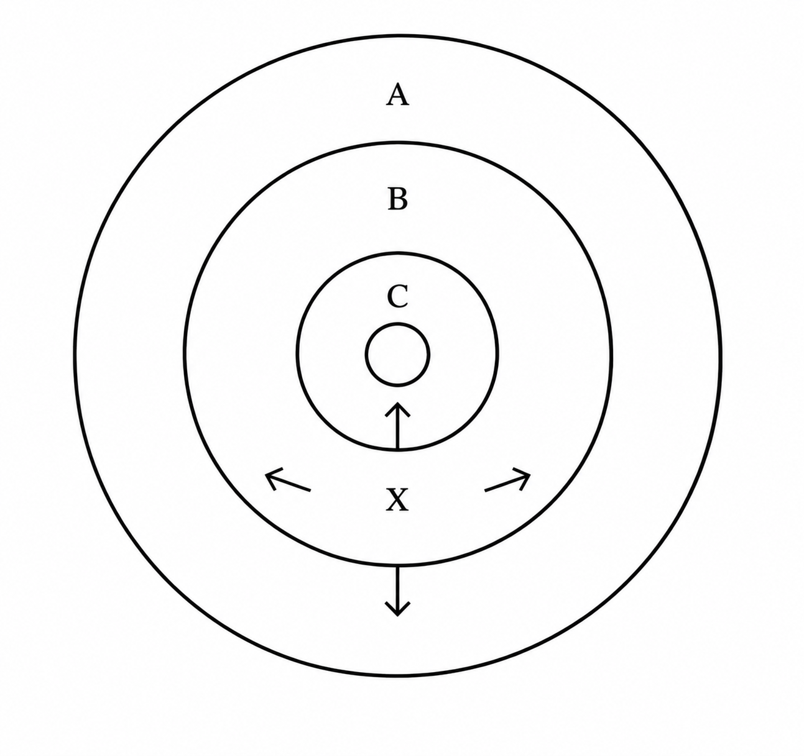
		

		

		
Page 9 · V · Définition réaliste et opératoire, p. 48–49

			…évident que cette illustration est incomplète \[46\], mais elle montre qu’une courbe de coûts croissante ne suffit pas à limiter la taille de l’entreprise. Le raisonnement a porté sur la concurrence parfaite ; le cas de la concurrence imparfaite en découle aisément.
			Pour déterminer la taille, il faut considérer les coûts d’utilisation du marché et les coûts d’organisation propres aux différents entrepreneurs. On peut alors déterminer le nombre de produits et leurs quantités par entreprise. Les questions de Shove sur la concurrence imparfaite semblent précisément dépasser ce que les courbes de coûts de Joan Robinson peuvent expliquer \[47\].
			**V**
			Il reste à vérifier si notre concept correspond au monde réel. La relation juridique de « maître et serviteur », ou d’employeur et salarié, constitue un bon point de départ \[48\]. Ses éléments essentiels sont les suivants :
			1. Le salarié doit fournir des services à l’employeur ou à d’autres pour son compte. Sinon, il s’agit d’un contrat de vente de biens ou d’un contrat semblable.
			2. L’employeur doit pouvoir contrôler son travail, personnellement ou par l’intermédiaire d’autres salariés ou d’un agent. Ce droit de contrôle et d’intervention, notamment celui de dire quand travailler pendant les heures de service, est le trait dominant. Il distingue le salarié du prestataire indépendant, engagé pour fournir seulement le résultat de son travail. Le prestataire organise lui-même son activité pour obtenir le résultat contractuel, sans contrôle de l’employeur sur son exécution \[49\].
			La direction constitue donc l’essence du concept juridique comme du concept économique proposé. Batt ajoute que la différence entre agent et salarié n’est pas le salaire fixe ou la commission, mais la liberté avec laquelle l’agent exécute sa mission \[50\].
			Notre définition correspond ainsi assez bien à l’entreprise réelle : elle est réaliste. Est-elle aussi opératoire ? Oui : le raisonnement marginal s’applique à sa taille. La question est toujours de savoir s’il vaut la peine de confier une transaction supplémentaire à l’autorité organisatrice. À la limite, son coût d’organisation dans cette entreprise, dans une autre ou par le marché s’égalise. Les entrepreneurs expérimentent continuellement, étendant ou réduisant leur contrôle, ce qui maintient l’équilibre.
			Cela fournit un équilibre pour l’analyse statique. Les facteurs dynamiques sont également importants : étudier les changements des coûts internes et des coûts de marché explique pourquoi les entreprises grandissent ou rétrécissent. On obtient une théorie d’équilibre en mouvement.
			L’analyse éclaire aussi les rapports entre initiative, entreprise et administration. L’initiative consiste à prévoir et intervient par le mécanisme des prix en concluant de nouveaux contrats. La direction réagit aux changements de prix en réaffectant les facteurs sous son contrôle. Que l’entrepreneur réunisse fréquemment ces deux fonctions découle des coûts d’utilisation du marché déjà étudiés.
			Enfin, ce raisonnement permet de préciser le « produit marginal » de l’entrepreneur. Développer ce point dépasserait toutefois notre tâche, relativement simple, de définition et de clarification.
			**Notes**
			\[46\] Comme indiqué auparavant, la localisation est l’un des facteurs du coût d’organisation.
			\[47\] Shove, « Imperfection of the Market », p. 115 : à propos de la hausse de la demande dans les banlieues et des prix des fournisseurs, il demande pourquoi les entreprises existantes n’y ouvrent pas des succursales. Si le raisonnement du texte est correct, le cadre de Joan Robinson ne suffit pas pour répondre.
			\[48\] Le concept juridique et celui d’entreprise ne sont pas identiques : l’entreprise peut contrôler aussi bien les biens d’une personne que son travail. Ils sont néanmoins suffisamment proches pour que l’analyse juridique aide à apprécier le concept économique.
			\[49\] Batt, Master and Servant, p. 6.
			\[50\] Ibid., p. 7.
		
